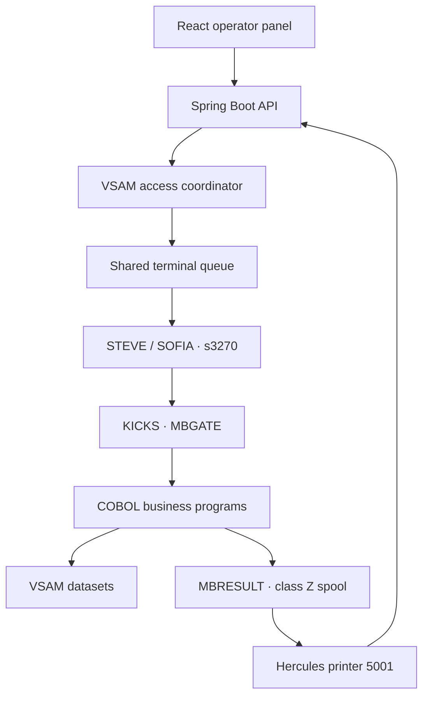

[README.md](https://github.com/user-attachments/files/32224740/README.md)
<div align="center">
  

# MoniBank

**An educational core banking system across generations**

[Live operator panel](https://monibank.stormsister.eu/) · [Technical blog](https://monibank.stormsister.eu/blog/) · [Polska wersja bloga](https://monibank.stormsister.eu/blog/pl/)
</div>

MoniBank is my hands-on mainframe engineering project. I built it to connect a modern React and Spring Boot application to a real MVS 3.8j environment instead of replacing the legacy core with mocks.

Customer, account, card and transaction data is owned by COBOL programs running under KICKS and stored in VSAM. Java acts as an integration layer: it translates HTTP requests into fixed-width messages, schedules work across persistent 3270 sessions, correlates mainframe result records and exposes them to the web application.

> [!IMPORTANT]
> MoniBank is an educational demonstration built with fictional data. It is not a real bank, does not provide financial services and is not intended for production banking use.

## What is running

The current legacy branch includes:

- customer, account and card creation, lookup, listing and status changes;
- cash deposits, cash withdrawals, transaction history and account statements;
- two persistent KICKS terminal workers, **STEVE** and **SOFIA**, sharing one request queue;
- an append-only operation journal with worker, queue, duration and outcome telemetry;
- live JES/Hercules and KICKS activity streamed to the browser with SSE;
- an automated end-of-day flow that posts interest and persists a daily report;
- JWT-protected administrative endpoints for daily close and controlled COBOL/JCL operations;
- container images built by GitHub Actions and deployed behind Nginx.

The repository also contains the beginning of the next stage of the project: a planned modern banking implementation. It is intentionally not presented as complete.

## Architecture



The production Compose file deploys the frontend and backend only. Hercules/MVS, KICKS, datasets, maps and transaction definitions are provisioned separately and the existing mainframe container is attached to the external `monibank-internal` Docker network.

## One request, end to end

1. The frontend calls a Spring MVC endpoint.
2. Java validates the request, assigns an eight-character request ID and builds the fixed-width input expected by the legacy program.
3. A fair, process-local coordinator grants shared access to read-only operations or exclusive access to a write operation.
4. The request enters one shared queue. The next ready terminal worker executes it through the `MBGW` KICKS transaction.
5. `MBGATE` validates the envelope and links to the correct COBOL program through a COMMAREA.
6. The program reads or updates VSAM and sends data plus a final success/error record to `MBRESULT`.
7. `MBRESULT` writes class-Z spool frames. Hercules exposes printer device `5001` over TCP.
8. The Java listener reassembles the frames, correlates them by request ID and returns the authoritative mainframe result to the caller.

The result channel matters: a successful HTTP response is based on the final `MBR;S` record, while `MBR;E` represents a business rejection returned by MVS. Transport, timeout and terminal failures are recorded separately as technical errors.

For write operations, Java does not automatically retry after an uncertain terminal failure. It checks the result channel first, avoiding an unsafe duplicate write when COBOL may already have committed the change.

## KICKS gateway and COBOL programs

`MBGATE` is the single online entry point. It accepts a protocol version, operation name, request ID, input length and up to 512 characters of input. It then links to the selected COBOL program and passes a common response area to `MBRESULT`.

| API operation | COBOL program | Responsibility |
|---|---|---|
| `GETCUST` | `GETCUST` | Read one customer |
| `ADDCUST` | `ADDCUSG` | Create a customer through the gateway-compatible program |
| `CHGCUST` | `CHGCUST` | Change customer status |
| `LISTCUST` | `LISTCUST` | List customers |
| `LISTACCT` | `LISTACCT` | List accounts |
| `ADDACCT` | `ADDACCT` | Create an account |
| `CHGACCT` | `CHGACCT` | Change account status |
| `LISTCARD` | `LISTCARD` | List cards |
| `ADDCARD` | `ADDCARD` | Create a card |
| `CHGCARD` | `CHGCARD` | Change card status |
| `POSTTXN` | `POSTTXN` | Post a deposit or withdrawal |
| `LISTTXN` | `LISTTXN` | Read transaction history |
| `POSTINT` | `POSTINT` | Post daily interest |
| `DAYSTAT` | `DAYSTAT` | Calculate and persist a daily close report |
| `GETSTAT` | `GETSTAT` | Read an already persisted daily report |

There is deliberately no public delete API. A historical `DELCUST` source exists in the repository, but it is neither routed by `MBGATE` nor exposed by the Spring controllers.

## VSAM data model

| Dataset | Record | Primary key | Alternate access paths |
|---|---:|---|---|
| `MBANK.CUST` | 119 bytes | Customer ID | National ID |
| `MBANK.ACCT` | 119 bytes | Account ID | Customer ID, IBAN |
| `MBANK.CARD` | 119 bytes | Card ID | Account ID, card number |
| `MBANK.TXN` | 119 bytes | Account ID + timestamp | Transaction ID |
| `MBANK.SEQ` | 32 bytes | Sequence name | — |
| `MBANK.DAYRPT` | 119 bytes | Business date + currency | — |

The JCL under `monibank-backend/src/main/resources/jcl/` defines and seeds these datasets. The sequence dataset provides identifiers for customers, accounts, cards and transactions.

## Concurrency and terminal workers

STEVE and SOFIA are isolated TSO/KICKS sessions controlled by separate `s3270` processes. Both consume work from one global queue, so two independent read requests can execute in parallel.

VSAM access is coordinated before a request occupies a terminal:

- `GETCUST`, `LISTCUST`, `LISTACCT`, `LISTCARD`, `LISTTXN` and `GETSTAT` use a shared read lock;
- writes and unknown operations use an exclusive lock;
- a waiting writer does not unnecessarily hold a terminal worker.

This lock lives inside one backend process. The current deployment therefore assumes one active backend replica. Multiple replicas would require a distributed coordinator or a single external owner for mainframe writes.

## End-of-day processing

When enabled, the scheduler starts at `00:05` in the configured time zone and closes the previous business date:

1. `POSTINT` calculates daily interest for eligible active accounts in the configured currency.
2. A deterministic transaction identifier makes a repeated run idempotent.
3. `DAYSTAT` scans transactions and customers, calculates the close figures and writes or rewrites `MBANK.DAYRPT`.
4. Dashboard retrieval uses `GETSTAT` to read that durable MVS report. A Java cache miss never recalculates the figures.

The default annual rate is expressed in basis points. Daily interest is calculated as:

```text
balance × annual basis points / 3,650,000
```

and rounded to two decimal places. Startup catch-up is optional: Java first asks MVS for yesterday's report and runs the close only when MVS returns `RPTNOTF`.

## Observability

The application exposes three complementary views:

- **System Status** — reader, result printer, terminal pool, queue, Hercules container metrics and uptime;
- **Operations** — append-only JSONL journal correlated with MVS results and terminal telemetry;
- **Mainframe Live** — browser SSE stream combining KICKS activity with raw MVS/Hercules output.

Operation list queries are capped at 500 records by the backend; the frontend currently asks for the latest 100. Summary counts are calculated independently for the selected time window. Operations and dashboard summaries refresh every 15 seconds.

Journal files are named `operations-YYYY-MM-DD.jsonl`, retained for 30 days by default and stored locally to the backend instance. A journal write failure is logged but does not turn an already successful banking operation into a failure.

## Security model

Administrative routes under `/api/admin/**` require a JWT with the `admin` scope. `/api/admin/auth/token` verifies the configured administrator credentials and issues an HS256 token. The signing secret must be Base64-encoded and represent at least 32 random bytes.

The educational business API remains public by design and is protected by separate token-bucket limits:

| Scope | Default limit |
|---|---:|
| Authentication | 5 requests / 15 minutes |
| Read | 240 requests / minute |
| Write | 12 requests / hour |

Administrative source submission is not arbitrary file upload: program and job names are validated and resolved only from COBOL/JCL resources packaged with the application.

## API overview

| Area | Selected endpoints |
|---|---|
| Customers | `GET /api/customers`, `POST /api/customers`, `POST /api/customers/get`, `PATCH /api/customers/{id}/status` |
| Accounts | `GET /api/accounts`, `POST /api/accounts`, `PATCH /api/accounts/{id}/status` |
| Cards | `GET /api/cards`, `POST /api/cards`, `PATCH /api/cards/{id}/status` |
| Transactions | `GET /api/transactions`, `GET /api/transactions/recent`, `POST /api/transactions/deposits`, `POST /api/transactions/withdrawals` |
| Statements | `GET /api/statements/accounts/{accountId}` |
| Operations | `GET /api/operations`, `GET /api/operations/summary` |
| Infrastructure | `GET /api/mainframe/status`, `GET /api/mainframe/logs/stream` |
| Daily report | `GET /api/dashboard/daily-close` |
| Administration | token, daily close and controlled JCL/COBOL endpoints under `/api/admin/**` |

## Technology

| Layer | Technology |
|---|---|
| Legacy runtime | MVS 3.8j, Hercules, KICKS, TSO, JES2 |
| Legacy application | COBOL, JCL, BMS maps, VSAM |
| Integration | Java 21, Spring Boot 4.1, j3270, `s3270`, TCP printer listener, SSE |
| Frontend | React 19, Vite 8, Tailwind CSS 4, TanStack Query |
| Delivery | Docker, Nginx, GitHub Actions, GHCR |

## Repository layout

```text
.
├── .github/workflows/       GitHub Actions image builds
├── blog/                    bilingual VitePress technical blog
├── monibank-backend/
│   ├── src/main/java/       API, orchestration and Hercules integration
│   └── src/main/resources/
│       ├── cobol/           COBOL programs and copybooks
│       └── jcl/             dataset, map, table, build and diagnostic jobs
├── monibank-frontend/       React operator panel and its Nginx image
└── compose.prod.yml         application-only production deployment
```

## Build the application

### Backend

```bash
cd monibank-backend
./mvnw test
./mvnw clean package -DskipTests
docker build -t monibank-backend:local .
```

The backend image installs `s3270` and includes a small compatibility wrapper for the script-port argument used by the Java 3270 library.

### Frontend

```bash
cd monibank-frontend
npm ci
npm run build
docker build -t monibank-frontend:local .
```

For local UI development, Vite proxies `/api` to `http://localhost:8080`.

Every push to `main` builds Linux/AMD64 backend and frontend images and publishes both `latest` and immutable `sha-<commit>` tags to GitHub Container Registry.

## Running the complete environment

The repository does not yet turn an empty machine into a complete MVS/KICKS environment with one command. It assumes a separately prepared Hercules system with KICKS, datasets, maps, tables, compiled programs and configured reader, 3270 and result-printer devices.

Mainframe setup jobs must be submitted manually and in dependency order. I will document the exact clean-system sequence, required variables, Docker networking, persistent volumes and production rollout in a separate, verified installation runbook instead of embedding a fragile partial procedure here.

`monibank-backend/.env.example` remains the inventory of application configuration variables, while `compose.prod.yml` describes the application containers attached to an existing `monibank-internal` network.

## Known constraints

- The project is educational and its public business endpoints are not a production authorization model.
- The mainframe runtime and its data are not distributed in this repository.
- Mainframe installation is currently a documented-manual-workflow target, not a one-command deployment.
- The VSAM coordinator assumes a single active backend process.
- The operation journal is file-based and local to that backend instance.
- Online writes are serialized deliberately; the terminal pool primarily improves concurrent reads and isolates terminal failures.
- Customer, account and card deletion is not part of the exposed application workflow.

## Further reading

I publish detailed, evidence-based notes in the [MoniBank technical blog](https://monibank.stormsister.eu/blog/). The repository already includes articles about the first customer lookup path and automated COBOL/JCL delivery. The next documentation series will describe the gateway, result protocol, worker pool, daily close and the origin of every dashboard metric directly from the corresponding source files.
