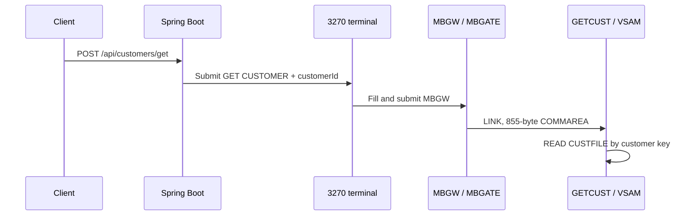
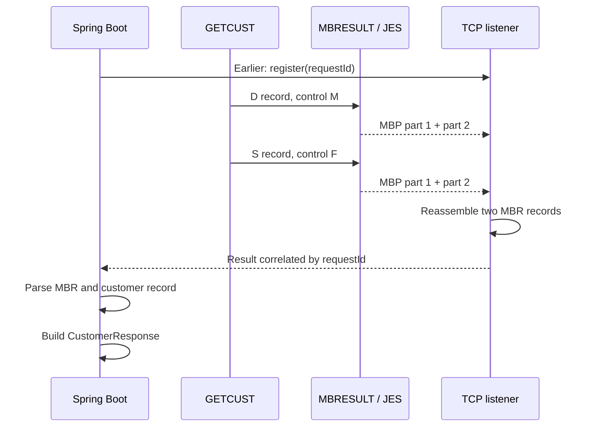

# This Looks Like an Ordinary JSON API. It Ends in MVS, COBOL, VSAM and JES.

**How MoniBank turns one HTTP request into an automated 3270 transaction on MVS 3.8J—and turns fixed-width mainframe records back into clean JSON.**

At first glance, there is nothing unusual about this request:

```http
POST /api/customers/get
Content-Type: application/json

{
  "customerId": "C000000000006"
}
```

> **Runtime capture.** The request and response below were captured from the working development environment. The repository proves the protocol and the successful `C000000000006` lookup, but its bootstrap seeder does not contain the personal-looking values shown in this response.

The response is equally familiar:

```json
{
  "customerId": "C000000000006",
  "countryCode": "PL",
  "nationalId": "***********",
  "firstName": "MONIKA",
  "lastName": "TESTOWA",
  "dateOfBirth": "19840526",
  "status": "A",
  "createdAt": "20260826110000"
}
```

This looks like one of the millions of JSON API exchanges that happen every minute. But the customer was not read from PostgreSQL, MongoDB, or a cloud service. Java entered a transaction through an automated 3270 terminal, a COBOL program running under KICKS read a 119-byte VSAM record on MVS 3.8J, and JES delivered the result through a virtual printer connection.

The interesting part is not merely that old and new technology can communicate. It is that each side keeps doing the job it understands best:

- HTTP and JSON remain the public contract.
- Spring Boot owns validation, orchestration, correlation, timeouts, and domain mapping.
- 3270 is the command and control channel.
- KICKS and COBOL own the online transaction and VSAM access.
- JES is the asynchronous result transport.
- A small framing protocol bridges an old spool record limit without changing the logical result format.

This article follows one successful `GETCUST` request all the way through the system.

> **Implementation baseline.** This article was checked against public repository commit [`b4247cc`](https://github.com/StormSister/MoniBank/commit/b4247cc9d88e8221bdd4f007a313f3554c3a367a). Runtime observations that are not reproducible from repository files alone are labelled explicitly.

> **Historical precision.** “A 1978 mainframe API” is a memorable hook, but the defensible wording is “a late-1970s MVS lineage.” The point is not a marketing date: a modern Spring application is exchanging live business data with a 24-bit MVS environment descended directly from that era.

## Architecture: two channels for one operation

A `GET CUSTOMER` call does not return through the channel that carried its command. The 3270 terminal submits the operation, while the structured API result returns separately through JES and the Java TCP listener.

### 1. Command path: HTTP → 3270 terminal → COBOL



Spring Boot validates the request and places the command in a queue. The persistent terminal worker retrieves it, fills the `MBGW` transaction fields and submits the screen. `MBGATE` builds the 855-byte COMMAREA and performs a `LINK` to `GETCUST`, which reads the customer from `CUSTFILE`.

### 2. Result path: COBOL → JES → TCP listener → JSON



`MBRESULT` writes two logical MBR records: a data record `D` and the final success record `S`. It divides each record into two physical MBP frames. The TCP listener receives four frames, reassembles two MBR records and completes the matching HTTP request.

| Channel | Responsibility |
|---|---|
| HTTP + 3270 terminal | submitting the `GET CUSTOMER` command |
| MBRESULT + JES + TCP | delivering the structured result |
| `requestId` | matching the result to the correct HTTP request |

## 1. The HTTP boundary is intentionally boring

`CustomerController` exposes:

```java
@PostMapping("/get")
public ResponseEntity<CustomerResponse> getCustomer(
        @Valid @RequestBody GetCustomerRequest request
) {
    return ResponseEntity.ok(
            customerService.getCustomer(request)
    );
}
```

The input record validates the mainframe key before a scarce terminal session is touched:

```java
public record GetCustomerRequest(
        @NotBlank
        @Pattern(regexp = "^C[0-9]{12}$")
        String customerId
) {}
```

That is more than API hygiene. A 400 response at the web boundary is cheaper and clearer than queuing an invalid request, driving a terminal, invoking COBOL, and returning `BADID` later.

## 2. The service selects the online path

`CustomerService.getCustomer()` calls the KICKS-specific executor:

```java
MainframeResult result = kicksMainframeOperationExecutor.execute(
        CustomerMainframeOperations.GET_CUSTOMER,
        request.customerId()
);
```

`CustomerMainframeOperations.GET_CUSTOMER` is the seven-character operation name `GETCUST`. Unlike the existing batch operations, this path does not build JCL and submit a job. It sends a request to a long-lived online KICKS session.

When the infrastructure result returns, the service requires exactly one `CUSTOMER` data record and verifies that the returned customer ID matches the requested ID. Only then does it return a domain object.

This last check is important. Correlation protects the transport; domain validation protects the business result.

## 3. Java creates correlation before it creates traffic

`KicksMainframeOperationExecutor` performs four essential operations:

1. Validate the operation and input limits.
2. Obtain the active `KicksTerminalSessionManager`.
3. Generate an eight-character request ID such as `R2501452`.
4. Call `MainframeResponseExecutor` with a function that submits the terminal request.

The crucial ordering lives in `MainframeResponseExecutor`:

```text
register requestId in MainframeTcpResultListener
then send the terminal request
then wait for the result
```

Registration happens first because the mainframe can answer quickly. If Java sent the request and registered afterward, a fast printer record could arrive with no waiting consumer and be discarded as an unknown request.

Every logical result record contains the same request ID. That lets one listener separate interleaved responses and is the foundation for the planned pool of multiple terminal workers.

## 4. A persistent 3270 worker drives MBGW

`KicksTerminalSessionManager` owns a queue and one persistent terminal worker. Its `@PostConstruct` method starts the worker alongside the Spring application, but the startup is asynchronous: the worker must still connect to TN3270, log into TSO, start KICKS, open the MoniBank gateway screen, and reach `READY` before it can process the queue.

The KICKS startup command is configuration, not a string hard-coded in the session. In the demonstrated environment it is:

```text
EXEC 'HERC01.CMDPROC(MBKICKS)'
```

The worker recognizes the KICKS welcome screen, clears it, opens transaction `MBGW`, waits for the MoniBank map in `READY` state, and then remains available for requests.

For `GETCUST`, Java creates:

```text
MbgwRequest(
  operation = GETCUST,
  requestId = R2501452,
  input     = C000000000006
)
```

The terminal automation fills the MBGW fields and presses Enter. No human types into the session during the API call.

The result view is also displayed on the MBGW screen, and Java waits for the matching request ID plus `SUCCESS` or `ERROR`. However, Java does not parse that screen into `CustomerResponse`. For the HTTP API, 3270 is therefore the **command and control channel**, while the JES printer stream is the authoritative data-return channel.

Source: [`KicksTerminalSessionManager`](https://github.com/StormSister/MoniBank/blob/main/monibank-backend/src/main/java/com/monibank/mainframe/hercules/terminal/KicksTerminalSessionManager.java) and [`KicksTerminalSession`](https://github.com/StormSister/MoniBank/blob/main/monibank-backend/src/main/java/com/monibank/mainframe/hercules/terminal/KicksTerminalSession.java).

## 5. MBGW, MBGATE and the 855-byte COMMAREA

On MVS, `MBGW` is the transaction entered at the terminal and `MBGATE` is its gateway program. `MBGATE` receives the BMS map, validates the screen-level fields, builds an 855-byte COMMAREA, selects the target program from the operation name, and executes `LINK` to `GETCUST`.

`GETCUST` validates:

- `EIBCALEN = 855`,
- protocol version `01`,
- operation `GETCUST`,
- a nonblank request ID,
- input length `0013`,
- a nonblank 13-character customer key.

The read itself is a standard online keyed VSAM access:

```cobol
EXEC CICS READ
    FILE('CUSTFILE')
    INTO(WS-CUSTOMER-RECORD)
    LENGTH(WS-RECORD-LENGTH)
    RIDFLD(WS-CUSTOMER-ID)
    KEYLENGTH(WS-KEY-LENGTH)
    RESP(WS-RESP)
    RESP2(WS-RESP2)
END-EXEC.
```

The `CUSTFILE` record is exactly 119 characters:

| Offset | Length | Field |
|---:|---:|---|
| 0 | 1 | status |
| 1 | 13 | customer ID |
| 14 | 2 | country code |
| 16 | 11 | national ID |
| 27 | 30 | first name |
| 57 | 40 | last name |
| 97 | 8 | date of birth |
| 105 | 14 | created timestamp |

`DFHRESP(NOTFND)` becomes a controlled `E` result with code `NOTFOUND`. A successful read produces one data record followed by one terminal success record.

The source uses `EXEC CICS` syntax, but it runs under KICKS. The KICKS preprocessor accepts the CICS-compatible command syntax and translates it for the KICKS runtime; this project is not claiming to run IBM CICS on MVS 3.8J.

Source: [`MBGATE.cob`](https://github.com/StormSister/MoniBank/blob/main/monibank-backend/src/main/resources/cobol/application/gateway/MBGATE.cob), [`GETCUST.cob`](https://github.com/StormSister/MoniBank/blob/main/monibank-backend/src/main/resources/cobol/application/customers/GETCUST.cob) and [`PUTGWCA.jcl`](https://github.com/StormSister/MoniBank/blob/main/monibank-backend/src/main/resources/jcl/application/build/kicks/PUTGWCA.jcl).

## 6. The logical result protocol is `D ... S/E`

MoniBank uses fixed-width, 160-character logical result records:

```text
MBR;D;CUSTOMER;R2501452;<119-byte fixed-width customer payload>
MBR;S;GETCUST;R2501452;C000000000006;A;OK
```

The rules are simple:

- zero or more `D` records carry data;
- exactly one final `S` record means success;
- exactly one final `E` record means a business or processing error;
- every record carries the request ID;
- a response is incomplete until `S` or `E` arrives.

The order matters. For a successful `GETCUST`, the `D` record is written first and the `S` record closes the response. For a customer list or statement, many `D` records can be emitted before the final status.

The protocol is shared with batch programs. Batch can write 160-byte records to an `LRECL=160` result dataset and later copy them to `SYSOUT=Z`. Online KICKS produces the same logical records but requires a different physical transport.

## 7. `MBRESULT` owns spool I/O, while the caller carries the token

`GETCUST` does not duplicate spool handling. It places one logical `MBR X(160)` record in the shared 185-byte `MBRSCA` call area and links to `MBRESULT`.

The distinction around the token matters. `MBRESULT` opens the class-Z SYSOUT and returns its eight-character token in the call area. `GETCUST` retains that same call area and passes it back on the next `LINK`. A data call uses control `M`; the final success or error call uses `F`.

Therefore a successful lookup performs two `LINK` calls:

1. `D` with control `M`: write the data record and leave the SYSOUT open;
2. `S` with control `F`: write the final header and close the SYSOUT.

Source: [`MBRESULT.cob`](https://github.com/StormSister/MoniBank/blob/main/monibank-backend/src/main/resources/cobol/application/result/MBRESULT.cob) and [`MBRSCA.cpy`](https://github.com/StormSister/MoniBank/blob/main/monibank-backend/src/main/resources/cobol/application/result/MBRSCA.cpy).

## 8. The failure that revealed the real transport limit

During the first online test, the request reached MBGW and completed with `ERROR`. Java then waited five seconds for the TCP result and timed out.

The timeout looked like the failure, but it was only the last visible symptom. The real sequence was:

```text
GETCUST created a valid 160-byte MBR record
MBRESULT attempted SPOOLWRITE
SPOOLWRITE failed
no complete SYSOUT reached the printer
Java timed out while waiting
```

The first error handling only returned a generic `WRITEERR`, which forced too much guessing. I added stage-specific diagnostics and preserved the original CICS response values even if cleanup also failed.

The decisive result was:

```text
RESP  = 22
RESP2 = 27
```

In this KICKS path, that meant a length error: the requested 160-character write exceeded the supported physical report line by 27 characters. The effective maximum was 133.

This also explained why the batch implementation had worked. Batch wrote an `LRECL=160` dataset and let IEBGENER/JES handle it. KICKS was calling the dynamic spool interface directly. The two routes end at JES, but they do not have identical record constraints on the way there.

The diagnostic lesson is reusable: after the first failure of an external mainframe API, expose the operation stage, `RESP`, and `RESP2`. Never let a cleanup response overwrite the primary error.

## 9. The solution keeps 160 logical bytes and frames the physical transport

Shrinking every result to 133 bytes would have infected the whole design:

- COBOL copybooks would diverge between batch and online.
- fixed-width customer payloads would need special packing.
- the common parser would need two protocols.
- future programs would inherit an accidental KICKS transport limit.

Instead, `MBRESULT` keeps accepting one 160-byte logical record and splits it into two physical frames.

Each frame is 96 characters:

```text
<ASA blank>MBP;<requestId>;<part>;<80 payload characters>
```

For example:

```text
 MBP;R2501452;1;<first 80 characters of the MBR record>
 MBP;R2501452;2;<last 80 characters of the MBR record>
```

The leading blank is a safe ASA carriage-control character. The visible application prefix is `MBP`, while the reassembled logical record begins with `MBR`.

Why two equal 80-character halves?

- 96 physical characters are safely below the confirmed 133-character limit.
- the split is deterministic;
- fixed-width padding is easy to restore;
- the logical record remains byte-for-byte identical after reassembly.

One successful lookup therefore creates four physical lines: two `MBP` frames for the logical `D` record and two more for the logical `S` record.

## 10. JES turns the result into a TCP printer stream

`SPOOLOPEN OUTPUT` returns a token. `SPOOLWRITE` calls use that token, and `SPOOLCLOSE` releases the completed report to JES. This is the standard shape of the CICS-to-JES spool interface, and KICKS implements the compatible subset used by the program.

MoniBank writes the report to class `Z`. Hercules maps the corresponding virtual printer device to a socket. Spring's `MainframeTcpResultListener` maintains a connection to that printer stream.

This gives the architecture a useful separation:

- the 3270 session submits work;
- the JES printer stream returns data;
- the HTTP thread waits on a correlation future rather than scraping terminal pages.

## 11. Java accepts both batch records and KICKS frames

`MainframeTcpResultListener` has two input modes:

- `MBR;...` is already a complete logical record, normally from batch;
- `MBP;...` is a KICKS physical frame and must be reassembled.

The listener normalizes form-feed and carriage-return characters, removes the optional leading ASA blank, and deliberately preserves trailing spaces.

For an `MBP` line it splits into at most four fields:

```text
MBP ; requestId ; part ; payload
```

The split limit matters because the 80-character payload is an arbitrary half of an `MBR` record and can contain semicolons.

If the printer path trims trailing spaces, Java right-pads each physical payload back to exactly 80 characters. `PendingResult.acceptFrame()` stores part 1 per request ID, combines it with part 2, validates the reconstructed record, and emits exactly 160 characters.

Only then does the listener process the logical type:

- `D` is appended and the future remains open;
- `S` or `E` is appended and completes the future.

The state is held per request ID in a concurrent map. Frames belonging to different terminal workers may be interleaved in the printer stream without mixing their logical responses.

## 12. Infrastructure parsing and domain parsing are separate

The common `MainframeResultParser` understands only the MBR protocol:

- header type,
- operation,
- result code,
- entity ID,
- status,
- data entity type,
- fixed-width payload.

It does not know what a customer is. For a `D` record it splits at most five times so that the full payload—including spaces—remains intact.

`CustomerRecordParser` owns the 119-byte customer layout. It extracts the fixed offsets and trims each individual business field. It produces:

```java
public record CustomerResponse(
        String customerId,
        String countryCode,
        String nationalId,
        String firstName,
        String lastName,
        String dateOfBirth,
        String status,
        String createdAt
) {}
```

This separation lets the same transport and MBR parser support accounts, transactions, statements, and other future entities without accumulating entity-specific offsets.

## 13. The response becomes ordinary again

After parsing, `CustomerService` verifies that one customer was returned and that its ID matches the original request. Spring serializes the `CustomerResponse` record to JSON.

The client never needs to know about:

- TSO,
- 3270 fields,
- an 855-byte COMMAREA,
- a 119-byte VSAM record,
- 160-byte MBR records,
- 96-byte spool frames,
- ASA carriage control,
- or a JES printer socket.

That is the architectural achievement: the complexity is real, but it is contained behind a conventional API contract.

## Why not simply return the result on the 3270 screen?

For one customer, the screen would be possible. For hundreds of customers or a long statement, it would become the wrong abstraction:

- a 24-by-80 display requires pagination;
- screen layouts are presentation contracts, not data contracts;
- scraping is sensitive to cursor position, messages, and map changes;
- a terminal session stays occupied while pages are collected;
- parallel workers become harder to reason about.

The terminal remains useful for commands and compact status. JES is better suited to streaming a variable number of result records.

## Future work: more than one terminal

The repository currently implements exactly one persistent worker, one terminal session and one shared queue. A possible next stage is a small pool backed by separately named TSO users, but that is roadmap rather than current functionality.

The important part is already in the protocol: request ID is present in every frame and every logical record. The shared printer stream may interleave results, but Java holds assembly and completion state per request.

Scaling the terminal side still requires operational controls:

- one lease per TSO user;
- clean `KSSF` and `LOGOFF` shutdown;
- orphan-session detection;
- bounded queues and backpressure;
- controlled `CANCEL` escalation rather than automatic `FORCE`;
- metrics for login time, `USERID IN USE`, retries, cleanup, and timeouts.

The earlier stuck `HERC01` session was not a side story—it exposed the lifecycle work required before “three workers” becomes reliable rather than merely concurrent.

## What I built, in one sentence

MoniBank presents a normal JSON customer API while internally using Java to orchestrate a persistent 3270/KICKS session, COBOL to read a keyed VSAM record, JES class Z to transport a framed fixed-width result, and a correlation-aware Java listener to reconstruct, validate, parse, and return the domain object.

## Questions and source code

- Browse the complete implementation in the [MoniBank repository](https://github.com/StormSister/MoniBank).
- Found a technical inconsistency or want to discuss the design? [Open an issue](https://github.com/StormSister/MoniBank/issues).
- Have a question or spotted an inconsistency? [Find me on LinkedIn](https://www.linkedin.com/in/monika-gudalewska/).

## References

- [KICKS User’s Guide 1.5.0 — overview](https://www.kicksfortso.com/User%27s%20Guide%201.5.0/)
- [KICKS User’s Guide 1.5.0 — programming and spool token usage](https://www.kicksfortso.com/User%27s%20Guide%201.5.0/Programming.shtml)
- [IBM — CICS interface to JES](https://www.ibm.com/docs/en/cics-ts/6.x?topic=files-cics-interface-jes)
- [IBM — creating output spool files](https://www.ibm.com/docs/en/cics-ts/5.5.0?topic=jes-creating-output-spool-files)
- [Hercules configuration reference — socket printer devices](https://www.hercules-390.eu/hercconf.html)
- [IBM — System/370 history](https://www.ibm.com/history/system-370)
