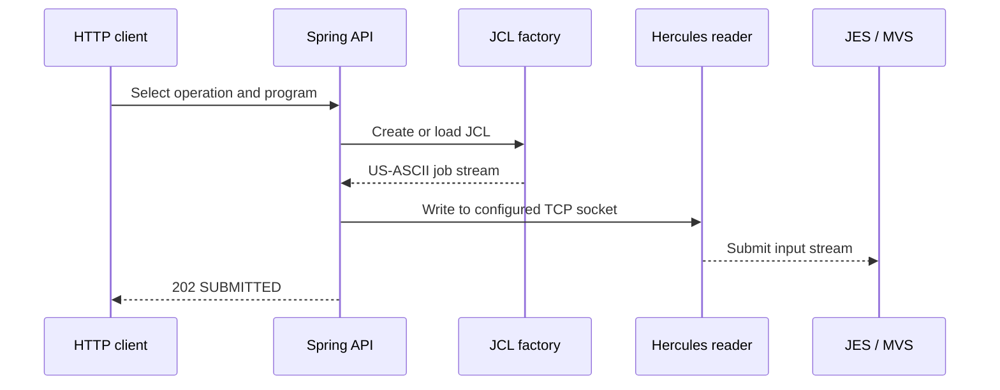

# Automating JCL and COBOL Builds Through Hercules—Without Pretending It Is Zowe

**MoniBank exposes a small Spring Boot API for placing packaged COBOL sources in a PDS, submitting build JCL to Hercules and deriving job state from MVS logs. This article describes exactly what the repository implements—and what it does not.**

The online `GET CUSTOMER` flow uses a persistent TN3270 session because it is an online KICKS transaction. Building and maintaining the programs is a different problem. Those operations belong to the batch side of MVS, so MoniBank generates or loads JCL and sends it to the configured Hercules reader socket.

The result is deliberately narrower than Zowe. It solves several of the same development tasks—moving source, submitting jobs and checking their state—but it does not implement the breadth, protocol boundary or operational guarantees of Zowe.

> **Implementation baseline.** Every MoniBank statement in this article was checked against public repository commit [`ffe53ba`](https://github.com/StormSister/MoniBank/commit/ffe53ba64cf0789774e2c6a6b85f87ddac726995). No runtime result is presented as repository evidence.

## What the repository contains

[`MainframeJobController`](https://github.com/StormSister/MoniBank/blob/ffe53ba64cf0789774e2c6a6b85f87ddac726995/monibank-backend/src/main/java/com/monibank/mainframe/api/MainframeJobController.java) exposes separate operations rather than one deployment pipeline:

| Endpoint | Repository implementation | What acceptance means |
|---|---|---|
| `POST /api/mainframe/jobs/put-cobol/{programName}` | Builds an `IEBGENER` job containing a packaged COBOL source | JCL was written to the reader socket |
| `POST /api/mainframe/jobs/compile-cobol/{programName}` | Builds a `COBUCL` compile-and-link job | JCL was written to the reader socket |
| `POST /api/mainframe/jobs/compile-kicks-cobol/{programName}` | Builds a KICKS-oriented `K2KCOBCL` job | JCL was written to the reader socket |
| `POST /api/mainframe/jobs/run-cobol/{programName}` | Builds a job that executes a load module | JCL was written to the reader socket |
| `POST /api/mainframe/jobs/submit-resource/{jclName}` | Loads a packaged JCL template and substitutes credentials | JCL was written to the reader socket |
| `GET /api/mainframe/jobs/{jobName}` | Scans recent MVS log lines for selected JES messages | A derived status, if that job name is found |

The `202 Accepted` response and the text `SUBMITTED` do **not** mean that compilation succeeded. They mean that the gateway completed its socket write without an `IOException`.

## The common submission path



[`HerculesMainframeGateway`](https://github.com/StormSister/MoniBank/blob/ffe53ba64cf0789774e2c6a6b85f87ddac726995/monibank-backend/src/main/java/com/monibank/mainframe/hercules/HerculesMainframeGateway.java) opens a TCP connection to `host` and `readerPort`, encodes the JCL as US-ASCII, writes it, flushes the stream and closes the connection. It does not call z/OSMF, a JES REST API or Zowe.

The same gateway also implements a small availability check: it attempts to connect to the configured reader address with a three-second timeout. The status endpoint reports that reachability as `ONLINE` or `OFFLINE`; it is not a full MVS health check.

## 1. Placing a COBOL source member with IEBGENER

[`MainframeResourceLoader`](https://github.com/StormSister/MoniBank/blob/ffe53ba64cf0789774e2c6a6b85f87ddac726995/monibank-backend/src/main/java/com/monibank/mainframe/hercules/MainframeResourceLoader.java) indexes `.cob` files packaged under the application's classpath `cobol` directory. It validates an MVS-style program name, reads the selected source as US-ASCII and passes it to [`PutCobolJclFactory`](https://github.com/StormSister/MoniBank/blob/ffe53ba64cf0789774e2c6a6b85f87ddac726995/monibank-backend/src/main/java/com/monibank/mainframe/hercules/jcl/PutCobolJclFactory.java).

The generated job runs `IEBGENER`. The COBOL text is inserted into an in-stream `SYSUT1`, while `SYSUT2` points to:

```text
HERC01.MBANK.COBOL(programName)
```

This is a pragmatic way to cross the boundary when the available interface is a card-reader-style job stream: the transfer itself becomes a batch job.

It is important not to overstate it. The endpoint does **not** accept an arbitrary source file in the HTTP request. The requested source must already exist as a packaged application resource when Spring Boot starts.

## 2. Compiling ordinary COBOL

[`CompileCobolJclFactory`](https://github.com/StormSister/MoniBank/blob/ffe53ba64cf0789774e2c6a6b85f87ddac726995/monibank-backend/src/main/java/com/monibank/mainframe/hercules/jcl/CompileCobolJclFactory.java) creates a job with `EXEC COBUCL`:

- `COB.SYSIN` reads `HERC01.MBANK.COBOL(programName)`;
- `COB.SYSLIB` points to `SYS1.COBLIB`;
- `LKED.SYSLMOD` writes `HERC01.TEST.LOADLIB(programName)`.

The factory proves how the compile and link-edit job is constructed. By itself, it does not prove that a particular invocation ended with acceptable step return codes.

[`RunCobolJclFactory`](https://github.com/StormSister/MoniBank/blob/ffe53ba64cf0789774e2c6a6b85f87ddac726995/monibank-backend/src/main/java/com/monibank/mainframe/hercules/jcl/RunCobolJclFactory.java) provides the next independent operation: it executes the named program with `HERC01.TEST.LOADLIB` as `STEPLIB`.

## 3. Compiling a KICKS-oriented program

The KICKS path is not “compiling through an online KICKS session.” [`CompileKicksCobolJclFactory`](https://github.com/StormSister/MoniBank/blob/ffe53ba64cf0789774e2c6a6b85f87ddac726995/monibank-backend/src/main/java/com/monibank/mainframe/hercules/jcl/CompileKicksCobolJclFactory.java) still creates a batch job. It:

- makes the KICKS procedure library available through `JOBPROC`;
- invokes procedure `K2KCOBCL`;
- reads the selected source member from `HERC01.MBANK.COBOL`;
- includes `KIKCOBGL` from `SKIKLOAD` during link-edit;
- sets the entry point and replaceable load-module name to the normalized program name.

That is the precise relationship with KICKS present in this factory: a KICKS-specific compile/link procedure and linkage input, submitted through JES.

## Packaged JCL is another supported input

The repository also contains reusable `.jcl` files under `src/main/resources/jcl`. [`ResourceJclLoader`](https://github.com/StormSister/MoniBank/blob/ffe53ba64cf0789774e2c6a6b85f87ddac726995/monibank-backend/src/main/java/com/monibank/mainframe/hercules/jcl/ResourceJclLoader.java) loads one by validated resource name and replaces `${JOB_USER}` and `${JOB_PASSWORD}` before submission.

The resource index caches resource locations, not rendered JCL containing credentials. Nevertheless, generated job cards carry credentials, which is acceptable only as a development-laboratory constraint—not a production credential model.

## Log retrieval and derived job state

The repository already abstracts log access behind [`MainframeLogSource`](https://github.com/StormSister/MoniBank/blob/ffe53ba64cf0789774e2c6a6b85f87ddac726995/monibank-backend/src/main/java/com/monibank/mainframe/port/MainframeLogSource.java):

- the `prod` implementation reads the configured local log file;
- the `local` implementation executes `ssh user@host tail -n ... logPath`.

[`HerculesJobTracker`](https://github.com/StormSister/MoniBank/blob/ffe53ba64cf0789774e2c6a6b85f87ddac726995/monibank-backend/src/main/java/com/monibank/mainframe/hercules/HerculesJobTracker.java) currently consumes this abstraction. It scans the latest 3,000 lines, recognizes `START JOB`, and derives status from `$HASP373`, `$HASP395`, `$HASP250` and lines containing `ABEND`.

This reusable log source can support future live-log presentation in the operator interface, but the reviewed commit does not expose such a streaming frontend feature. What exists today is pull-based log reading in the backend and a job-status endpoint built on top of it.

There is another important boundary: `COMPLETED` means that the tracker saw a matching `$HASP395 ... ENDED` line. The tracker does not parse individual step return codes or return JES spool files.

## Is this the same methodology as Zowe?

Only at the workflow level.

Official Zowe documentation describes `zos-files` operations for uploading local files to z/OS data sets and `zos-jobs` operations for submitting JCL, listing jobs and spool files, and viewing job status or spool output. Those are the same categories of developer need addressed by this MoniBank code.

The integration boundary is different:

| Concern | MoniBank in the reviewed commit | Zowe core workflow |
|---|---|---|
| Source placement | Source embedded in an `IEBGENER` job sent to a reader socket | File/data-set operations supplied by Zowe tooling |
| Job submission | Raw US-ASCII JCL written to a configured Hercules TCP reader | `zos-jobs` commands and services for z/OS jobs |
| Status | Derived from recent emulator/MVS log lines | Job status plus job and spool-file operations |
| Scope | Project-specific Spring endpoints and fixed data-set conventions | General-purpose tooling across data sets, jobs and other z/OS services |

So the honest description is: **MoniBank recreates a small subset of Zowe-like development workflows for an MVS 3.8J/Hercules laboratory, using interfaces that this environment exposes. It is not an implementation or replacement for Zowe.**

See the official Zowe descriptions of [`zos-files` and `zos-jobs`](https://docs.zowe.org/stable/user-guide/cli-using-understanding-core-command-groups/) and [data-set upload in Zowe Explorer](https://docs.zowe.org/stable/user-guide/ze-working-with-data-sets/).

## What is still missing

The repository makes the remaining engineering work visible:

- no single operation orchestrates source placement, waits for completion, compiles, verifies return codes and reports one final result;
- `SUBMITTED` confirms transport to the reader socket, not execution success;
- job tracking searches a bounded log tail and does not retrieve compile listings or JES spool output;
- build factories use fixed job names such as `PUTCOB`, `CMPCOB` and `KIKCOMP`, which limits unambiguous correlation between overlapping submissions;
- several data-set names and the `HERC01` qualifier are hard-coded;
- the repository has no automated tests specifically covering these factories, the controller workflow or reader submission;
- live presentation of the retrieved logs in the frontend is planned, not implemented in the reviewed commit.

That list defines code current maturity accurately: a project-specific integration layer with clear seams for a proper job pipeline, richer spool inspection and live operational visibility.

[View the source repository](https://github.com/StormSister/MoniBank) · [Read the GET CUSTOMER walkthrough](/articles/get-customer)
