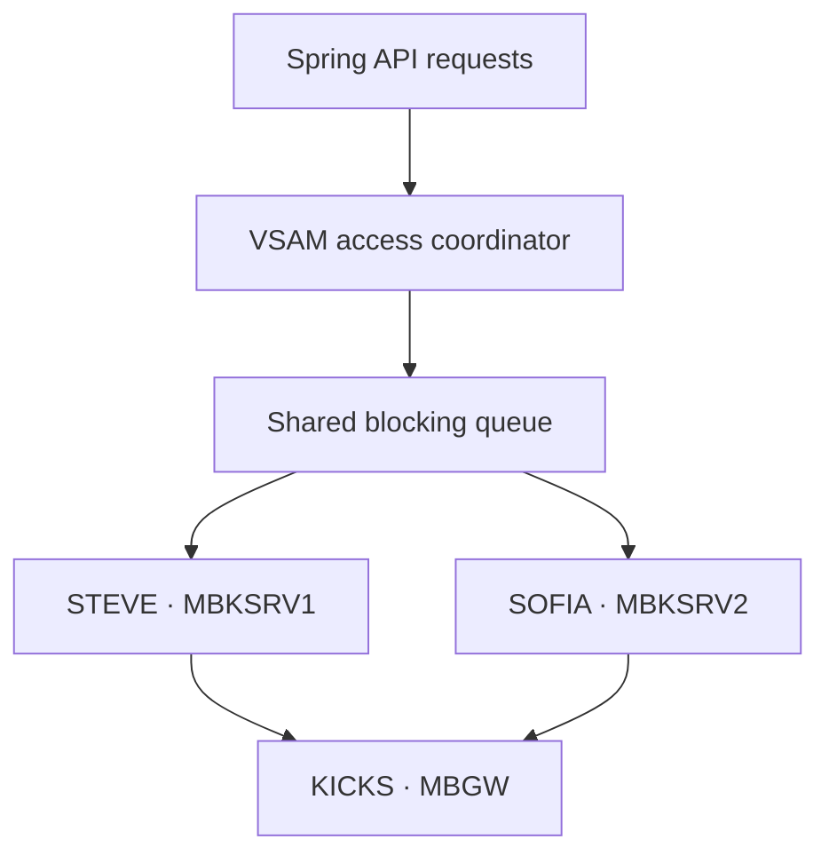

# I Wanted Three KICKS Terminal Workers. I Shipped Two.

**A second terminal did make MoniBank concurrent. It also exposed everything a single happy-path session had hidden: independent TSO identities, emulator control ports, startup state, stuck logons, VSAM access rules, Linux packaging and recovery.**

My first working MoniBank integration had one persistent 3270 session. Java could log on to TSO, start KICKS, open the `MBGW` transaction, submit an operation and wait for the structured result returning through JES and the TCP printer listener.

That proved the route. It did not prove that the route could serve more than one request at a time.

I initially planned three named workers: **STEVE**, **SOFIA** and **STEFANO**. The deployed system now runs STEVE and SOFIA. This is the story of why two working sessions taught me more than simply changing a pool-size value to three.

> **Implementation baseline.** Repository statements in this article were checked against public commit [`3c87a79`](https://github.com/StormSister/MoniBank/commit/3c87a799e5e0bafa683c2f368c029839b7ca958d). Runtime checkpoints are labelled separately; they show what I observed on my TK5R deployment, not what source code alone can prove.

## The bottleneck hidden by one terminal

A 3270 session is stateful. It can be on the Hercules welcome screen, at a TSO prompt, inside KICKS, on the `MBGW` map or displaying an unexpected message. While one session is filling and submitting a request, it cannot safely handle another request.

With one worker, all operations were serialized by the terminal itself. A slow or broken session also stopped the entire online API path.

I wanted a pool with three properties:

1. each worker owns an independent TSO/KICKS session;
2. all ready workers consume requests from one shared queue;
3. one failed worker can rebuild its session without stopping the others.

The goal was not to create three copies of one socket. It was to create three independent state machines.

## Why every worker needs its own identity

[`KicksTerminalSessionManager`](https://github.com/StormSister/MoniBank/blob/3c87a799e5e0bafa683c2f368c029839b7ca958d/monibank-backend/src/main/java/com/monibank/mainframe/hercules/terminal/KicksTerminalSessionManager.java) validates the configuration before starting the pool. For every enabled worker it requires a unique:

- logical worker ID;
- TSO username;
- emulator control port.

Reusing a TSO user is not harmless configuration duplication. MVS can reject the next logon because that user is already active. Reusing the script-control port would make two Java workers compete for one local emulator socket.

The friendly names belong to the Java layer. The deployed mapping is:

| Worker | TSO user | Control port |
|---|---|---:|
| STEVE | `MBKSRV1` | `13270` |
| SOFIA | `MBKSRV2` | `13272` |

STEFANO was the name planned for a third worker. The configuration inventory still contains an optional third credential slot whose default username is `MBKSRV3`, but the current production profile contains only STEVE and SOFIA and defaults the pool size to two. I therefore describe STEFANO as part of the design journey, not as a production worker I can prove was running.

## One queue, independent sessions



The manager uses one `LinkedBlockingQueue`. Each terminal worker owns one session and polls that same queue. A request is not permanently assigned to a name: whichever healthy worker becomes available first can take it.

When a worker accepts an entry, the journal records the request ID, operation, worker, username and queue time. This is why the Operations page can show that the same API was served by different terminals.

The pool also exposes individual states such as `CONNECTING`, `LOGGING_IN`, `STARTING_KICKS`, `OPENING_MBGW`, `READY`, `BUSY`, `RECOVERING`, `FAILED` and `CLOSED`. One aggregate word would hide too much of the real lifecycle.

## More terminals do not remove the VSAM problem

Two sessions can execute two COBOL programs concurrently. That does not mean every pair of operations should be allowed to modify the same VSAM environment concurrently.

I added a fair [`VsamAccessCoordinator`](https://github.com/StormSister/MoniBank/blob/3c87a799e5e0bafa683c2f368c029839b7ca958d/monibank-backend/src/main/java/com/monibank/mainframe/hercules/VsamAccessCoordinator.java) in front of terminal submission:

- known read-only operations receive a shared read lock;
- every write receives an exclusive lock;
- an unknown operation is treated conservatively as a write;
- lock acquisition happens before a request occupies a terminal.

This lets independent reads use STEVE and SOFIA in parallel while serializing writes deliberately. It also prevents a request waiting for a write lock from wasting one of the two terminal sessions.

The coordinator is process-local. The current architecture therefore assumes one active backend instance. Running multiple backend replicas would require a distributed coordinator or a separate single owner for mainframe writes.

## Runtime checkpoint: did two workers actually share work?

During an early cross-operation test I sent `ADDCUST` and `ADDACCT` concurrently. The operation journal assigned them to different workers:

| Operation | Worker | TSO user | Queue | Recorded duration |
|---|---|---|---:|---:|
| `ADDCUST` | SOFIA | `MBKSRV2` | 0 ms | 21.168 s |
| `ADDACCT` | STEVE | `MBKSRV1` | 0 ms | 22.593 s |

The PowerShell test completed in 22.731 seconds rather than the sum of both recorded durations. That was useful evidence that two sessions were executing simultaneously. It did **not** prove that the operations were fast.

This runtime checkpoint predates the final conservative write-lock policy. Both operations are writes, so the current `VsamAccessCoordinator` intentionally prevents this exact pair from executing concurrently. I keep the result because it proves that the terminal pool could distribute work; it also explains why terminal concurrency needed a separate data-access rule.

The long timings led me back into the application path. After correcting and recompiling the gateway-compatible `ADDCUSG`, a later single customer request completed in 1.389 seconds. I do not use these two checkpoints as a clean benchmark because the COBOL version changed between them. They document two different discoveries: concurrency worked, and terminal count was not the only cause of latency.

## Failure one: a terminal is more than a TCP connection

Early pool attempts reached the 3270 endpoint but failed with messages such as:

```text
Expected screen did not appear
Emulator socket connection timed out
```

A successful socket connect did not mean the worker was ready. [`KicksTerminalSession`](https://github.com/StormSister/MoniBank/blob/3c87a799e5e0bafa683c2f368c029839b7ca958d/monibank-backend/src/main/java/com/monibank/mainframe/hercules/terminal/KicksTerminalSession.java) has to move through the actual host screens:

```text
Hercules welcome → TSO logon → TSO messages → KICKS → MBGW READY
```

The session becomes available to the queue only after the expected `MBGW` map is open. This distinction stopped the dispatcher from sending work to a terminal that merely had an open network connection.

## Failure two: a previous TSO session can survive the emulator

Killing or losing the client does not guarantee that MVS immediately releases its TSO user. During development I encountered `USERID ... IN USE`, which could trap a worker in a failed logon loop.

The recovery component can request cancellation through the Hercules HTTP operator interface, but I restricted it deliberately. [`HerculesHttpTsoSessionRecovery`](https://github.com/StormSister/MoniBank/blob/3c87a799e5e0bafa683c2f368c029839b7ca958d/monibank-backend/src/main/java/com/monibank/mainframe/hercules/terminal/HerculesHttpTsoSessionRecovery.java):

- accepts only IDs matching `MBKSRV...`;
- requires the ID to belong to a configured terminal session;
- cannot be used to cancel an arbitrary TSO user;
- applies a 30-second cooldown between cancellation attempts.

On controlled shutdown, each active terminal also tries to leave KICKS and log off TSO cleanly. Forced cancellation is a recovery path, not the normal lifecycle.

## Failure three: Windows and Linux agreed on 3270, but not on one argument

Locally, the Java library started the Windows emulator successfully. In the Linux backend container, both workers repeatedly reported an emulator socket timeout even though manual testing proved that `s3270` could open its script port.

The mismatch was small enough to be misleading. The Java library supplied:

```text
-scriptport localhost:13270
```

while the packaged Linux `s3270` expected the numeric port:

```text
-scriptport 13270
```

I kept the original binary as `/usr/bin/s3270.real` and added a small wrapper in the image. [`s3270-wrapper.sh`](https://github.com/StormSister/MoniBank/blob/3c87a799e5e0bafa683c2f368c029839b7ca958d/monibank-backend/docker/s3270-wrapper.sh) removes the `localhost:` prefix only for the `-scriptport` value and forwards every other argument unchanged.

This was not a mainframe failure. It was an integration-contract difference between a Java library and two emulator distributions.

## Recovery is part of the worker, not a restart script

Every worker runs its own loop. When startup, an idle health check or request execution fails, the worker:

1. records the failure and increments its recovery count;
2. closes the current emulator resources;
3. moves to `RECOVERING`;
4. waits for the configured delay;
5. creates a new session and repeats the complete logon path.

Idle workers verify their session every 15 seconds. Other workers can continue polling the shared queue while one is rebuilding.

The manager also handles shutdown explicitly: it stops accepting requests, fails entries still waiting in the queue, inserts one stop marker per worker and gives the pool up to 30 seconds to finish.

## A production epilogue: S522

After deployment I observed both service users being ended with `ABEND S522`, followed by this sequence in the live activity stream:

```text
TSO session logged off
queued on TSOINRDR
started
TSO session logged on
```

The event is consistent with the persistent sessions exceeding an MVS wait limit. The shown activity proves that both sessions entered a new TSO start/logon sequence without a backend restart. The excerpt by itself does not contain the final `MBGW terminal session is READY` messages, so I still need that confirmation before describing the recovery as fully completed.

It also exposed a presentation problem. A red `failed · ABEND S522` line is technically true, but incomplete when automatic recovery succeeds seconds later. I plan to present the sequence as `session expired → recovery started → ready`, while preserving the abend code in the technical detail.

An idle Java health check and host-account activity are not necessarily the same thing. I still need to determine from timestamps whether to change the service-session wait policy or introduce a harmless host-level heartbeat. I will not claim that decision is complete before testing it.

## Why I stopped at two

The goal of the experiment was not to maximize a configuration number. It was to prove isolation, scheduling, safe data access and recovery.

Two production workers already demonstrate:

- independent TSO/KICKS identities;
- concurrent read capacity;
- an independent recovery path for each worker while the other worker loop remains active;
- real worker attribution and queue telemetry;
- application-level serialization of writes.

A third worker would increase read capacity, but it would not make serialized writes parallel. It would also add another service user, emulator process, control port and recovery lifecycle. STEFANO remains a useful capacity option, not a success metric.

## What I learned

1. **A terminal pool is a pool of state machines, not sockets.** Readiness must be based on the expected application screen.
2. **Identity is a resource.** Every persistent terminal needs its own TSO user and lifecycle.
3. **Concurrency needs a data rule.** More workers without an explicit VSAM policy can increase risk rather than throughput.
4. **Queue time and execution time answer different questions.** A zero queue proves immediate assignment, not a fast COBOL path.
5. **Recovery needs boundaries.** Automatic cancellation must be restricted to known technical users.
6. **Container parity is not automatic.** A one-argument emulator difference prevented the same Java code from starting on Linux.
7. **Two reliable workers are more valuable than three names in a diagram.**

The finished design is intentionally modest: one backend process, one fair VSAM coordinator, one shared queue and two recoverable KICKS sessions. It is enough to turn MoniBank from a single-terminal demonstration into a small, observable online integration system—and honest enough to show where its scaling boundary still is.
