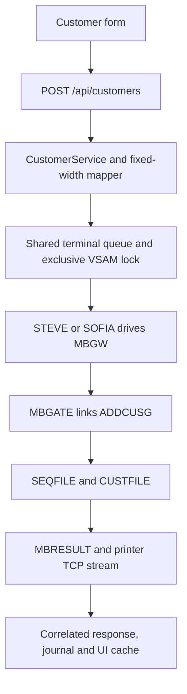

# Add customer flow

Creating a customer is an end-to-end legacy-core operation. The browser does not generate the customer ID and Java does not write a local customer database. The authoritative record and its identifier are created inside KICKS and stored in VSAM.



## 1. What the operator sees

The Customers page opens a **Create customer** modal with five inputs:

| Field | Browser rule | Mainframe width |
|---|---|---:|
| Country code | exactly two uppercase letters | 2 |
| National ID | exactly 11 digits | 11 |
| First name | 1–30 permitted characters | 30 |
| Last name | 1–40 permitted characters | 40 |
| Date of birth | required and not in the future | 8 (`yyyyMMdd`) |

While the mutation is pending, the action reads `Creating in MVS…`. A successful response closes the form, displays the generated customer ID and opens the returned customer details. A failed mutation leaves the form available and displays the API error.

## 2. Frontend ownership and refresh

[`CustomersPage.jsx`](https://github.com/StormSister/MoniBank/blob/main/monibank-frontend/src/pages/CustomersPage.jsx) owns the modal and its client-side validation. It converts the HTML date value from `yyyy-MM-dd` to `yyyyMMdd` before submission.

[`useCreateCustomer`](https://github.com/StormSister/MoniBank/blob/main/monibank-frontend/src/hooks/useCustomers.js) sends the request. On success it inserts the returned record at the beginning of the TanStack Query cache under `['customers']`, removing a record with the same ID if one is already present.

This update is immediate and local to the browser cache. The frontend does **not** run `LISTCUST` again after a successful create. A full reload obtains the list through a separate `GET /api/customers` operation, which does execute `LISTCUST` against the legacy core.

## 3. HTTP boundary and validation

The request is:

```http
POST /api/customers
Content-Type: application/json
```

```json
{
  "countryCode": "PL",
  "nationalId": "12345678901",
  "firstName": "Anna",
  "lastName": "Nowak",
  "dateOfBirth": "19900102"
}
```

[`CreateCustomerRequest`](https://github.com/StormSister/MoniBank/blob/main/monibank-backend/src/main/java/com/monibank/mainframe/customer/api/CreateCustomerRequest.java) repeats the important rules with Jakarta Validation. The controller therefore does not rely only on browser validation.

[`CustomerController`](https://github.com/StormSister/MoniBank/blob/main/monibank-backend/src/main/java/com/monibank/mainframe/customer/api/CustomerController.java) delegates the valid request to `CustomerService.createCustomer` and returns the resulting `CustomerResponse`.

## 4. Java record and request identity

[`CustomerRecordMapper`](https://github.com/StormSister/MoniBank/blob/main/monibank-backend/src/main/java/com/monibank/mainframe/customer/mainframe/CustomerRecordMapper.java) creates a fixed-width 105-character record:

| Offset | Length | Value |
|---:|---:|---|
| 0 | 2 | country code |
| 2 | 11 | national ID |
| 13 | 30 | first name |
| 43 | 40 | last name |
| 83 | 8 | date of birth |
| 91 | 14 | Java creation timestamp (`yyyyMMddHHmmss`) |

Short text values are right-padded with spaces. Control characters and values longer than their fields are rejected.

The eight-character request ID is **not** part of those 105 characters. [`KicksMainframeOperationExecutor`](https://github.com/StormSister/MoniBank/blob/main/monibank-backend/src/main/java/com/monibank/mainframe/hercules/KicksMainframeOperationExecutor.java) generates it and sends it separately in the `MBGWCA` COMMAREA. That ID later correlates the browser request, terminal execution and printer result.

## 5. Terminal dispatch and gateway routing

`ADDCUST` is a mutating operation, so [`VsamAccessCoordinator`](https://github.com/StormSister/MoniBank/blob/main/monibank-backend/src/main/java/com/monibank/mainframe/hercules/VsamAccessCoordinator.java) takes its exclusive write lock. Known read-only operations may share the read lock; a create cannot overlap another operation protected as a write.

The request then enters the shared queue in [`KicksTerminalSessionManager`](https://github.com/StormSister/MoniBank/blob/main/monibank-backend/src/main/java/com/monibank/mainframe/hercules/terminal/KicksTerminalSessionManager.java). Whichever persistent worker is free first — STEVE using `MBKSRV1` or SOFIA using `MBKSRV2` in the production configuration — takes the entry and records its queue time.

The worker fills and submits the `MBGW` screen. [`MBGATE.cob`](https://github.com/StormSister/MoniBank/blob/main/monibank-backend/src/main/resources/cobol/application/gateway/MBGATE.cob) validates the protocol fields, builds the 855-byte COMMAREA and routes operation `ADDCUST` to program `ADDCUSG` with `EXEC CICS LINK`.

The similarly named [`ADDCUST.cob`](https://github.com/StormSister/MoniBank/blob/main/monibank-backend/src/main/resources/cobol/application/customers/ADDCUST.cob) is a separate map-driven program. It is not the target selected by `MBGATE` for the Java gateway path described here.

## 6. Customer ID and authoritative storage

[`ADDCUSG.cob`](https://github.com/StormSister/MoniBank/blob/main/monibank-backend/src/main/resources/cobol/application/customers/ADDCUSG.cob) performs the authoritative create:

1. It validates COMMAREA version `01`, operation `ADDCUST`, request ID and input length `0105`.
2. It reads the `CUSTOMER` entry from `SEQFILE` for update.
3. It builds an ID as `C` followed by the current 12-digit sequence value.
4. It increments and rewrites the sequence before writing the customer. The source explicitly notes that a failed customer write may therefore leave a sequence gap.
5. It creates a 119-byte active (`A`) customer record.
6. It writes that record to `CUSTFILE`, keyed by the 13-character customer ID.

The VSAM alternate index is the authority for the unique country-code-plus-national-ID key. `DUPREC` becomes `DUPCUSTOMERID`; `DUPKEY` reports the alternate-key conflict.

## 7. Result transport, parsing and UI update

On success, `ADDCUSG` prepares one `MBR;D` customer data record and a final `MBR;S` header. On a handled business failure it finishes with `MBR;E`. It links program `MBRESULT`, which writes the logical records to the result channel used by the printer transport.

[`MainframeTcpResultListener`](https://github.com/StormSister/MoniBank/blob/main/monibank-backend/src/main/java/com/monibank/mainframe/hercules/MainframeTcpResultListener.java) receives the stream, reassembles framed 160-character records when necessary and assigns them to the pending Java request by request ID. A final `S` or `E` completes that pending result; a `D` record alone does not.

Java then verifies the request ID, operation and result type. `CustomerService` additionally requires exactly one `CUSTOMER` data record and checks that its ID matches the ID in the success header. [`CustomerRecordParser`](https://github.com/StormSister/MoniBank/blob/main/monibank-backend/src/main/java/com/monibank/mainframe/customer/mainframe/CustomerRecordParser.java) converts the 119-character payload into the JSON response used by the UI.

Only after that validated success does the frontend add the customer to its cache.

## 8. Failure and observability semantics

The operation tracker starts before terminal assignment. The final append-only JSONL journal event records the request ID, operation, assigned worker and TSO user, queue time, total duration and one of three outcomes:

- `SUCCESS` after a validated `MBR;S` result;
- `BUSINESS_ERROR` after a valid correlated `MBR;E` result;
- `TECHNICAL_ERROR` for terminal, timeout, transport, protocol or unexpected failures.

The terminal request has a 30-second limit, while the result listener normally waits five seconds for the final printer response. Because `ADDCUST` is a write, the integration does not blindly resubmit it when the screen or response is ambiguous. `MainframeResponseExecutor` first checks whether an authoritative correlated result already arrived, including the case in which COBOL committed successfully but the terminal failed while preparing for its next request.

The journal is observability, not the customer database. A journal write failure is logged but does not turn an already successful VSAM create into a failed banking operation.

## Proven boundary

This page documents the active Java gateway route: `POST /api/customers` → `ADDCUST` operation → `MBGW` → `MBGATE` → `ADDCUSG` → VSAM → `MBRESULT` → TCP-correlated response. It does not claim that the standalone `ADDCUST` map transaction or a batch job participates in this request.
