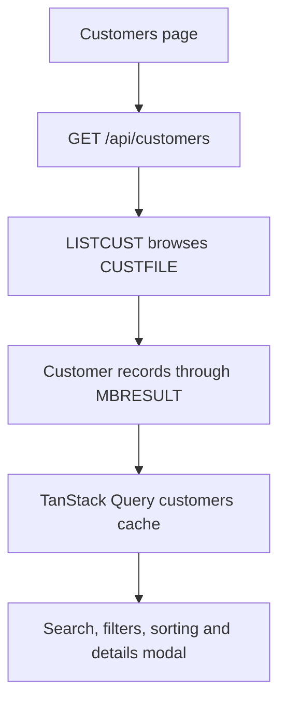

# Customers

The Customers page is the operator view of the customer registry stored in the MVS core. The initial list, record creation and status changes are legacy-core operations; search, filtering, sorting and the details modal are browser-side views of the returned records.



## What the operator sees

[`CustomersPage.jsx`](https://github.com/StormSister/MoniBank/blob/main/monibank-frontend/src/pages/CustomersPage.jsx) displays:

- counts of all, active and inactive customers;
- a table containing customer identity, dates and status;
- local search by name, customer ID or national ID;
- active/inactive filtering and sorting by surname or customer ID;
- a details modal;
- actions to create a customer and change status.

The summary counts are calculated from the complete list currently held by the browser. Search and filters only change the visible rows; they do not issue another HTTP or mainframe request.

## Loading the registry {#list}

[`useCustomers`](https://github.com/StormSister/MoniBank/blob/main/monibank-frontend/src/hooks/useCustomers.js) requests:

```http
GET /api/customers
```

[`CustomerController`](https://github.com/StormSister/MoniBank/blob/main/monibank-backend/src/main/java/com/monibank/mainframe/customer/api/CustomerController.java) delegates to `CustomerService.getCustomers`, which executes `LISTCUST` with an empty input.

[`LISTCUST.cob`](https://github.com/StormSister/MoniBank/blob/main/monibank-backend/src/main/resources/cobol/application/customers/LISTCUST.cob) validates the common COMMAREA and requires input length `0000`. It then:

1. opens a browse on `CUSTFILE` with `STARTBR`;
2. reads every 119-byte record with `READNEXT`;
3. emits one `MBR;D` `CUSTOMER` record for every customer;
4. ends the browse with `ENDBR`;
5. emits final `MBR;S` with `OK`.

An empty file is a successful empty list, not an error. Java keeps only data records whose entity type is `CUSTOMER`, parses their fixed-width payloads and returns a JSON array. Routing through the common KICKS transaction is documented in [MBGATE gateway](./mbgate), while the multi-record result transport is documented in [MBRESULT result channel](./mbresult).

## Browser-side views and the details boundary {#local-view}

The browser stores the returned array under the TanStack Query key `['customers']`. The application-wide defaults consider the query fresh for 60 seconds, retry a failed query once and do not refetch merely because the browser window regains focus.

All of the following are local operations on this cached array:

- summary counts;
- text search;
- status filtering;
- sorting;
- opening the details modal.

Opening **Customer details** does **not** execute `GETCUST`. The modal finds the selected ID in the array already returned by `LISTCUST`. It therefore shows the cached list record and does not independently prove that the VSAM record has remained unchanged since the list was loaded.

The backend does implement `POST /api/customers/get` and the COBOL program `GETCUST`. That separately verified integration is described in [GET CUSTOMER integration](../articles/get-customer), but the current Customers-page modal does not call it.

## Creating a customer

The **New customer** action submits `POST /api/customers`. It is a write operation that generates the customer ID and stores the authoritative record in MVS. After success, the frontend inserts the returned record into the existing `['customers']` cache instead of running `LISTCUST` again.

Field validation, the 105-character input, sequence allocation, `ADDCUSG`, VSAM write, result correlation and failure semantics are already documented in [Add customer flow](./add-customer). They are not duplicated here.

## Changing active status {#status}

The activate/deactivate action submits:

```http
PATCH /api/customers/{customerId}/status
Content-Type: application/json

{"status":"A"}
```

The only accepted statuses are `A` and `I`. [`CustomerRecordMapper`](https://github.com/StormSister/MoniBank/blob/main/monibank-backend/src/main/java/com/monibank/mainframe/customer/mainframe/CustomerRecordMapper.java) builds the 14-character `CHGCUST` input from a 13-character customer ID and one status character.

[`CHGCUST.cob`](https://github.com/StormSister/MoniBank/blob/main/monibank-backend/src/main/resources/cobol/application/customers/CHGCUST.cob) validates that input, reads the matching `CUSTFILE` record with `UPDATE`, changes only its status and uses `REWRITE`. It returns the complete updated customer as one `MBR;D` record followed by the final result header.

After Java verifies that exactly one customer with the expected ID was returned, the frontend replaces that record inside `['customers']`. It does not refetch the complete list. Deactivation is therefore a status change, not deletion: the record remains visible and can be activated again.

## Data authority and freshness

| Value or behaviour | Source of truth |
|---|---|
| Customer record and status | `CUSTFILE` in the MVS core |
| Generated customer ID | MVS sequence and add-customer program |
| List returned to the page | `LISTCUST` result |
| Search, selected filter and sort | Current browser state |
| Details modal contents | Cached `LISTCUST` record |
| Success notice and open modal | Current browser state |

The footer label `Source: LISTCUST / VSAM` describes the origin of the loaded list. It does not mean that each local sort, filter or modal opening performs a new VSAM access.

## Failures and refresh behaviour

If the initial list request fails, the table is replaced by an error notice and an explicit **Retry** action. A failed create or status change keeps its modal open and displays the API message.

Successful mutations update the local cache only after Java receives and verifies the correlated mainframe result. A full page reload, a new query after the stale period, or the explicit list retry can execute `LISTCUST` again. The page has no polling interval of its own.

## Related detailed documentation

- [Add customer flow](./add-customer)
- [GET CUSTOMER integration](../articles/get-customer)
- [MBGATE gateway](./mbgate)
- [MBRESULT result channel](./mbresult)
