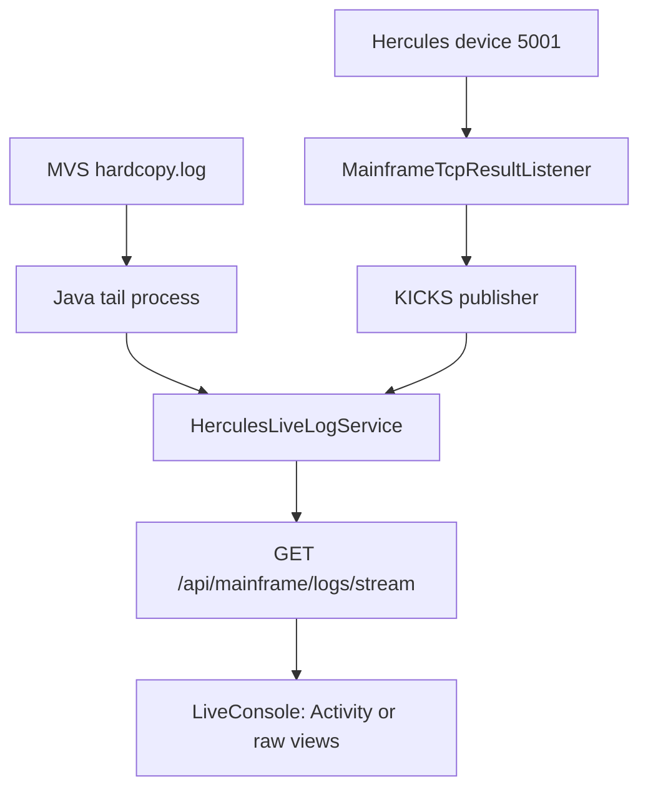

# Live mainframe console

The right-hand console is a read-only observability surface for the running legacy environment. It combines two different streams: the MVS hardcopy and lines received by Java from Hercules printer device `5001`. It does not provide a console command line and it is not the persistent MoniBank operation journal.



## What the operator sees

[`LiveConsole.jsx`](https://github.com/StormSister/MoniBank/blob/main/monibank-frontend/src/components/layout/LiveConsole.jsx) renders a fixed panel with:

- a connection state and the number of lines retained in the browser;
- `Activity`, `KICKS raw` and `System raw` tabs;
- auto-scroll and optional JES-banner filtering;
- local buffer clearing;
- resize, full-screen, minimise and close controls.

The normal panel width is stored in browser `localStorage`. It defaults to 520 pixels and is clamped between 420 and 760 pixels, with an additional viewport-based limit. This preference is UI state only and is unrelated to the backend stream.

## The two source streams {#sources}

| UI source | SSE event | Actual origin |
|---|---|---|
| `System raw` | `jes` | Lines followed from the Hercules MVS hardcopy file |
| `KICKS raw` | `kicks` | Logical result and other printer lines published by `MainframeTcpResultListener` |
| `Activity` | derived in the browser | Selected events recognised in either of the two streams |

In production, [`LocalMainframeLiveLogProcessFactory`](https://github.com/StormSister/MoniBank/blob/main/monibank-backend/src/main/java/com/monibank/mainframe/hercules/LocalMainframeLiveLogProcessFactory.java) runs `tail -F` on `MAINFRAME_LIVE_LOG_PATH`, which defaults to `/mainframe-logs/hardcopy.log`. The production compose file mounts `/srv/monibank/mainframe-logs` into the backend as read-only.

The local profile uses [`SshMainframeLiveLogProcessFactory`](https://github.com/StormSister/MoniBank/blob/main/monibank-backend/src/main/java/com/monibank/mainframe/hercules/SshMainframeLiveLogProcessFactory.java). It performs the same `tail -F` over SSH and can optionally execute it inside the configured Hercules container.

The second source is not another file tail. [`MainframeTcpResultListener`](https://github.com/StormSister/MoniBank/blob/main/monibank-backend/src/main/java/com/monibank/mainframe/hercules/MainframeTcpResultListener.java) receives printer device `5001`, reconstructs framed MoniBank results and publishes the resulting lines as `kicks` events. The framing and request-completion responsibility is described separately in [MBRESULT result channel](./mbresult).

## SSE transport and buffering

[`MainframeLiveLogController`](https://github.com/StormSister/MoniBank/blob/main/monibank-backend/src/main/java/com/monibank/mainframe/api/MainframeLiveLogController.java) exposes:

```http
GET /api/mainframe/logs/stream
Accept: text/event-stream
```

It disables HTTP caching and Nginx response buffering for the stream. [`HerculesLiveLogService`](https://github.com/StormSister/MoniBank/blob/main/monibank-backend/src/main/java/com/monibank/mainframe/hercules/HerculesLiveLogService.java) assigns a monotonically increasing ID and a source name to every line.

The service keeps at most 500 combined lines in memory. A new subscriber without `Last-Event-ID` receives up to the latest 100. When an event ID is supplied, the service replays retained lines with a greater ID. A keepalive comment is sent every 15 seconds.

[`useMainframeLiveLog`](https://github.com/StormSister/MoniBank/blob/main/monibank-frontend/src/hooks/useMainframeLiveLog.js) creates the browser `EventSource`, listens for `jes` and `kicks`, and independently retains the latest 500 lines. The count in the console header is this browser-side count, not the size of the hardcopy file.

## How Activity is derived {#activity}

`Activity` is a frontend projection, not a third backend stream. The browser recognises selected raw patterns and creates shorter operator-facing messages.

From the KICKS/printer source it recognises:

- `MBR;D` data records;
- final `MBR;S` success and `MBR;E` error records;
- `MBS;H` and `MBS;E` daily-report boundaries.

From the hardcopy it recognises selected JES and TSO events, including jobs queued or started, step return codes, job completion, JCL errors, ABENDs, TSO logon/logoff, and waits for unavailable data sets.

Lines that do not match these rules are intentionally absent from `Activity` but remain available in the corresponding raw tab. The view therefore must not be interpreted as a complete hardcopy, audit log or operation count. Persistent request telemetry belongs to the Operations journal.

## Connection loss and recovery {#reconnection}

The Java tailer starts when the first SSE subscriber arrives. If its `tail` or SSH process ends, it waits two seconds and starts a new one. On the first connection it requests 100 existing lines; subsequent tail-process reconnects start from new output.

The browser reports three states:

- `connecting` before the stream opens;
- `connected` after `EventSource.onopen`;
- `reconnecting` after `EventSource.onerror`.

Native `EventSource` performs the HTTP reconnection. Retained event IDs allow the backend to replay lines still present in its 500-line buffer. A gap remains possible if the client is disconnected long enough for older lines to leave that buffer.

## Local controls and their boundaries

Auto-scroll remains enabled while the viewport is within 36 pixels of the bottom. Scrolling upwards disables it so incoming lines do not move the operator away from an inspected event.

`Hide JES banners` is available only in raw tabs. It removes recognised separator lines from the rendered view; it does not remove them from either buffer. **Clear** empties only the current browser state. It does not truncate the MVS hardcopy, clear printer output or erase the backend replay buffer.

## Security boundary {#security}

The feature is read-only by construction: the endpoint accepts no command, and the production hardcopy directory is mounted into the backend with `:ro`. Closing, clearing or filtering the panel cannot change Hercules, MVS, KICKS or JES.

The current [`SecurityConfiguration`](https://github.com/StormSister/MoniBank/blob/main/monibank-backend/src/main/java/com/monibank/mainframe/security/SecurityConfiguration.java) permits `/api/**`, including this SSE endpoint, without an administrator token. The public demo therefore deliberately exposes selected operational output. No redaction layer is applied by `HerculesLiveLogService`; sensitive values must not be written to the streamed sources. Raw mainframe ports remain a separate network-level concern and are not opened by this feature.

## Responsibility boundary

Live Console answers “what is the legacy environment emitting now?”. It does not prove that every business request completed, replace the correlated [`MBRESULT`](./mbresult) response used by Java, or replace the durable Operations journal. Those surfaces share some events but have different responsibilities.
