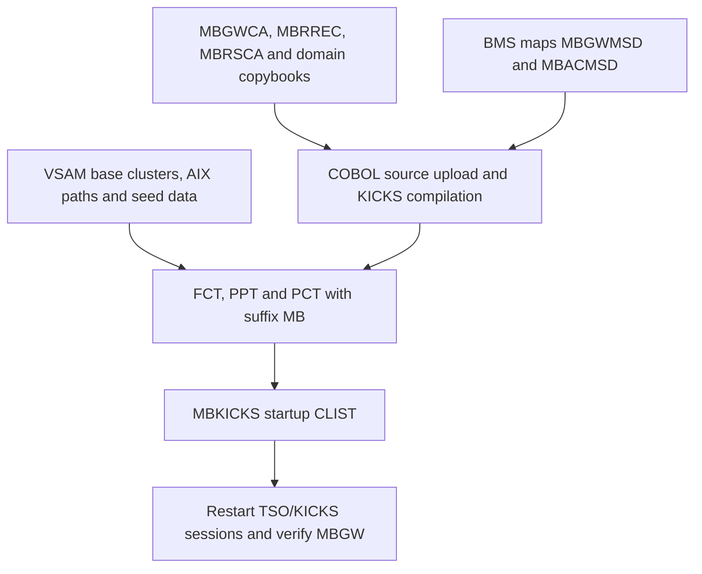

# Installing the MoniBank gateway on MVS

The online integration is not installed by copying one executable. It consists of VSAM datasets, generated copybooks and maps, COBOL load modules, three KICKS tables and a custom startup CLIST. Their dependency order is why the setup jobs were submitted manually rather than treated as interchangeable files.

::: warning Verification boundary
This order is reconstructed from the running TK5R installation and the dependencies in the repository. The individual components and online flow are proven. A complete destructive rebuild from a pristine TK5 image has not yet been performed as one automated acceptance test.
:::

## Why the API uses one gateway transaction

The MoniBank section of the PCT currently contains four transaction IDs:

| TRANSID | Program | Role |
|---|---|---|
| `MBH1` | `MBHELLO` | diagnostic example |
| `MBSQ` | `MBSEQRY` | sequence diagnostic |
| `MBAC` | `ADDCUST` | manual customer-entry map |
| `MBGW` | `MBGATE` | gateway used by the Java API |

So the KICKS region does not literally contain only one transaction. However, the **application integration has one terminal entry point**: every Java worker stays on `MBGW`, and `MBGATE` routes the named operation to an allowed program with `EXEC CICS LINK`.

The business programs therefore need PPT entries but do not need one PCT transaction each. This choice gives the Java layer one stable screen protocol, one request ID convention and one place for routing and response checks. Adding a business operation means adding a gateway route and a linked program, not teaching the terminal automation another screen flow.

`MBAC` remains useful as a manual test and diagnostic path. It is not used by `POST /api/customers`; the gateway operation `ADDCUST` links to `ADDCUSG` instead.

## Installation dependency map

## Ordered setup

### 1. Create persistent data

Create the VSAM base clusters, their alternate indexes and paths, the sequence file and the daily report file. Load seed records only after their target clusters exist.

This step must precede the custom KICKS startup because `MBKICKS` allocates DD names such as `CUSTFILE`, `NATPATH`, `SEQFILE`, `ACCTFILE`, `CARDFILE`, `TXNFILE` and `DAYRPT`.

The relevant jobs live under [`jcl/application/setup/vsam`](https://github.com/StormSister/MoniBank/tree/main/monibank-backend/src/main/resources/jcl/application/setup/vsam) and [`jcl/application/setup/seed`](https://github.com/StormSister/MoniBank/tree/main/monibank-backend/src/main/resources/jcl/application/setup/seed).

### 2. Install common copybooks

Submit:

1. [`PUTGWCA.jcl`](https://github.com/StormSister/MoniBank/blob/main/monibank-backend/src/main/resources/jcl/application/build/kicks/PUTGWCA.jcl) for the 855-byte gateway COMMAREA;
2. [`PUTMBRCP.jcl`](https://github.com/StormSister/MoniBank/blob/main/monibank-backend/src/main/resources/jcl/application/build/kicks/PUTMBRCP.jcl) for the 160-byte result record and 185-byte `MBRESULT` call area;
3. domain copybook jobs such as `PUTACCP.jcl` before compiling programs that copy them.

These jobs write members into `HERC01.KICKS.V1R5M0.COBCOPY`. Compiling a dependent program before its copybook exists fails during preprocessing or compilation.

### 3. Build the BMS maps

[`MBGWMAP.jcl`](https://github.com/StormSister/MoniBank/blob/main/monibank-backend/src/main/resources/jcl/application/build/kicks/MBGWMAP.jcl) builds `MBGWMSD`, the 24×80 protocol screen used by the workers. [`MBACMAP.jcl`](https://github.com/StormSister/MoniBank/blob/main/monibank-backend/src/main/resources/jcl/application/build/kicks/MBACMAP.jcl) builds the optional manual add-customer map.

The generated map copybook must exist before compiling the COBOL program that contains `COPY MBGWMSD` or `COPY MBACMSD`.

### 4. Upload and compile the COBOL programs

For each program, MoniBank uses two generated jobs:

1. `PUTCOB` writes the repository source to `HERC01.MBANK.COBOL(<member>)`;
2. `KIKCOMP` runs KICKS procedure `K2KCOBCL` and link-edits the load module.

The Java factories are [`PutCobolJclFactory`](https://github.com/StormSister/MoniBank/blob/main/monibank-backend/src/main/java/com/monibank/mainframe/hercules/jcl/PutCobolJclFactory.java) and [`CompileKicksCobolJclFactory`](https://github.com/StormSister/MoniBank/blob/main/monibank-backend/src/main/java/com/monibank/mainframe/hercules/jcl/CompileKicksCobolJclFactory.java).

Compile `MBRESULT`, `MBGATE` and every business program referenced by the gateway. `MBGATE` needs the generated gateway map and `MBGWCA`; business callers of `MBRESULT` need `MBRREC` and `MBRSCA`.

Each submitted job must be checked in JES. Submission alone does not prove that preprocessing, compilation and link-edit completed successfully.

### 5. Build the three KICKS tables

With the datasets, maps and load modules ready, build the table suffix `MB`:

| Job | Table | What MoniBank adds |
|---|---|---|
| [`KIKFCTMB.jcl`](https://github.com/StormSister/MoniBank/blob/main/monibank-backend/src/main/resources/jcl/application/build/kicks/KIKFCTMB.jcl) | FCT | VSAM DD names, base clusters and alternate paths |
| [`KIKPPTMB.jcl`](https://github.com/StormSister/MoniBank/blob/main/monibank-backend/src/main/resources/jcl/application/build/kicks/KIKPPTMB.jcl) | PPT | `MBGATE`, `MBRESULT`, business programs and maps |
| [`KIKPCTMB.jcl`](https://github.com/StormSister/MoniBank/blob/main/monibank-backend/src/main/resources/jcl/application/build/kicks/KIKPCTMB.jcl) | PCT | the `MBGW` gateway transaction plus diagnostic/manual transactions |

The three jobs produce `KIKFCTMB`, `KIKPPTMB` and `KIKPCTMB`. Rebuilding a table does not change a region that is already running with its old tables; the KICKS sessions must subsequently be recycled.

### 6. Install the custom MBKICKS CLIST

[`PUTMBK.jcl`](https://github.com/StormSister/MoniBank/blob/main/monibank-backend/src/main/resources/jcl/application/setup/kicks/PUTMBK.jcl) writes `HERC01.CMDPROC(MBKICKS)`.

This is not a replacement KICKS implementation. It is a MoniBank wrapper that:

1. allocates every MoniBank base cluster and alternate path under the DD names used by FCT;
2. stops immediately on an allocation error and reports which file failed;
3. invokes the supplied KICKS CLIST with `PCT(MB)`, `PPT(MB)` and `FCT(MB)`;
4. frees the MoniBank allocations during cleanup.

The wrapper was necessary because the supplied generic CLIST did not know MoniBank's datasets or table suffix. Keeping the original KICKS CLIST underneath preserves the distribution's startup logic while isolating project-specific configuration in one member.

### 7. Start and verify the online path

After recycling the TSO/KICKS sessions, a successful verification requires more than a KICKS welcome screen:

1. enter `MBGW` and confirm the `READY` map;
2. verify that STEVE and SOFIA reach `MBGW terminal session is READY` in the backend logs;
3. execute a read-only operation first and confirm correlated `MBP`/`MBR` output on the result-printer channel;
4. only then test a write and verify both its VSAM result and final operation-journal event.

The result-printer listener and terminal workers belong to the Java deployment. They are not installed by the MVS jobs above.

## What is still manual

The repository preserves the sources and JCL, but the mainframe installation is intentionally not described as a one-click deployment. Job credentials must be supplied, destructive VSAM recreation must be deliberate, job return codes must be inspected and KICKS must be restarted at the correct boundary.

Automating this safely would require an idempotent installer that distinguishes create, upgrade and seed operations. Replaying the present setup jobs blindly would be unsafe for persistent banking data.

