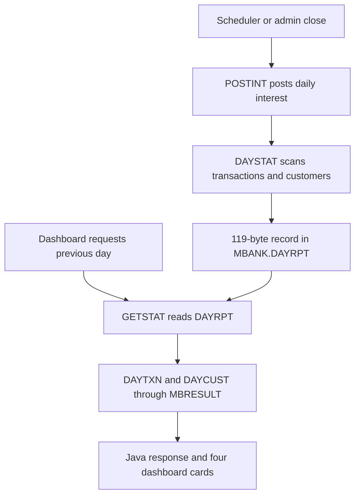

# Previous-day close summary

This dashboard panel is a view of a durable closed-day report produced by MVS. Opening the page does not recalculate interest or scan the live transaction file. It requests the already stored report for a business date and currency.



## 1. What the operator sees

The panel displays the report state, business date and four cards:

| Card | Displayed value | Supporting line |
|---|---|---|
| Total closed-day operations | completed deposits + withdrawals + interest postings | interest count and total interest amount |
| Cash deposits during the day | total amount of completed deposits | deposit count |
| Cash withdrawals during the day | total amount of completed withdrawals | withdrawal count |
| Active customers at day close | customers whose stored status was `A` | customers created on the business date |

The badge is `CLOSED` only for a successfully parsed report. During loading it shows `LOADING`; after a failed request it shows `UNAVAILABLE`.

## 2. Frontend ownership and date selection

[`DashboardPage.jsx`](https://github.com/StormSister/MoniBank/blob/main/monibank-frontend/src/pages/DashboardPage.jsx) renders the panel. It calls [`useDailyCloseReport`](https://github.com/StormSister/MoniBank/blob/main/monibank-frontend/src/hooks/useDailyCloseReport.js) with currency `EUR` and no explicit date.

The hook chooses, in order:

1. a date passed by the caller;
2. build-time `VITE_DAILY_CLOSE_DATE` when configured;
3. the previous day calculated in the browser.

It then requests `GET /api/dashboard/daily-close?date=<date>&currency=EUR` under the TanStack Query key `['daily-close', date, currency]`.

There is no polling interval for this report. The application-wide query configuration considers it fresh for 60 seconds and does not refetch on window focus. The error banner provides an explicit **Try again** button. This differs from the live status and operation widgets, which poll periodically.

## 3. HTTP and Java read path {#read-path}

[`DailyCloseReportController`](https://github.com/StormSister/MoniBank/blob/main/monibank-backend/src/main/java/com/monibank/mainframe/dashboard/api/DailyCloseReportController.java) accepts an ISO date and a three-letter uppercase currency. If another client omits the date, the controller defaults to the previous server-local day; the dashboard normally sends its selected date explicitly.

[`DailyCloseReportService`](https://github.com/StormSister/MoniBank/blob/main/monibank-backend/src/main/java/com/monibank/mainframe/dashboard/DailyCloseReportService.java) maintains an in-memory, access-ordered cache of at most eight date/currency reports. A cache hit returns immediately. A miss executes the read-only mainframe operation `GETSTAT` with an 11-character input:

```text
yyyyMMddCCC
```

For example, `20260914EUR` requests the EUR report for 14 September 2026.

## 4. What GETSTAT reads

[`GETSTAT.cob`](https://github.com/StormSister/MoniBank/blob/main/monibank-backend/src/main/resources/cobol/statistics/GETSTAT.cob) performs a keyed `CICS READ` on `DAYRPT`. The key is 11 characters: eight for the business date and three for the currency.

It requires an exact 119-byte record in state `C`, with a date and currency matching the request. A missing key produces `RPTNOTF`. On success it emits:

- one `MBR;D` record with entity `DAYTXN`;
- one `MBR;D` record with entity `DAYCUST`;
- a final `MBR;S` header with status `C` and the stored result code.

The records travel through the common [`MBRESULT result channel`](./mbresult). `GETSTAT` reads the durable report; it does not browse `TXNFILE` or `CUSTFILE` itself.

## 5. How the report is produced {#production}

When daily close is enabled, [`DailyCloseScheduler`](https://github.com/StormSister/MoniBank/blob/main/monibank-backend/src/main/java/com/monibank/mainframe/dashboard/DailyCloseScheduler.java) uses the configured cron and zone. Repository defaults are `00:05` in `Europe/Warsaw`, but the production feature is disabled unless `MB_DAILY_CLOSE_ENABLED` enables it.

The scheduler closes the previous calendar day in the configured zone. The same orchestration can be invoked through the protected admin endpoint. [`DailyCloseOrchestrator`](https://github.com/StormSister/MoniBank/blob/main/monibank-backend/src/main/java/com/monibank/mainframe/dashboard/DailyCloseOrchestrator.java) prevents two closes from running inside one backend instance and takes the exclusive VSAM coordinator lock for the whole flow:

1. `POSTINT` posts daily interest;
2. `DAYSTAT` calculates and stores the report;
3. Java places the returned report in the in-memory cache.

Startup catch-up is separately configurable. Before performing a catch-up close, it tries `GETSTAT` first so a backend restart does not repeat an already completed day merely because the Java cache is empty.

## 6. How DAYSTAT calculates every figure

[`DAYSTAT.cob`](https://github.com/StormSister/MoniBank/blob/main/monibank-backend/src/main/resources/cobol/statistics/DAYSTAT.cob) browses the `TXNID` alternate path and then `CUSTFILE`.

For transaction totals it includes only records that satisfy all three conditions:

- status is completed (`C`);
- creation date equals the requested business date;
- currency equals the requested currency.

Only types `DP`, `WD` and `IN` increment the operation count. Their counts and amounts are also accumulated separately. Consequently, **Total closed-day operations is a transaction count from VSAM, not the number of entries in the Java operation journal**.

The customer browse has different semantics:

- total, active and inactive counts describe all customer records visible at close time;
- new-customer count includes records whose creation date equals the business date;
- the customer summary uses scope `ALL`, not the requested transaction currency.

## 7. Persistence and reruns

`DAYSTAT` writes one 119-byte `MBANK.DAYRPT` record keyed by business date and currency. It stores the counts, amounts, request ID, state `C`, result `OK` and a logical close timestamp of `23:59:59` on the business date.

The first close uses `CICS WRITE`. If the key already exists, a rerun reads it for update and uses `CICS REWRITE`. Interest posting is designed to be idempotent per account and business date: `POSTINT` uses a deterministic transaction ID, and a duplicate record means that account/day has already been posted. A rerun can therefore replace the summary without intentionally creating a second interest transaction.

This design makes `DAYRPT`, not the Java cache, the durable source used after a restart.

## 8. Parsing, failures and UI fallback {#failures}

[`DailyStatisticsResultParser`](https://github.com/StormSister/MoniBank/blob/main/monibank-backend/src/main/java/com/monibank/mainframe/dashboard/mainframe/DailyStatisticsResultParser.java) requires exactly one `DAYTXN` and one `DAYCUST` payload, each 119 characters. It cross-checks their dates, customer scope, request ID, final status and result code before producing `DailyCloseReportResponse`.

The API distinguishes:

- HTTP `404` / `DAILY_CLOSE_REPORT_NOT_FOUND` when MVS returns `RPTNOTF`;
- HTTP `503` / `DAILY_CLOSE_REPORT_UNAVAILABLE` when the report cannot be loaded reliably.

The dashboard keeps the live transaction panel available in either case. A missing historical report therefore does not imply that the current mainframe or live transaction path is offline.

## Active path versus supporting code

The active dashboard path is the online `GETSTAT` operation through the terminal gateway. The repository also contains JCL-oriented `DailyCloseBatchExecutor` and `DailyCloseReportExecutor` components, but neither the current dashboard controller nor the active scheduler injects them. They must not be presented as the source of this panel's current production response.
