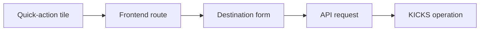

# Dashboard quick actions

The six quick-action tiles at the bottom of the dashboard are navigation shortcuts. Clicking one does **not** immediately execute a mainframe operation. The tile opens the appropriate screen and, where needed, supplies a query parameter that selects the intended form.

## Route map {#routes}

| Tile | Route | Effect on the destination page |
| --- | --- | --- |
| New Customer | `/customers?action=new` | requests the new-customer form |
| Open Account | `/accounts?action=new` | requests the new-account form |
| Deposit | `/cash-desk?operation=deposit` | selects the deposit workflow |
| Withdraw | `/cash-desk?operation=withdrawal` | selects the withdrawal workflow |
| Issue Card | `/cards?action=new` | requests the new-card form |
| Statement | `/statements` | opens the statements screen |

The navigation is implemented by React Router in `DashboardPage`. No request body, customer data or account data is carried from the dashboard.

## Where the business work begins {#submission-boundary}

The destination page owns validation, user input and the API call. This boundary matters:

Closing or leaving the destination form before submission therefore produces no mainframe operation and no operation-journal entry.

## Detailed process documentation

The individual routes will be documented separately because their payloads, validation rules and COBOL programs differ. The customer flow is already available:

- [Add customer: from the operator form to a VSAM record](./add-customer)

The following pages will extend the same evidence-based format:

- opening an account;
- making a deposit or withdrawal;
- issuing a card;
- generating a statement.
