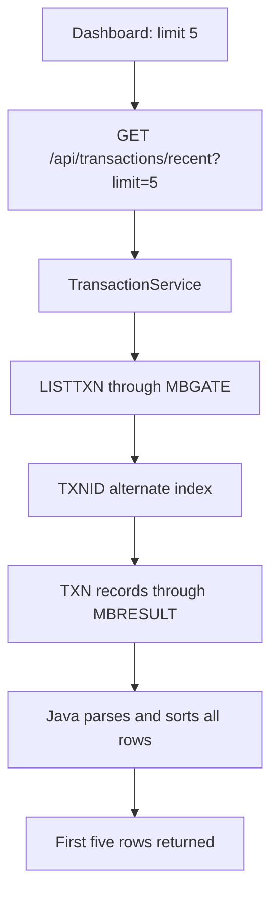

# Recent Transactions · Live

This dashboard panel is a short view of transactions stored in the mainframe VSAM data set. The word **Live** means that the data is requested through the active KICKS terminal path. It does not mean that the table receives a continuous event stream.

## What the operator sees

The dashboard asks for five rows and presents:

| Column | Source field | Presentation |
| --- | --- | --- |
| Date & time | `createdAt` | `yyyyMMddHHmmss` rendered as date and minutes |
| Type | `type` | `DP`, `WD` and `IN` become Deposit, Withdrawal and Interest |
| Account | `accountId` | mainframe account identifier |
| Detail | `detail` | shortened visually when it is too long |
| Amount | `direction`, `amount`, `currency` | debit is negative; credit is positive |
| Balance after | `balanceAfter`, `currency` | balance recorded by the transaction |
| Status | `status` | `C`, `P`, `F` become Completed, Pending, Failed |

The **Open statements** link navigates to the Statements page. It does not pass the five dashboard rows as a statement.

## Request path {#request-path}

`useRecentTransactions(5)` creates the frontend query. The controller accepts limits from 1 to 50, although this panel always requests five.

## What LISTTXN does

For the recent endpoint Java invokes `LISTTXN` with an empty input. That selects the all-transactions browse mode.

The COBOL program:

1. starts a CICS browse on `TXNID`, the path over the transaction-ID alternate index;
2. reads every available 119-byte transaction record;
3. converts packed decimal amounts and balances into printable fields;
4. sends one `MBR;D` record with entity type `TXN` for every result;
5. finishes with an `MBR;S` header and code `OK`.

An empty VSAM result is valid and produces an empty list. CICS browse, read, end-browse or result-spool failures produce an error rather than a partial successful response.

## Parsing, ordering and the real limit {#limit}

The Java parser requires every printable transaction payload to contain exactly 119 characters. It maps the payload into the API response and sorts the complete result by:

1. `createdAt`, newest first;
2. `transactionId`, descending when timestamps match.

Only after that does `getRecentTransactions(limit)` take the requested number of rows.

::: warning Current scaling boundary
The `limit=5` parameter limits the HTTP response, not the mainframe browse. `LISTTXN` still reads and returns the complete transaction file before Java sorts it and keeps five records. This is correct for the current educational data set, but a larger system should move the limit or paging boundary closer to VSAM.
:::

## When the panel refreshes {#refresh}

This query has no polling interval. It loads through React Query and uses the application's one-minute stale time; refetch-on-window-focus is disabled.

A deposit or withdrawal completed through this frontend updates the transaction cache immediately and then invalidates active transaction queries. Consequently the new transaction can appear without a full page reload.

Transactions created elsewhere — for example an interest posting during daily close — do not push an event into this table. They become visible after a new query, such as a page reload. This is why **Live** must not be interpreted as WebSocket or server-sent-event streaming.

## Empty and failure states

- While the query is running, the table shows loading rows.
- A successful response with no records shows **No transactions found**.
- A failed request shows **Could not load transactions from the mainframe**.

The panel reports transaction-read availability independently from the previous-day summary above it. One can fail while the other remains usable because they execute different mainframe operations and read different VSAM files.
