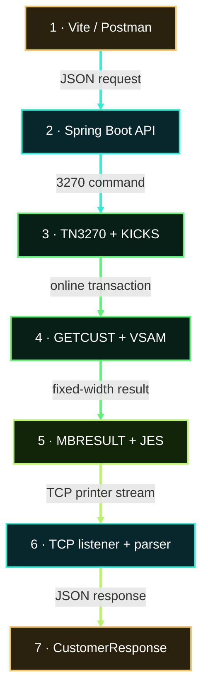

# Legacy Bank architecture

Legacy Bank is the actively developed MVS 3.8J branch of MoniBank. The command and its result use two separate integration channels.

<strong>Command path:</strong> Vite or Postman → Java → 3270/KICKS → COBOL/VSAM <strong>Result path:</strong> COBOL → MBRESULT/JES → Java → JSON response

The persistent terminal channel carries the online command. The JES class-Z virtual-printer channel returns the correlated fixed-width result to the Java TCP listener, where it is parsed and mapped to the HTTP response.

The first technical article will expand this overview and trace the working **GET CUSTOMER** implementation class by class and program by program.

[View the source code on GitHub](https://github.com/StormSister/MoniBank) · [Back to the project overview](/)