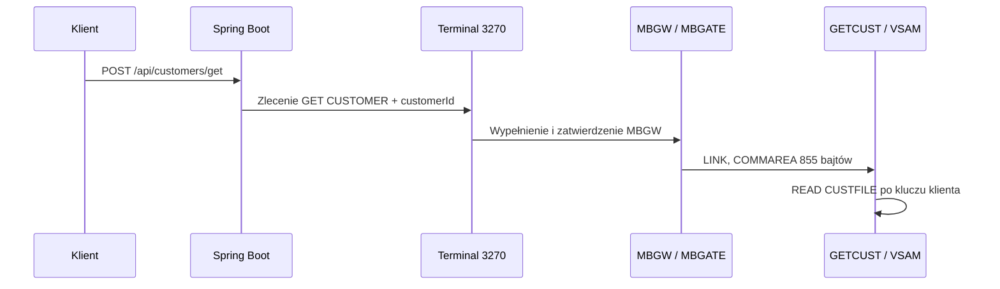
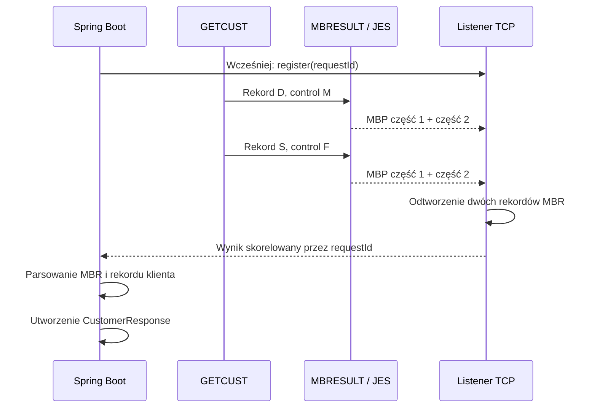

# To wygląda jak zwykłe API JSON. Kończy się w MVS, COBOL-u, VSAM-ie i JES-ie

**Jak MoniBank zamienia jedno żądanie HTTP w zautomatyzowaną transakcję 3270 na MVS 3.8J — a następnie przekształca rekordy mainframe o stałej długości z powrotem w czysty JSON.**

Na pierwszy rzut oka w tym żądaniu nie ma nic niezwykłego:

```http
POST /api/customers/get
Content-Type: application/json

{ "customerId": "C000000000006" }
```

> **Przechwycony wynik działania:** poniższy request i odpowiedź pochodzą z działającego środowiska developerskiego. Repozytorium potwierdza protokół oraz udany odczyt `C000000000006`, ale bootstrap seeder w repo nie zawiera widocznych niżej danych przypominających dane osobowe.

Odpowiedź wygląda równie znajomo:

```json
{
  "customerId": "C000000000006",
  "countryCode": "PL",
  "nationalId": "***********",
  "firstName": "MONIKA",
  "lastName": "TESTOWA",
  "dateOfBirth": "19840526",
  "status": "A",
  "createdAt": "20260826110000"
}
```

Wygląda to jak jedna z milionów wymian JSON wykonywanych w każdej minucie. Dane klienta nie zostały jednak odczytane z PostgreSQL ani usługi chmurowej. Java uruchomiła transakcję przez zautomatyzowany terminal 3270, program COBOL działający pod KICKS odczytał 119-bajtowy rekord VSAM na MVS 3.8J, a JES dostarczył wynik przez połączenie wirtualnej drukarki.

Każda część wykonuje zadanie, które rozumie najlepiej:

- HTTP i JSON pozostają publicznym kontraktem;
- Spring Boot odpowiada za walidację, orkiestrację, korelację, timeouty i mapowanie;
- 3270 jest kanałem poleceń;
- KICKS i COBOL realizują transakcję online i dostęp do VSAM;
- JES jest asynchronicznym transportem wyniku;
- protokół ramek omija limit spool KICKS bez zmiany logicznego formatu odpowiedzi.

Ten artykuł śledzi jedno prawdziwe wywołanie `GETCUST`.

> **Wersja implementacji:** artykuł został sprawdzony z publicznym commitem [`b4247cc`](https://github.com/StormSister/MoniBank/commit/b4247cc9d88e8221bdd4f007a313f3554c3a367a). Obserwacje z działającego środowiska, których nie da się odtworzyć wyłącznie z plików repozytorium, oznaczam wprost.

> **Precyzja historyczna:** zamiast mówić o „API z 1978 roku”, bezpieczniej użyć określenia „linia MVS wywodząca się z końca lat siedemdziesiątych”. Istotą projektu nie jest marketingowa data, lecz wymiana prawdziwych danych pomiędzy współczesnym Springiem a 24-bitowym środowiskiem MVS wywodzącym się bezpośrednio z tej epoki.

## Architektura: dwa kanały jednej operacji

Wywołanie `GET CUSTOMER` nie wraca tą samą drogą, którą zostało wysłane. Terminal 3270 przekazuje polecenie, natomiast ustrukturyzowany wynik dla API wraca osobnym kanałem przez JES i listener TCP w Javie.

### 1. Polecenie: HTTP → terminal 3270 → COBOL



Spring Boot waliduje request i umieszcza polecenie w kolejce. Stały worker terminalowy pobiera je, wypełnia pola transakcji `MBGW` i zatwierdza ekran. `MBGATE` buduje 855-bajtową COMMAREA i wykonuje `LINK` do `GETCUST`, który odczytuje klienta z `CUSTFILE`.

### 2. Wynik: COBOL → JES → listener TCP → JSON



`MBRESULT` zapisuje dwa logiczne rekordy MBR: rekord danych `D` oraz końcowy rekord sukcesu `S`. Każdy z nich dzieli na dwie fizyczne ramki MBP. Listener TCP odbiera cztery ramki, składa z nich dwa rekordy MBR i przekazuje wynik do oczekującego requestu HTTP.

| Kanał | Odpowiedzialność |
|---|---|
| HTTP + terminal 3270 | wysłanie polecenia `GET CUSTOMER` |
| MBRESULT + JES + TCP | dostarczenie ustrukturyzowanego wyniku |
| `requestId` | połączenie wyniku z właściwym requestem HTTP |

## 1. Granica HTTP jest celowo zwyczajna

`CustomerController` udostępnia:

```java
@PostMapping("/get")
public ResponseEntity<CustomerResponse> getCustomer(
        @Valid @RequestBody GetCustomerRequest request
) {
    return ResponseEntity.ok(customerService.getCustomer(request));
}
```

`GetCustomerRequest` sprawdza klucz, zanim zostanie zajęta sesja terminalowa:

```java
public record GetCustomerRequest(
        @NotBlank
        @Pattern(regexp = "^C[0-9]{12}$")
        String customerId
) {}
```

Odpowiedź HTTP 400 jest tańsza i czytelniejsza niż kolejkowanie błędnego żądania, sterowanie terminalem, uruchamianie COBOL-a i dopiero późniejsze zwracanie `BADID`.

## 2. Serwis wybiera ścieżkę KICKS online

`CustomerService.getCustomer()` wywołuje:

```java
MainframeResult result = kicksMainframeOperationExecutor.execute(
        CustomerMainframeOperations.GET_CUSTOMER,
        request.customerId()
);
```

`CustomerMainframeOperations.GET_CUSTOMER` oznacza operację `GETCUST`. Ta ścieżka **nie buduje JCL i nie wysyła joba**. Przekazuje żądanie do długotrwałej sesji KICKS.

Po otrzymaniu rezultatu serwis wymaga dokładnie jednego rekordu `CUSTOMER` i sprawdza, czy zwrócone ID odpowiada ID z requestu. Korelacja chroni transport; ta kontrola chroni wynik domenowy.

## 3. Najpierw korelacja, dopiero potem ruch

`KicksMainframeOperationExecutor`:

1. sprawdza operację i limity wejścia;
2. pobiera aktywny `KicksTerminalSessionManager`;
3. generuje ośmioznakowy request ID, np. `R2501452`;
4. wywołuje `MainframeResponseExecutor` z funkcją wysyłającą request terminalowy.

Krytyczna kolejność w `MainframeResponseExecutor` to:

```text
zarejestruj requestId w MainframeTcpResultListener
wyślij request przez terminal
czekaj na wynik
```

Rejestracja następuje przed wysłaniem, ponieważ wynik z drukarki może przyjść bardzo szybko. Każda ramka i każdy rekord logiczny zawierają ten sam request ID, dzięki czemu wspólny listener rozdziela odpowiedzi.

## 4. Java uruchamia i utrzymuje KICKS razem z aplikacją

`KicksTerminalSessionManager` jest właścicielem kolejki oraz jednego stałego workera 3270. Metoda oznaczona `@PostConstruct` uruchamia worker razem z aplikacją Spring, ale inicjalizacja jest asynchroniczna. Worker nadal musi osiągnąć stan `READY`, zanim zacznie przetwarzać kolejkę:

1. łączy się z TN3270;
2. loguje się do TSO;
3. uruchamia KICKS;
4. otwiera ekran bramki MoniBank `MBGW`;
5. pozostaje gotowy na kolejne requesty.

W logach potwierdzają to:

```text
MBGW terminal session is READY
Persistent KICKS terminal session is ready to accept MBGW requests
```

Polecenie startowe nie jest na stałe wpisane w klasę sesji — pochodzi z `KicksTerminalProperties.kicksStartupCommand`. W pokazanym środowisku automatyzacja wpisuje w terminalu:

```text
EXEC 'HERC01.CMDPROC(MBKICKS)'
```

Dla endpointu powstaje:

```text
MbgwRequest(
  operation = GETCUST,
  requestId = R2501452,
  input     = C000000000006
)
```

Worker wypełnia na ekranie MBGW operację, request ID, długość danych `0013` oraz customer ID i naciska Enter. Przeglądarka nie komunikuje się z TN3270 bezpośrednio, a kontroler ani serwis nie sterują terminalem. Właścicielem sesji i serializacji dostępu jest manager.

MBGW wyświetla również czytelny dla człowieka widok wyniku, a Java czeka na zgodny request ID oraz status `SUCCESS` lub `ERROR`. Java nie parsuje jednak tego ekranu do `CustomerResponse`. Dla endpointu terminal pozostaje kanałem poleceń i kontroli, natomiast autorytatywny wynik danych wraca przez JES i listener TCP.

Źródła: [`KicksTerminalSessionManager`](https://github.com/StormSister/MoniBank/blob/main/monibank-backend/src/main/java/com/monibank/mainframe/hercules/terminal/KicksTerminalSessionManager.java) i [`KicksTerminalSession`](https://github.com/StormSister/MoniBank/blob/main/monibank-backend/src/main/java/com/monibank/mainframe/hercules/terminal/KicksTerminalSession.java).

## 5. MBGW, MBGATE i 855-bajtowa COMMAREA

`MBGW` jest identyfikatorem transakcji wpisywanym w terminalu, a `MBGATE` — jej programem bramki. `MBGATE` odbiera mapę BMS, waliduje pola ekranowe, buduje 855-bajtową COMMAREA, wybiera program według nazwy operacji i wykonuje `LINK` do `GETCUST`.

`GETCUST` sprawdza:

- `EIBCALEN = 855`;
- wersję protokołu `01`;
- operację `GETCUST`;
- niepusty request ID;
- input length `0013`;
- 13-znakowy klucz klienta.

Następnie wykonuje kluczowy odczyt VSAM:

```cobol
EXEC CICS READ
    FILE('CUSTFILE')
    INTO(WS-CUSTOMER-RECORD)
    LENGTH(WS-RECORD-LENGTH)
    RIDFLD(WS-CUSTOMER-ID)
    KEYLENGTH(WS-KEY-LENGTH)
    RESP(WS-RESP)
    RESP2(WS-RESP2)
END-EXEC.
```

`CUSTFILE` zawiera rekord o długości 119 znaków:

| Offset | Długość | Pole |
|---:|---:|---|
| 0 | 1 | status |
| 1 | 13 | customer ID |
| 14 | 2 | country code |
| 16 | 11 | national ID |
| 27 | 30 | first name |
| 57 | 40 | last name |
| 97 | 8 | date of birth |
| 105 | 14 | created timestamp |

`DFHRESP(NOTFND)` staje się kontrolowanym wynikiem `E` z kodem `NOTFOUND`. Sukces tworzy rekord danych, a później rekord końcowy.

Kod używa składni `EXEC CICS`, ale działa pod KICKS. Preprocesor KICKS akceptuje zgodną składnię poleceń CICS i tłumaczy ją dla runtime’u KICKS; projekt nie twierdzi, że uruchamia IBM CICS na MVS 3.8J.

Źródła: [`MBGATE.cob`](https://github.com/StormSister/MoniBank/blob/main/monibank-backend/src/main/resources/cobol/application/gateway/MBGATE.cob), [`GETCUST.cob`](https://github.com/StormSister/MoniBank/blob/main/monibank-backend/src/main/resources/cobol/application/customers/GETCUST.cob) i [`PUTGWCA.jcl`](https://github.com/StormSister/MoniBank/blob/main/monibank-backend/src/main/resources/jcl/application/build/kicks/PUTGWCA.jcl).

## 6. Logiczny protokół D ... S/E

MoniBank używa logicznych rekordów po 160 znaków:

```text
MBR;D;CUSTOMER;R2501452;<119-bajtowy fixed-width payload>
MBR;S;GETCUST;R2501452;C000000000006;A;OK
```

- zero lub więcej `D` przenosi dane;
- `S` kończy odpowiedź sukcesem;
- `E` kończy odpowiedź błędem;
- każdy rekord zawiera request ID;
- odpowiedź nie jest kompletna przed `S` lub `E`.

`GETCUST` najpierw tworzy `D`, a potem `S` albo `E`. Większe operacje będą mogły wysłać wiele rekordów `D`.

## 7. Program wynikowy MBRESULT

`GETCUST` nie pisze samodzielnie całej obsługi spool. Wywołuje wspólny program wynikowy:

```cobol
PERFORM CALL-MBRESULT THRU CALL-MBRESULT-EXIT
```

Dla rekordu `D` przekazuje kontrolę `M` — więcej rekordów nadejdzie. Dla końcowego `S` albo `E` przekazuje `F`.

`MBRESULT`:

1. przyjmuje gotowy logiczny rekord `X(160)`;
2. otwiera raport spool klasy `Z`;
3. zwraca ośmioznakowy token w 185-bajtowej COMMAREA `MBRSCA`;
4. zapisuje fizyczne ramki;
5. przy `M` pozostawia raport otwarty;
6. przy `F` zamyka raport, aby JES mógł go dostarczyć.

To `GETCUST`, jako caller, zachowuje tę samą call area pomiędzy wywołaniami i przekazuje token ponownie przy drugim `LINK`. Udany odczyt oznacza dwa wywołania `MBRESULT`: `D/M`, a następnie `S/F`.

Źródła: [`MBRESULT.cob`](https://github.com/StormSister/MoniBank/blob/main/monibank-backend/src/main/resources/cobol/application/result/MBRESULT.cob) i [`MBRSCA.cpy`](https://github.com/StormSister/MoniBank/blob/main/monibank-backend/src/main/resources/cobol/application/result/MBRSCA.cpy).

## 8. Problem 27 bajtów

Pierwsza implementacja próbowała wykonać `SPOOLWRITE` dla 160 znaków. MBGW zakończył operację jako `ERROR`, a Java po pięciu sekundach otrzymała timeout.

Timeout był skutkiem:

```text
GETCUST stworzył poprawny MBR X(160)
MBRESULT wykonał SPOOLWRITE
SPOOLWRITE zawiódł
nie powstał kompletny SYSOUT
listener nie otrzymał wyniku
Java przekroczyła timeout
```

Po dodaniu diagnostyki zobaczyłam:

```text
RESP=22
RESP2=27
```

`RESP=22` oznaczało `LENGERR`, a `RESP2=27` — przekroczenie dozwolonej długości o 27. Limit tej ścieżki wynosił 133 znaki.

Batch działał z 160 znakami, ponieważ najpierw zapisywał dataset `LRECL=160`, a IEBGENER przenosił go do SYSOUT. Dynamiczne `SPOOLWRITE` KICKS jest inną ścieżką.

Nie skróciłam protokołu do 133. Zachowałam wspólny rekord 160-bajtowy i zmieniłam wyłącznie fizyczny transport.

## 9. Dwie ramki MBP po 80 bajtów payloadu

`MBRESULT` dzieli logiczne 160 znaków na dwie równe części po 80. Fizyczna ramka ma 96 znaków:

```text
<spacja ASA>MBP;<requestId>;<part>;<80 znaków payloadu>
```

```text
 MBP;R2501452;1;<pierwsze 80 znaków MBR>
 MBP;R2501452;2;<ostatnie 80 znaków MBR>
```

Spacja na początku jest znakiem ASA carriage control. Prefiks `MBP` opisuje transport fizyczny; po złożeniu powstaje oryginalny rekord `MBR`.

96 mieści się bezpiecznie poniżej limitu 133, podział jest deterministyczny, a rekord po złożeniu pozostaje identyczny bajt w bajt.

Jeden udany odczyt tworzy więc cztery linie fizyczne: dwie ramki `MBP` dla logicznego rekordu `D` i dwie kolejne dla logicznego rekordu `S`.

## 10. JES i wirtualna drukarka klasy Z

`SPOOLOPEN OUTPUT` zwraca token, `SPOOLWRITE` zapisuje ramki, a `SPOOLCLOSE` uwalnia raport do JES. Hercules mapuje wirtualną drukarkę klasy `Z` na socket, a `MainframeTcpResultListener` utrzymuje połączenie ze strumieniem drukarki.

Odpowiedzialności są rozdzielone:

- 3270 wysyła polecenie;
- JES/printer zwraca dane;
- wątek HTTP czeka na future skorelowane request ID;
- Java nie scrapuje stron ekranu 3270.

## 11. Listener składa MBP z powrotem do MBR

`MainframeTcpResultListener` obsługuje:

- surowe `MBR;...` ze ścieżki batch;
- ramki `MBP;...` ze ścieżki KICKS.

Listener usuwa opcjonalną spację ASA i znaki sterujące, ale **nie wykonuje `trim()` na payloadzie**. Dzieli ramkę najwyżej na cztery pola:

```text
MBP ; requestId ; part ; payload
```

Limit jest ważny, ponieważ arbitralna połowa MBR może zawierać średniki. Jeśli drukarka usunęła końcowe spacje, Java dopełnia payload z prawej strony do dokładnie 80 znaków.

`PendingResult.acceptFrame()`:

1. przechowuje część 1 według request ID;
2. po nadejściu części 2 łączy `80 + 80`;
3. sprawdza odtworzony rekord;
4. przekazuje dokładnie 160 znaków do istniejącego parsera.

Następnie:

- `D` jest dodawany, a future pozostaje otwarte;
- `S` albo `E` jest dodawany i kończy future.

Stan per request ID znajduje się w mapie współbieżnej. W przyszłości ramki kilku workerów będą mogły przeplatać się w jednym strumieniu bez pomieszania odpowiedzi.

## 12. Parser protokołu i parser klienta to dwie warstwy

`MainframeResultParser` zna tylko MBR: typ rekordu, operację, kod, encję, status i fixed-width payload. Dla `D` wykonuje najwyżej pięć podziałów, aby nie zniszczyć spacji wewnątrz payloadu.

`CustomerRecordParser` zna układ 119-bajtowego klienta. Pobiera pola według offsetów, przycina osobno każde pole biznesowe i tworzy:

```java
public record CustomerResponse(
        String customerId,
        String countryCode,
        String nationalId,
        String firstName,
        String lastName,
        String dateOfBirth,
        String status,
        String createdAt
) {}
```

Dzięki temu wspólny transport i parser MBR nie zawierają wiedzy o klientach i mogą obsłużyć konta, transakcje oraz wyciągi.

## 13. Odpowiedź znowu staje się zwyczajna

`CustomerService` wymaga jednego klienta i porównuje jego ID z requestem. Spring serializuje `CustomerResponse` do JSON.

Klient API nie musi znać TSO, TN3270, MBGW, 855-bajtowej COMMAREA, 119-bajtowego VSAM, rekordów MBR X(160), ramek MBP, ASA ani drukarki JES. Złożoność jest prawdziwa, ale zamknięta za konwencjonalnym API.

## Dlaczego wynik nie wraca ekranem 3270?

Dla jednego klienta byłoby to możliwe, lecz dla wielu rekordów ekran 24×80 wymusza paginację. Layout ekranu jest kontraktem prezentacji, scraping zależy od kursora i zmian mapy, a terminal pozostaje zajęty podczas zbierania stron.

Terminal służy do komendy i krótkiego statusu. JES lepiej przenosi zmienną liczbę rekordów.

## Dalszy rozwój: więcej niż jeden terminal

Repozytorium implementuje obecnie dokładnie jeden stały worker, jedną sesję terminalową i jedną kolejkę. Możliwym kolejnym etapem jest niewielka pula oparta na osobno nazwanych użytkownikach TSO, ale pozostaje to roadmapą, a nie obecną funkcją.

Nadal potrzebne będą: lease per użytkownik TSO, kontrolowane `KSSF` i `LOGOFF`, wykrywanie sesji osieroconych, backpressure, ograniczony cleanup oraz metryki. Incydent z zablokowanym `HERC01` pokazał, że cykl życia sesji jest częścią architektury, nie pobocznym problemem.

## Co naprawdę zbudowałam — w jednym zdaniu

MoniBank udostępnia zwyczajne API JSON pobierające klienta, ale wewnętrznie Java orkiestruje stałą sesję 3270/KICKS, COBOL odczytuje kluczowy rekord VSAM, JES klasy Z transportuje wynik podzielony na ramki, a świadomy korelacji listener Java odtwarza, waliduje i parsuje dane, aby zwrócić obiekt domenowy.

## Pytania i kod źródłowy

- Pełną implementację znajdziesz w [repozytorium MoniBank](https://github.com/StormSister/MoniBank).
- Znalazłeś nieścisłość techniczną albo chcesz porozmawiać o architekturze? [Otwórz issue](https://github.com/StormSister/MoniBank/issues).
- Masz pytanie albo zauważyłeś nieścisłość? [Znajdź mnie na LinkedIn](https://www.linkedin.com/in/monika-gudalewska/).

## Materiały źródłowe

- [KICKS User’s Guide 1.5.0](https://www.kicksfortso.com/User%27s%20Guide%201.5.0/)
- [KICKS programming and spool token usage](https://www.kicksfortso.com/User%27s%20Guide%201.5.0/Programming.shtml)
- [IBM — CICS interface to JES](https://www.ibm.com/docs/en/cics-ts/6.x?topic=files-cics-interface-jes)
- [Hercules socket printer configuration](https://www.hercules-390.eu/hercconf.html)
