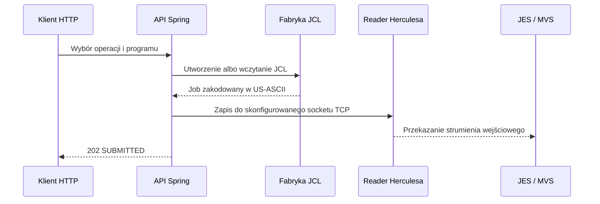

# Automatyzacja JCL i kompilacji COBOL pod Herculesem — bez udawania, że to Zowe

**MoniBank udostępnia niewielkie API Spring Boot do umieszczania spakowanych z aplikacją źródeł COBOL w PDS-ie, wysyłania JCL do Herculesa i wyznaczania stanu jobów na podstawie logów MVS. Ten artykuł opisuje dokładnie to, co znajduje się w repozytorium — oraz to, czego jeszcze tam nie ma.**

Przepływ online `GET CUSTOMER` używa stałej sesji TN3270, ponieważ wywołuje transakcję KICKS. Budowanie i utrzymywanie programów jest innym problemem. Te operacje należą do świata batch, dlatego MoniBank generuje albo wczytuje JCL i wysyła go do skonfigurowanego socketu readera Herculesa.

Zakres jest celowo znacznie węższy niż w Zowe. Rozwiązanie realizuje kilka podobnych zadań programistycznych — przeniesienie źródła, wysłanie joba i odczyt jego stanu — ale nie oferuje zakresu, protokołów ani gwarancji operacyjnych Zowe.

> **Punkt odniesienia.** Każde stwierdzenie dotyczące MoniBanku zostało sprawdzone z publicznym commitem [`ffe53ba`](https://github.com/StormSister/MoniBank/commit/ffe53ba64cf0789774e2c6a6b85f87ddac726995). Wyników zaobserwowanych wyłącznie podczas działania systemu nie przedstawiam tu jako dowodów z repozytorium.

## Co znajduje się w repozytorium

[`MainframeJobController`](https://github.com/StormSister/MoniBank/blob/ffe53ba64cf0789774e2c6a6b85f87ddac726995/monibank-backend/src/main/java/com/monibank/mainframe/api/MainframeJobController.java) udostępnia osobne operacje, a nie jeden kompletny pipeline wdrożeniowy:

| Endpoint | Implementacja w repozytorium | Co oznacza przyjęcie żądania |
|---|---|---|
| `POST /api/mainframe/jobs/put-cobol/{programName}` | Buduje job `IEBGENER` zawierający spakowane źródło COBOL | JCL zapisano do socketu readera |
| `POST /api/mainframe/jobs/compile-cobol/{programName}` | Buduje job kompilacji i link-editu `COBUCL` | JCL zapisano do socketu readera |
| `POST /api/mainframe/jobs/compile-kicks-cobol/{programName}` | Buduje job `K2KCOBCL` przeznaczony dla KICKS | JCL zapisano do socketu readera |
| `POST /api/mainframe/jobs/run-cobol/{programName}` | Buduje job uruchamiający load module | JCL zapisano do socketu readera |
| `POST /api/mainframe/jobs/submit-resource/{jclName}` | Wczytuje spakowany szablon JCL i podstawia dane logowania | JCL zapisano do socketu readera |
| `GET /api/mainframe/jobs/{jobName}` | Przeszukuje ostatnie linie logu MVS pod kątem wybranych komunikatów JES | Wyznaczony stan, jeśli nazwa joba zostanie znaleziona |

Odpowiedź `202 Accepted` i tekst `SUBMITTED` **nie** oznaczają udanej kompilacji. Oznaczają, że gateway zakończył zapis do socketu bez `IOException`.

## Wspólna ścieżka wysyłania



[`HerculesMainframeGateway`](https://github.com/StormSister/MoniBank/blob/ffe53ba64cf0789774e2c6a6b85f87ddac726995/monibank-backend/src/main/java/com/monibank/mainframe/hercules/HerculesMainframeGateway.java) otwiera połączenie TCP z `host` i `readerPort`, koduje JCL jako US-ASCII, zapisuje go, opróżnia strumień i zamyka połączenie. Nie wywołuje z/OSMF, REST API JES ani Zowe.

Ten sam gateway realizuje prostą kontrolę dostępności: próbuje połączyć się ze skonfigurowanym adresem readera z trzysekundowym timeoutem. Endpoint statusu przedstawia tę osiągalność jako `ONLINE` albo `OFFLINE`; nie jest to pełna kontrola kondycji MVS.

## 1. Umieszczenie źródła COBOL przy użyciu IEBGENER

[`MainframeResourceLoader`](https://github.com/StormSister/MoniBank/blob/ffe53ba64cf0789774e2c6a6b85f87ddac726995/monibank-backend/src/main/java/com/monibank/mainframe/hercules/MainframeResourceLoader.java) indeksuje pliki `.cob` spakowane w katalogu classpath `cobol`. Sprawdza nazwę programu zgodną z ograniczeniami MVS, odczytuje wybrane źródło jako US-ASCII i przekazuje je do [`PutCobolJclFactory`](https://github.com/StormSister/MoniBank/blob/ffe53ba64cf0789774e2c6a6b85f87ddac726995/monibank-backend/src/main/java/com/monibank/mainframe/hercules/jcl/PutCobolJclFactory.java).

Wygenerowany job uruchamia `IEBGENER`. Tekst programu COBOL trafia do wejściowego `SYSUT1`, a `SYSUT2` wskazuje:

```text
HERC01.MBANK.COBOL(programName)
```

To pragmatyczny sposób przekroczenia granicy, gdy dostępnym interfejsem jest strumień joba przypominający czytnik kart: sam transfer staje się zadaniem batchowym.

Nie należy jednak opisywać tego szerzej, niż pozwala kod. Endpoint **nie** przyjmuje dowolnego pliku źródłowego w żądaniu HTTP. Wybrane źródło musi już istnieć jako zasób spakowany z aplikacją w chwili uruchomienia Spring Boota.

## 2. Kompilacja zwykłego programu COBOL

[`CompileCobolJclFactory`](https://github.com/StormSister/MoniBank/blob/ffe53ba64cf0789774e2c6a6b85f87ddac726995/monibank-backend/src/main/java/com/monibank/mainframe/hercules/jcl/CompileCobolJclFactory.java) tworzy job z `EXEC COBUCL`:

- `COB.SYSIN` czyta `HERC01.MBANK.COBOL(programName)`;
- `COB.SYSLIB` wskazuje `SYS1.COBLIB`;
- `LKED.SYSLMOD` zapisuje `HERC01.TEST.LOADLIB(programName)`.

Fabryka dowodzi, w jaki sposób budowany jest job kompilacji i link-editu. Sama nie dowodzi, że konkretne wywołanie zakończyło wszystkie kroki akceptowalnymi kodami powrotu.

[`RunCobolJclFactory`](https://github.com/StormSister/MoniBank/blob/ffe53ba64cf0789774e2c6a6b85f87ddac726995/monibank-backend/src/main/java/com/monibank/mainframe/hercules/jcl/RunCobolJclFactory.java) udostępnia kolejną niezależną operację: uruchamia wskazany program z `HERC01.TEST.LOADLIB` jako `STEPLIB`.

## 3. Kompilacja programu przeznaczonego dla KICKS

Ścieżka KICKS nie oznacza „kompilacji przez sesję online KICKS”. [`CompileKicksCobolJclFactory`](https://github.com/StormSister/MoniBank/blob/ffe53ba64cf0789774e2c6a6b85f87ddac726995/monibank-backend/src/main/java/com/monibank/mainframe/hercules/jcl/CompileKicksCobolJclFactory.java) nadal tworzy job batchowy. Job:

- udostępnia bibliotekę procedur KICKS przez `JOBPROC`;
- uruchamia procedurę `K2KCOBCL`;
- czyta wybrany member z `HERC01.MBANK.COBOL`;
- podczas link-editu dołącza `KIKCOBGL` z `SKIKLOAD`;
- ustawia entry point i zastępowalną nazwę load module na znormalizowaną nazwę programu.

Taki jest dokładny związek tej fabryki z KICKS: specyficzna procedura kompilacji/link-editu i wejście linkera, uruchamiane jako job JES.

## Spakowane pliki JCL jako drugie źródło

Repozytorium zawiera również wielokrotnego użytku pliki `.jcl` w `src/main/resources/jcl`. [`ResourceJclLoader`](https://github.com/StormSister/MoniBank/blob/ffe53ba64cf0789774e2c6a6b85f87ddac726995/monibank-backend/src/main/java/com/monibank/mainframe/hercules/jcl/ResourceJclLoader.java) wczytuje plik na podstawie sprawdzonej nazwy i przed wysłaniem zastępuje `${JOB_USER}` oraz `${JOB_PASSWORD}`.

Indeks zasobów przechowuje lokalizacje plików, a nie wyrenderowany JCL zawierający dane logowania. Mimo to wygenerowane karty JOB zawierają poświadczenia. Jest to ograniczenie dopuszczalne w laboratorium deweloperskim, a nie model bezpieczeństwa dla produkcji.

## Pobieranie logów i wyznaczanie stanu joba

Repozytorium już oddziela sposób pobierania logów za pomocą interfejsu [`MainframeLogSource`](https://github.com/StormSister/MoniBank/blob/ffe53ba64cf0789774e2c6a6b85f87ddac726995/monibank-backend/src/main/java/com/monibank/mainframe/port/MainframeLogSource.java):

- implementacja profilu `prod` czyta skonfigurowany lokalny plik logu;
- implementacja profilu `local` wykonuje `ssh user@host tail -n ... logPath`.

[`HerculesJobTracker`](https://github.com/StormSister/MoniBank/blob/ffe53ba64cf0789774e2c6a6b85f87ddac726995/monibank-backend/src/main/java/com/monibank/mainframe/hercules/HerculesJobTracker.java) już korzysta z tej abstrakcji. Przeszukuje ostatnie 3000 linii, rozpoznaje `START JOB` i wyznacza stan na podstawie `$HASP373`, `$HASP395`, `$HASP250` oraz linii zawierających `ABEND`.

Ta sama abstrakcja może później zasilić podgląd logów na żywo w panelu operatora, ale w sprawdzonym commicie nie ma jeszcze frontendowego streamingu logów. Obecnie istnieje pobieranie logów przez backend oraz zbudowany na nim endpoint statusu joba.

Istnieje też ważna granica interpretacji: `COMPLETED` oznacza, że tracker znalazł pasującą linię `$HASP395 ... ENDED`. Kod trackera nie analizuje kodów powrotu poszczególnych kroków i nie zwraca plików spool joba.

## Czy jest to ta sama metodyka co w Zowe?

Tylko na poziomie przepływu pracy.

Oficjalna dokumentacja Zowe opisuje operacje `zos-files` służące między innymi do przesyłania lokalnych plików do zbiorów z/OS oraz `zos-jobs` do wysyłania JCL, listowania jobów i plików spool, a także odczytu statusu i wyniku spool. Są to te same kategorie potrzeb programistycznych, na które odpowiada kod MoniBanku.

Granica integracji jest jednak inna:

| Obszar | MoniBank w sprawdzonym commicie | Podstawowy przepływ Zowe |
|---|---|---|
| Umieszczenie źródła | Źródło osadzone w jobie `IEBGENER` wysyłanym do socketu readera | Operacje na plikach i zbiorach dostarczane przez narzędzia Zowe |
| Wysłanie joba | Surowy JCL US-ASCII zapisany do skonfigurowanego readera TCP Herculesa | Komendy i usługi `zos-jobs` przeznaczone dla jobów z/OS |
| Stan | Wyznaczany z ostatnich linii logu emulatora/MVS | Stan joba oraz operacje na jobach i plikach spool |
| Zakres | Endpointy Spring właściwe dla projektu i ustalone konwencje zbiorów | Ogólne narzędzia obejmujące zbiory, joby i inne usługi z/OS |

Uczciwy opis brzmi zatem: **MoniBank odtwarza niewielki podzbiór przepływów deweloperskich przypominających Zowe dla laboratorium MVS 3.8J/Hercules, wykorzystując interfejsy dostępne w tym środowisku. Nie jest implementacją ani zamiennikiem Zowe.**

Zobacz oficjalny opis [`zos-files` i `zos-jobs`](https://docs.zowe.org/stable/user-guide/cli-using-understanding-core-command-groups/) oraz [wysyłania zbiorów w Zowe Explorer](https://docs.zowe.org/stable/user-guide/ze-working-with-data-sets/).

## Czego jeszcze brakuje

Repozytorium jasno pokazuje kolejne zadania inżynierskie:

- nie ma jednej operacji, która umieszcza źródło, czeka na zakończenie, kompiluje, sprawdza kody powrotu i zwraca jeden końcowy wynik;
- `SUBMITTED` potwierdza transport do socketu readera, a nie powodzenie wykonania;
- śledzenie jobów przeszukuje ograniczony fragment logu i nie pobiera listingu kompilacji ani wyniku JES spool;
- fabryki używają stałych nazw jobów, takich jak `PUTCOB`, `CMPCOB` i `KIKCOMP`, co utrudnia jednoznaczną korelację nakładających się wywołań;
- część nazw zbiorów i kwalifikator `HERC01` są wpisane na stałe;
- w repozytorium nie ma automatycznych testów przeznaczonych dla tych fabryk, całego przepływu kontrolera ani wysyłania do readera;
- prezentowanie pobranych logów na żywo we frontendzie jest planem, a nie funkcją obecną w obecnym commicie.

Ta lista określa dzisiejszą dojrzałość kodu: jest to właściwa dla projektu warstwa integracyjna z wyraźnymi miejscami na pełny pipeline jobów, bogatszą analizę spool i podgląd operacyjny na żywo.

[Zobacz repozytorium](https://github.com/StormSister/MoniBank) · [Przeczytaj opis przepływu GET CUSTOMER](/pl/articles/get-customer)
