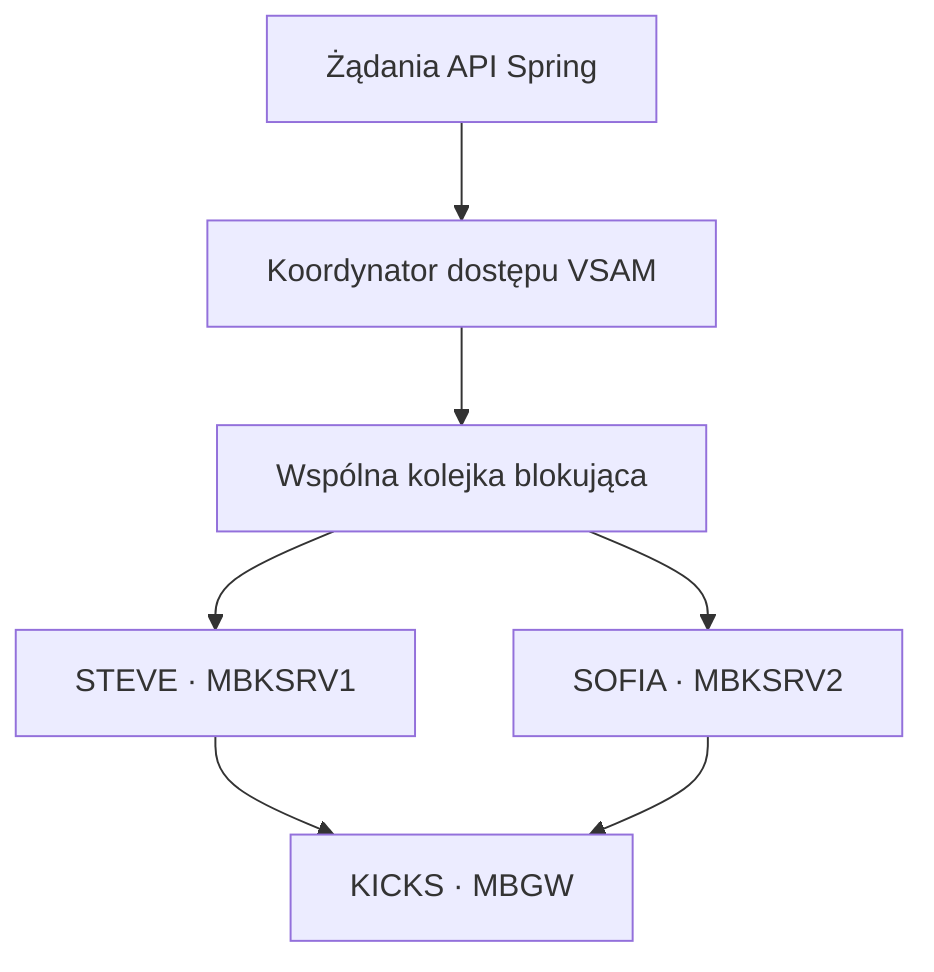

# Chciałam mieć trzy workery KICKS. Wdrożyłam dwa.

**Drugi terminal naprawdę dał MoniBankowi współbieżność. Jednocześnie odsłonił wszystko, co ukrywała jedna szczęśliwa sesja: osobne konta TSO, porty sterujące emulatorów, etapy startu, pozostawione logowania, reguły dostępu do VSAM-u, pakowanie na Linuksa i recovery.**

Pierwsza działająca integracja MoniBanku korzystała z jednej stałej sesji 3270. Java potrafiła zalogować się do TSO, uruchomić KICKS, otworzyć transakcję `MBGW`, wysłać operację i zaczekać na ustandaryzowany wynik wracający przez JES oraz listener drukarki TCP.

To potwierdziło drogę jednego żądania. Nie dowodziło, że ta droga obsłuży więcej niż jedno żądanie jednocześnie.

Początkowo zaplanowałam trzy nazwane workery: **STEVE**, **SOFIA** i **STEFANO**. Wdrożony system uruchamia obecnie STEVE i SOFIĘ. To historia o tym, dlaczego dwie działające sesje nauczyły mnie więcej niż samo ustawienie rozmiaru puli na trzy.

> **Punkt odniesienia.** Stwierdzenia dotyczące kodu sprawdziłam z publicznym commitem [`3c87a79`](https://github.com/StormSister/MoniBank/commit/3c87a799e5e0bafa683c2f368c029839b7ca958d). Obserwacje runtime oznaczam osobno — pokazują zachowanie mojego wdrożenia TK5R, ale same nie są dowodem wynikającym z repozytorium.

## Wąskie gardło ukryte przez jeden terminal

Sesja 3270 ma stan. Może znajdować się na ekranie powitalnym Herculesa, przy logowaniu TSO, wewnątrz KICKS, na mapie `MBGW` albo na niespodziewanym ekranie komunikatu. Kiedy jedna sesja wypełnia i wysyła żądanie, nie może bezpiecznie przyjąć kolejnego.

Przy jednym workerze sam terminal serializował wszystkie operacje. Wolna albo uszkodzona sesja zatrzymywała też całą ścieżkę online API.

Chciałam zbudować pulę o trzech właściwościach:

1. każdy worker posiada niezależną sesję TSO/KICKS;
2. wszystkie gotowe workery pobierają żądania z jednej wspólnej kolejki;
3. awaria jednego workera nie zatrzymuje pozostałych, a jego sesja może zostać odtworzona.

Celem nie było utworzenie trzech kopii jednego socketu. Chodziło o trzy niezależne maszyny stanów.

## Dlaczego każdy worker potrzebuje własnej tożsamości

[`KicksTerminalSessionManager`](https://github.com/StormSister/MoniBank/blob/3c87a799e5e0bafa683c2f368c029839b7ca958d/monibank-backend/src/main/java/com/monibank/mainframe/hercules/terminal/KicksTerminalSessionManager.java) sprawdza konfigurację przed uruchomieniem puli. Każdy aktywny worker musi mieć unikalne:

- logiczne ID;
- konto TSO;
- port sterujący emulatora.

Ponowne użycie konta TSO nie jest niewinnym powtórzeniem konfiguracji. MVS może odrzucić następne logowanie, ponieważ użytkownik nadal jest aktywny. Powtórzenie portu skryptowego spowodowałoby natomiast walkę dwóch workerów Javy o socket jednego emulatora.

Przyjazne imiona należą do warstwy Javy. Wdrożone mapowanie wygląda tak:

| Worker | Użytkownik TSO | Port sterujący |
|---|---|---:|
| STEVE | `MBKSRV1` | `13270` |
| SOFIA | `MBKSRV2` | `13272` |

STEFANO był nazwą planowanego trzeciego workera. Wykaz konfiguracji nadal zawiera opcjonalne trzecie miejsce na dane logowania z domyślną nazwą użytkownika `MBKSRV3`, ale aktualny profil produkcyjny zawiera wyłącznie STEVE i SOFIĘ, a domyślny rozmiar puli wynosi dwa. Dlatego opisuję STEFANO jako część drogi projektowej, a nie produkcyjnego workera, którego działanie potrafię udowodnić.

## Jedna kolejka, niezależne sesje



Manager używa jednej `LinkedBlockingQueue`. Każdy worker posiada własną sesję i odpytuje tę samą kolejkę. Żądanie nie jest na stałe przypisane do konkretnego imienia — pobierze je ten zdrowy worker, który jako pierwszy będzie wolny.

Po pobraniu wpisu dziennik zapisuje request ID, operację, nazwę workera, konto TSO i czas kolejki. Dzięki temu strona Operations może pokazać, że to samo API jest obsługiwane przez różne terminale.

Pula udostępnia też osobne stany: `CONNECTING`, `LOGGING_IN`, `STARTING_KICKS`, `OPENING_MBGW`, `READY`, `BUSY`, `RECOVERING`, `FAILED` i `CLOSED`. Jedno zbiorcze słowo ukrywałoby zbyt dużą część prawdziwego cyklu życia.

## Więcej terminali nie usuwa problemu VSAM-u

Dwie sesje mogą wykonywać równolegle dwa programy COBOL. Nie oznacza to, że każdej parze operacji należy pozwolić jednocześnie modyfikować to samo środowisko VSAM.

Przed wysłaniem żądania do terminala dodałam sprawiedliwy [`VsamAccessCoordinator`](https://github.com/StormSister/MoniBank/blob/3c87a799e5e0bafa683c2f368c029839b7ca958d/monibank-backend/src/main/java/com/monibank/mainframe/hercules/VsamAccessCoordinator.java):

- znane operacje tylko do odczytu otrzymują współdzieloną blokadę read;
- każdy zapis otrzymuje blokadę wyłączną;
- nieznana operacja jest bezpiecznie traktowana jak zapis;
- blokada jest pobierana, zanim żądanie zajmie terminal.

Niezależne odczyty mogą dzięki temu używać STEVE i SOFII równolegle, ale zapisy są celowo serializowane. Żądanie czekające na blokadę zapisu nie marnuje też jednego z dwóch terminali.

Koordynator działa wewnątrz jednego procesu. Obecna architektura zakłada więc jedną aktywną instancję backendu. Więcej replik wymagałoby koordynatora rozproszonego albo osobnego właściciela zapisów mainframe.

## Obserwacja runtime: czy dwa workery naprawdę podzieliły pracę

We wczesnym teście krzyżowym wysłałam jednocześnie `ADDCUST` i `ADDACCT`. Dziennik operacji przypisał je do różnych workerów:

| Operacja | Worker | Użytkownik TSO | Kolejka | Zapisany czas wykonania |
|---|---|---|---:|---:|
| `ADDCUST` | SOFIA | `MBKSRV2` | 0 ms | 21,168 s |
| `ADDACCT` | STEVE | `MBKSRV1` | 0 ms | 22,593 s |

Cały test PowerShell zakończył się po 22,731 sekundy, a nie po sumie czasów obu operacji. Był to użyteczny dowód, że sesje pracowały jednocześnie. **Nie** był to dowód szybkiego działania.

Ta obserwacja pochodzi sprzed wprowadzenia finalnej, konserwatywnej polityki blokowania zapisów. Obie operacje są zapisami, dlatego obecny `VsamAccessCoordinator` celowo nie pozwoliłby tej parze wykonywać się równolegle. Zachowuję ten wynik, ponieważ potwierdza zdolność puli terminali do rozdzielania pracy, a jednocześnie wyjaśnia, dlaczego współbieżność terminali potrzebowała osobnej reguły dostępu do danych.

Długie czasy skierowały mnie z powrotem do ścieżki aplikacyjnej. Po poprawieniu i ponownej kompilacji zgodnego z bramką programu `ADDCUSG` kolejne pojedyncze dodanie klienta zakończyło się po 1,389 sekundy. Nie traktuję tych dwóch obserwacji jako czystego benchmarku, ponieważ pomiędzy nimi zmieniła się wersja COBOL-a. Dokumentują dwa różne odkrycia: współbieżność działała, a liczba terminali nie była jedynym źródłem opóźnienia.

## Awaria pierwsza: terminal to coś więcej niż połączenie TCP

Pierwsze próby uruchomienia puli dochodziły do endpointu 3270, ale kończyły się komunikatami:

```text
Expected screen did not appear
Emulator socket connection timed out
```

Otwarcie socketu nie oznaczało gotowości workera. [`KicksTerminalSession`](https://github.com/StormSister/MoniBank/blob/3c87a799e5e0bafa683c2f368c029839b7ca958d/monibank-backend/src/main/java/com/monibank/mainframe/hercules/terminal/KicksTerminalSession.java) musi przejść przez prawdziwe ekrany hosta:

```text
Hercules welcome → logowanie TSO → komunikaty TSO → KICKS → MBGW READY
```

Dopiero oczekiwana mapa `MBGW` pozwala udostępnić sesję kolejce. To rozróżnienie powstrzymuje dispatcher przed wysłaniem pracy do terminala, który ma tylko otwarte połączenie sieciowe.

## Awaria druga: sesja TSO może przeżyć emulator

Zamknięcie albo utrata klienta nie gwarantuje natychmiastowego zwolnienia użytkownika przez MVS. Podczas prac spotkałam `USERID ... IN USE`, które mogło zamknąć workera w pętli odrzuconych logowań.

Komponent recovery może zażądać anulowania sesji przez interfejs operatora HTTP Herculesa, ale celowo go ograniczyłam. [`HerculesHttpTsoSessionRecovery`](https://github.com/StormSister/MoniBank/blob/3c87a799e5e0bafa683c2f368c029839b7ca958d/monibank-backend/src/main/java/com/monibank/mainframe/hercules/terminal/HerculesHttpTsoSessionRecovery.java):

- akceptuje tylko identyfikatory pasujące do `MBKSRV...`;
- wymaga, żeby użytkownik należał do skonfigurowanej sesji terminalowej;
- nie pozwala anulować dowolnego użytkownika TSO;
- zachowuje 30 sekund przerwy pomiędzy próbami anulowania.

Podczas kontrolowanego zamknięcia każdy aktywny terminal próbuje też prawidłowo opuścić KICKS i wylogować TSO. Wymuszone anulowanie jest ścieżką recovery, a nie normalnym cyklem życia.

## Awaria trzecia: Windows i Linux znały 3270, ale nie zgadzały się w jednym argumencie

Lokalnie biblioteka Javy poprawnie uruchamiała emulator Windows. W linuksowym kontenerze backendu oba workery powtarzały timeout socketu emulatora, mimo że ręczny test potwierdzał, że `s3270` potrafi otworzyć swój port skryptowy.

Różnica była na tyle mała, że łatwo prowadziła do błędnej diagnozy. Biblioteka Javy przekazywała:

```text
-scriptport localhost:13270
```

a spakowany w obrazie linuksowy `s3270` oczekiwał samego numeru:

```text
-scriptport 13270
```

Oryginalny program zachowałam jako `/usr/bin/s3270.real`, a w obrazie dodałam niewielki wrapper. [`s3270-wrapper.sh`](https://github.com/StormSister/MoniBank/blob/3c87a799e5e0bafa683c2f368c029839b7ca958d/monibank-backend/docker/s3270-wrapper.sh) usuwa prefiks `localhost:` wyłącznie z wartości `-scriptport`, a pozostałe argumenty przekazuje bez zmian.

Nie była to awaria mainframe’u. Była to różnica kontraktu integracyjnego pomiędzy biblioteką Javy a dystrybucjami emulatora.

## Recovery należy do workera, a nie do zewnętrznego skryptu restartującego

Każdy worker posiada własną pętlę. Jeżeli nie powiedzie się start, idle health check albo wykonanie requestu, worker:

1. zapisuje błąd i zwiększa licznik recovery;
2. zamyka bieżące zasoby emulatora;
3. przechodzi do `RECOVERING`;
4. czeka przez skonfigurowane opóźnienie;
5. tworzy nową sesję i powtarza pełną drogę logowania.

Bezczynne workery sprawdzają stan sesji co 15 sekund. Kiedy jeden worker się odbudowuje, pozostałe nadal mogą pobierać pracę ze wspólnej kolejki.

Manager jawnie obsługuje również zatrzymanie aplikacji: przestaje przyjmować żądania, kończy błędem wpisy nadal czekające w kolejce, dodaje po jednym znaczniku stop dla każdego workera i daje puli maksymalnie 30 sekund na zakończenie.

## Produkcyjny epilog: S522

Po wdrożeniu zaobserwowałam zakończenie obu technicznych użytkowników przez `ABEND S522`, po którym strumień aktywności pokazał:

```text
TSO session logged off
queued on TSOINRDR
started
TSO session logged on
```

Zdarzenie jest zgodne z przekroczeniem limitu oczekiwania MVS przez trwałe sesje. Pokazany fragment potwierdza, że obie sesje rozpoczęły nową sekwencję startu i logowania TSO bez restartu backendu. Sam wycinek nie zawiera jednak końcowych komunikatów `MBGW terminal session is READY`, dlatego przed nazwaniem recovery w pełni zakończonym potrzebuję jeszcze tego potwierdzenia.

Zdarzenie ujawniło też problem prezentacji. Czerwona linia `failed · ABEND S522` jest technicznie prawdziwa, ale niepełna, jeżeli chwilę później recovery kończy się powodzeniem. Chcę prezentować cały ciąg jako `session expired → recovery started → ready`, zachowując kod abendu w szczegółach technicznych.

Idle health check w Javie i aktywność konta widziana przez host nie muszą oznaczać tego samego. Nadal muszę ustalić na podstawie timestampów, czy zmienić limit dla kont technicznych, czy dodać nieszkodliwy heartbeat na poziomie hosta. Nie będę przedstawiać tej decyzji jako zakończonej przed testem.

## Dlaczego zatrzymałam się na dwóch

Celem eksperymentu nie było maksymalizowanie liczby w konfiguracji. Chciałam udowodnić izolację, planowanie pracy, bezpieczny dostęp do danych i recovery.

Dwa produkcyjne workery pokazują już:

- osobne tożsamości TSO/KICKS;
- równoległą przepustowość odczytów;
- niezależną ścieżkę recovery każdego workera, podczas gdy pętla drugiego pozostaje aktywna;
- rzeczywiste przypisanie pracy i telemetrię kolejki;
- serializację zapisów w warstwie aplikacyjnej.

Trzeci worker zwiększyłby możliwości odczytu, ale nie zamieniłby serializowanych zapisów w operacje równoległe. Dodałby też kolejne konto techniczne, emulator, port sterujący i cykl recovery. STEFANO pozostaje opcją zwiększenia pojemności, a nie miernikiem sukcesu.

## Czego się nauczyłam

1. **Pula terminali jest pulą maszyn stanów, a nie socketów.** O gotowości musi świadczyć właściwy ekran aplikacji.
2. **Tożsamość jest zasobem.** Każdy stały terminal potrzebuje własnego konta TSO i cyklu życia.
3. **Współbieżność potrzebuje reguł dla danych.** Więcej workerów bez jawnej polityki VSAM może zwiększać ryzyko zamiast przepustowości.
4. **Czas kolejki i czas wykonania odpowiadają na inne pytania.** Zero w kolejce oznacza natychmiastowe przypisanie, nie szybki program COBOL.
5. **Recovery potrzebuje granic.** Automatyczne anulowanie musi być ograniczone do znanych użytkowników technicznych.
6. **Zgodność kontenerowa nie powstaje automatycznie.** Różnica jednego argumentu emulatora uniemożliwiła start tego samego kodu Javy na Linuksie.
7. **Dwa niezawodne workery są cenniejsze niż trzy imiona na diagramie.**

Końcowa architektura jest celowo skromna: jeden proces backendu, jeden sprawiedliwy koordynator VSAM, jedna wspólna kolejka i dwie odtwarzalne sesje KICKS. To wystarczyło, żeby MoniBank przestał być demonstracją jednego terminala i stał się małym, obserwowalnym systemem integracji online — a jednocześnie uczciwie pokazuje granicę dalszego skalowania.
