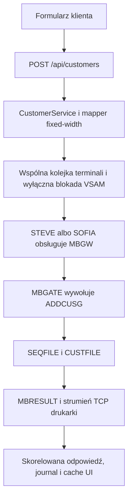

# Proces dodawania klienta

Dodanie klienta jest operacją wykonywaną od początku do końca w legacy core. Przeglądarka nie nadaje identyfikatora klienta, a Java nie zapisuje go w lokalnej bazie. Autorytatywny rekord i jego identyfikator powstają w KICKS i są przechowywane w VSAM-ie.



## 1. Co widzi operator

Na stronie Customers operator otwiera formularz **Create customer** z pięcioma polami:

| Pole | Reguła w przeglądarce | Długość na mainframe |
|---|---|---:|
| Kod kraju | dokładnie dwie wielkie litery | 2 |
| Identyfikator krajowy | dokładnie 11 cyfr | 11 |
| Imię | 1–30 dozwolonych znaków | 30 |
| Nazwisko | 1–40 dozwolonych znaków | 40 |
| Data urodzenia | wymagana, nie może być przyszła | 8 (`yyyyMMdd`) |

Podczas wykonywania operacji przycisk pokazuje `Creating in MVS…`. Po sukcesie formularz się zamyka, pojawia się nadany identyfikator i aplikacja otwiera szczegóły zwróconego klienta. Po błędzie formularz pozostaje dostępny i wyświetla komunikat API.

## 2. Frontend i sposób odświeżenia

Za modal i walidację po stronie klienta odpowiada [`CustomersPage.jsx`](https://github.com/StormSister/MoniBank/blob/main/monibank-frontend/src/pages/CustomersPage.jsx). Przed wysłaniem data z formatu HTML `yyyy-MM-dd` jest zamieniana na `yyyyMMdd`.

[`useCreateCustomer`](https://github.com/StormSister/MoniBank/blob/main/monibank-frontend/src/hooks/useCustomers.js) wysyła żądanie. Po sukcesie wstawia zwrócony rekord na początek cache TanStack Query pod kluczem `['customers']` i usuwa ewentualny wcześniejszy rekord o tym samym ID.

To natychmiastowa aktualizacja lokalnego cache przeglądarki. Frontend **nie** wykonuje ponownie `LISTCUST` po udanym dodaniu. Pełne przeładowanie pobiera listę osobnym `GET /api/customers`, który uruchamia operację `LISTCUST` w legacy core.

## 3. Granica HTTP i walidacja

Żądanie ma postać:

```http
POST /api/customers
Content-Type: application/json
```

```json
{
  "countryCode": "PL",
  "nationalId": "12345678901",
  "firstName": "Anna",
  "lastName": "Nowak",
  "dateOfBirth": "19900102"
}
```

[`CreateCustomerRequest`](https://github.com/StormSister/MoniBank/blob/main/monibank-backend/src/main/java/com/monibank/mainframe/customer/api/CreateCustomerRequest.java) powtarza najważniejsze reguły przy użyciu Jakarta Validation. Backend nie ufa więc wyłącznie walidacji w przeglądarce.

[`CustomerController`](https://github.com/StormSister/MoniBank/blob/main/monibank-backend/src/main/java/com/monibank/mainframe/customer/api/CustomerController.java) przekazuje poprawne żądanie do `CustomerService.createCustomer` i zwraca wynikowy `CustomerResponse`.

## 4. Rekord Java i tożsamość żądania

[`CustomerRecordMapper`](https://github.com/StormSister/MoniBank/blob/main/monibank-backend/src/main/java/com/monibank/mainframe/customer/mainframe/CustomerRecordMapper.java) buduje rekord fixed-width o długości 105 znaków:

| Offset | Długość | Wartość |
|---:|---:|---|
| 0 | 2 | kod kraju |
| 2 | 11 | identyfikator krajowy |
| 13 | 30 | imię |
| 43 | 40 | nazwisko |
| 83 | 8 | data urodzenia |
| 91 | 14 | czas utworzenia z Javy (`yyyyMMddHHmmss`) |

Krótsze teksty są uzupełniane spacjami z prawej strony. Znaki sterujące i wartości dłuższe niż przeznaczone dla nich pola są odrzucane.

Ośmioznakowy request ID **nie** należy do tych 105 znaków. [`KicksMainframeOperationExecutor`](https://github.com/StormSister/MoniBank/blob/main/monibank-backend/src/main/java/com/monibank/mainframe/hercules/KicksMainframeOperationExecutor.java) generuje go i przesyła osobno w COMMAREA `MBGWCA`. Ten identyfikator łączy później żądanie HTTP, wykonanie terminalowe i wynik z drukarki.

## 5. Przydział terminala i routing bramki

`ADDCUST` modyfikuje dane, dlatego [`VsamAccessCoordinator`](https://github.com/StormSister/MoniBank/blob/main/monibank-backend/src/main/java/com/monibank/mainframe/hercules/VsamAccessCoordinator.java) zajmuje wyłączną blokadę zapisu. Znane operacje tylko do odczytu mogą współdzielić blokadę odczytu; dodanie klienta nie nakłada się na inną operację chronioną jako zapis.

Żądanie trafia następnie do wspólnej kolejki w [`KicksTerminalSessionManager`](https://github.com/StormSister/MoniBank/blob/main/monibank-backend/src/main/java/com/monibank/mainframe/hercules/terminal/KicksTerminalSessionManager.java). Wpis pobiera pierwszy wolny, stały worker — STEVE używający `MBKSRV1` albo SOFIA używająca `MBKSRV2` w konfiguracji produkcyjnej — a Java zapisuje czas oczekiwania w kolejce.

Worker wypełnia i zatwierdza ekran `MBGW`. [`MBGATE.cob`](https://github.com/StormSister/MoniBank/blob/main/monibank-backend/src/main/resources/cobol/application/gateway/MBGATE.cob) sprawdza pola protokołu, buduje COMMAREA o długości 855 bajtów i dla operacji `ADDCUST` wykonuje `EXEC CICS LINK` do programu `ADDCUSG`.

Podobnie nazwany [`ADDCUST.cob`](https://github.com/StormSister/MoniBank/blob/main/monibank-backend/src/main/resources/cobol/application/customers/ADDCUST.cob) jest osobnym programem ekranowym. Nie jest celem wybieranym przez `MBGATE` w opisywanej tu ścieżce z Javy.

## 6. Identyfikator klienta i autorytatywny zapis

[`ADDCUSG.cob`](https://github.com/StormSister/MoniBank/blob/main/monibank-backend/src/main/resources/cobol/application/customers/ADDCUSG.cob) wykonuje właściwą operację:

1. Sprawdza wersję COMMAREA `01`, operację `ADDCUST`, request ID i długość wejścia `0105`.
2. Czyta do aktualizacji wpis `CUSTOMER` z `SEQFILE`.
3. Buduje ID z litery `C` i bieżącej 12-cyfrowej wartości sekwencji.
4. Zwiększa i przepisuje sekwencję przed zapisem klienta. Kod wprost zaznacza, że nieudany zapis klienta może dlatego pozostawić lukę w numeracji.
5. Buduje aktywny (`A`) rekord klienta o długości 119 bajtów.
6. Zapisuje go do `CUSTFILE` pod 13-znakowym kluczem ID klienta.

Autorytetem dla unikalnego połączenia kodu kraju i identyfikatora krajowego jest indeks alternatywny VSAM. `DUPREC` daje `DUPCUSTOMERID`, natomiast `DUPKEY` sygnalizuje konflikt klucza alternatywnego.

## 7. Transport wyniku, parsowanie i aktualizacja UI

Po sukcesie `ADDCUSG` przygotowuje jeden rekord danych klienta `MBR;D` oraz końcowy nagłówek `MBR;S`. Obsłużony błąd biznesowy kończy się rekordem `MBR;E`. Program wywołuje przez `LINK` program `MBRESULT`, który zapisuje rekordy logiczne do kanału wyniku obsługiwanego przez transport drukarki.

[`MainframeTcpResultListener`](https://github.com/StormSister/MoniBank/blob/main/monibank-backend/src/main/java/com/monibank/mainframe/hercules/MainframeTcpResultListener.java) odbiera strumień, w razie potrzeby składa ramki w 160-znakowe rekordy i przypisuje je do oczekującego żądania po request ID. Końcowe `S` albo `E` zamyka wynik; sam rekord `D` jeszcze tego nie robi.

Java sprawdza request ID, nazwę operacji i typ wyniku. `CustomerService` dodatkowo wymaga dokładnie jednego rekordu danych typu `CUSTOMER` i porównuje jego ID z identyfikatorem z nagłówka sukcesu. [`CustomerRecordParser`](https://github.com/StormSister/MoniBank/blob/main/monibank-backend/src/main/java/com/monibank/mainframe/customer/mainframe/CustomerRecordParser.java) zamienia 119-znakowy payload na odpowiedź JSON używaną przez UI.

Dopiero po tak zweryfikowanym sukcesie frontend dodaje klienta do swojego cache.

## 8. Błędy i obserwowalność

Tracker rozpoczyna pomiar jeszcze przed przydzieleniem terminala. Końcowe zdarzenie w dopisywanym pliku JSONL zawiera request ID, operację, przydzielony worker i użytkownika TSO, czas w kolejce, całkowity czas oraz jeden z trzech wyników:

- `SUCCESS` po zweryfikowanym rekordzie `MBR;S`;
- `BUSINESS_ERROR` po poprawnym i skorelowanym rekordzie `MBR;E`;
- `TECHNICAL_ERROR` przy awarii terminala, timeoutach, błędzie transportu, protokołu albo nieoczekiwanym wyjątku.

Żądanie terminalowe ma limit 30 sekund, a listener wyniku standardowo czeka pięć sekund na końcową odpowiedź z drukarki. Ponieważ `ADDCUST` jest zapisem, integracja nie ponawia go w ciemno po niejednoznacznym zachowaniu ekranu lub transportu. `MainframeResponseExecutor` najpierw sprawdza, czy dotarł już autorytatywny, skorelowany wynik — również wtedy, gdy COBOL zdążył zatwierdzić zapis, lecz terminal zawiódł podczas przygotowywania kolejnego żądania.

Journal służy do obserwowalności, a nie jako baza klientów. Błąd zapisu journala jest logowany, ale nie zmienia udanego już zapisu w VSAM-ie w nieudaną operację bankową.

## Potwierdzona granica

Ta strona opisuje aktywną ścieżkę gatewayową: `POST /api/customers` → operacja `ADDCUST` → `MBGW` → `MBGATE` → `ADDCUSG` → VSAM → `MBRESULT` → odpowiedź skorelowana przez TCP. Nie twierdzi, że samodzielna transakcja mapowa `ADDCUST` albo job batchowy uczestniczy w tym żądaniu.
