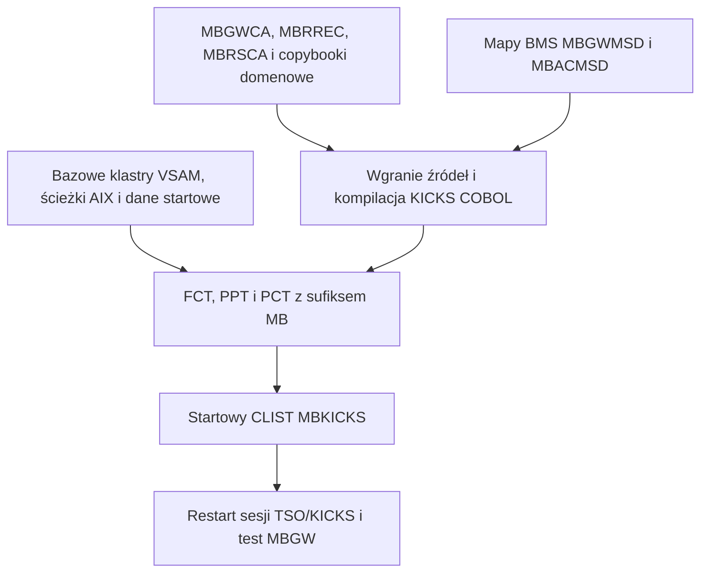

# Instalacja bramki MoniBanku na MVS

Integracja online nie powstaje przez skopiowanie jednego pliku wykonywalnego. Składają się na nią datasety VSAM, wygenerowane copybooki i mapy, load modules programów COBOL, trzy tabele KICKS oraz własny CLIST startowy. Zależności pomiędzy nimi są powodem, dla którego joby wysyłałam ręcznie i we właściwej kolejności.

::: warning Granica weryfikacji
Kolejność odtworzyłam na podstawie działającej instalacji TK5R i zależności zapisanych w repozytorium. Poszczególne elementy oraz przepływ online są potwierdzone. Nie wykonałam jeszcze jednego automatycznego testu niszczącego, który odtwarza całość od zupełnie czystego obrazu TK5.
:::

## Dlaczego API korzysta z jednej transakcji bramkowej

Sekcja MoniBanku w PCT zawiera obecnie cztery identyfikatory transakcji:

| TRANSID | Program | Rola |
|---|---|---|
| `MBH1` | `MBHELLO` | przykład diagnostyczny |
| `MBSQ` | `MBSEQRY` | diagnostyka sekwencji |
| `MBAC` | `ADDCUST` | ręczny ekran dodawania klienta |
| `MBGW` | `MBGATE` | bramka używana przez API Javy |

Nie mogę więc napisać, że cały region KICKS ma dosłownie jedną transakcję. **Integracja aplikacyjna ma jednak jeden terminalowy punkt wejścia**: każdy worker Javy pozostaje na `MBGW`, a `MBGATE` kieruje wskazaną operację do dozwolonego programu przez `EXEC CICS LINK`.

Programy biznesowe potrzebują dzięki temu wpisów w PPT, ale nie osobnego TRANSID-u w PCT dla każdej operacji. Java otrzymuje jeden stabilny protokół ekranu, jedną konwencję request ID oraz jedno miejsce routingu i kontroli odpowiedzi. Dodanie operacji oznacza rozszerzenie routingu i dodanie programu wywoływanego przez `LINK`, a nie uczenie automatyzacji terminalowej kolejnego ekranu.

`MBAC` pozostaje przydatnym ręcznym testem i narzędziem diagnostycznym. Nie uczestniczy w `POST /api/customers`; operacja gatewayowa `ADDCUST` wywołuje `ADDCUSG`.

## Mapa zależności instalacji

## Kolejność instalacji

### 1. Utworzenie trwałych danych

Najpierw powstają bazowe klastry VSAM, ich indeksy alternatywne i ścieżki, plik sekwencji oraz plik raportów dziennych. Rekordy startowe można załadować dopiero po utworzeniu ich docelowych klastrów.

Ten etap musi poprzedzać uruchomienie własnego KICKS, ponieważ `MBKICKS` alokuje nazwy DD takie jak `CUSTFILE`, `NATPATH`, `SEQFILE`, `ACCTFILE`, `CARDFILE`, `TXNFILE` i `DAYRPT`.

Odpowiednie joby znajdują się w [`jcl/application/setup/vsam`](https://github.com/StormSister/MoniBank/tree/main/monibank-backend/src/main/resources/jcl/application/setup/vsam) oraz [`jcl/application/setup/seed`](https://github.com/StormSister/MoniBank/tree/main/monibank-backend/src/main/resources/jcl/application/setup/seed).

### 2. Instalacja wspólnych copybooków

Wysłałam kolejno:

1. [`PUTGWCA.jcl`](https://github.com/StormSister/MoniBank/blob/main/monibank-backend/src/main/resources/jcl/application/build/kicks/PUTGWCA.jcl) — 855-bajtowa COMMAREA bramki;
2. [`PUTMBRCP.jcl`](https://github.com/StormSister/MoniBank/blob/main/monibank-backend/src/main/resources/jcl/application/build/kicks/PUTMBRCP.jcl) — rekord wyniku 160 bajtów i 185-bajtowa call area programu `MBRESULT`;
3. copybooki domenowe, np. `PUTACCP.jcl`, zanim skompilowałam korzystające z nich programy.

Joby zapisują members w `HERC01.KICKS.V1R5M0.COBCOPY`. Próba wcześniejszej kompilacji programu zależnego kończy się błędem preprocessora albo kompilatora.

### 3. Budowa map BMS

[`MBGWMAP.jcl`](https://github.com/StormSister/MoniBank/blob/main/monibank-backend/src/main/resources/jcl/application/build/kicks/MBGWMAP.jcl) buduje `MBGWMSD` — ekran protokołu 24×80 obsługiwany przez workery. [`MBACMAP.jcl`](https://github.com/StormSister/MoniBank/blob/main/monibank-backend/src/main/resources/jcl/application/build/kicks/MBACMAP.jcl) buduje opcjonalną ręczną mapę dodawania klienta.

Wygenerowany copybook mapy musi istnieć przed kompilacją programu COBOL zawierającego `COPY MBGWMSD` albo `COPY MBACMSD`.

### 4. Wgranie i kompilacja programów COBOL

Dla każdego programu MoniBank generuje dwa joby:

1. `PUTCOB` zapisuje źródło z repozytorium w `HERC01.MBANK.COBOL(<member>)`;
2. `KIKCOMP` uruchamia procedurę KICKS `K2KCOBCL` i wykonuje link-edit load module.

Fabrykami tych jobów są [`PutCobolJclFactory`](https://github.com/StormSister/MoniBank/blob/main/monibank-backend/src/main/java/com/monibank/mainframe/hercules/jcl/PutCobolJclFactory.java) i [`CompileKicksCobolJclFactory`](https://github.com/StormSister/MoniBank/blob/main/monibank-backend/src/main/java/com/monibank/mainframe/hercules/jcl/CompileKicksCobolJclFactory.java).

Skompilowałam `MBRESULT`, `MBGATE` oraz wszystkie programy biznesowe wskazane przez routing bramki. `MBGATE` wymaga wygenerowanej mapy i `MBGWCA`, a programy wywołujące `MBRESULT` — `MBRREC` oraz `MBRSCA`.

Każdy job trzeba sprawdzić w JES. Samo przyjęcie joba nie dowodzi, że preprocesor, kompilator i link-edit zakończyły się poprawnie.

### 5. Budowa trzech tabel KICKS

Gdy datasety, mapy i load modules były gotowe, zbudowałam tabele z sufiksem `MB`:

| Job | Tabela | Co dodaje MoniBank |
|---|---|---|
| [`KIKFCTMB.jcl`](https://github.com/StormSister/MoniBank/blob/main/monibank-backend/src/main/resources/jcl/application/build/kicks/KIKFCTMB.jcl) | FCT | nazwy DD VSAM, klastry bazowe i ścieżki alternatywne |
| [`KIKPPTMB.jcl`](https://github.com/StormSister/MoniBank/blob/main/monibank-backend/src/main/resources/jcl/application/build/kicks/KIKPPTMB.jcl) | PPT | `MBGATE`, `MBRESULT`, programy biznesowe i mapy |
| [`KIKPCTMB.jcl`](https://github.com/StormSister/MoniBank/blob/main/monibank-backend/src/main/resources/jcl/application/build/kicks/KIKPCTMB.jcl) | PCT | transakcję bramkową `MBGW` oraz transakcje diagnostyczne/ręczne |

Joby tworzą `KIKFCTMB`, `KIKPPTMB` i `KIKPCTMB`. Przebudowa tabeli nie zmienia regionu działającego nadal ze starą wersją — sesje KICKS trzeba później uruchomić ponownie.

### 6. Instalacja własnego CLIST-u MBKICKS

[`PUTMBK.jcl`](https://github.com/StormSister/MoniBank/blob/main/monibank-backend/src/main/resources/jcl/application/setup/kicks/PUTMBK.jcl) zapisuje `HERC01.CMDPROC(MBKICKS)`.

Nie jest to własna implementacja KICKS, lecz wrapper MoniBanku, który:

1. alokuje wszystkie klastry bazowe i ścieżki alternatywne pod nazwami DD używanymi przez FCT;
2. zatrzymuje start przy błędzie alokacji i wskazuje plik, którego nie udało się podłączyć;
3. uruchamia dostarczony CLIST KICKS z parametrami `PCT(MB)`, `PPT(MB)` i `FCT(MB)`;
4. zwalnia alokacje MoniBanku podczas sprzątania.

Wrapper był potrzebny, ponieważ ogólny CLIST dostarczony z KICKS nie znał datasetów MoniBanku ani sufiksu tabel MoniBanku. Pozostawienie oryginalnego CLIST-u pod spodem zachowuje logikę startową dystrybucji, a konfigurację projektu izoluje w jednym memberze.

### 7. Start i sprawdzenie ścieżki online

Po restarcie sesji TSO/KICKS samo pojawienie się ekranu powitalnego KICKS nie wystarcza. Poprawna weryfikacja wygląda tak:

1. wpisuję `MBGW` i potwierdzam mapę `READY`;
2. sprawdzam w logach backendu, czy STEVE i SOFIA osiągnęli `MBGW terminal session is READY`;
3. najpierw wykonuję operację tylko do odczytu i potwierdzam skorelowane `MBP`/`MBR` w kanale drukarki;
4. dopiero potem testuję zapis oraz sprawdzam wynik VSAM i końcowe zdarzenie w journalu operacji.

Listener drukarki i workery terminalowe należą do wdrożenia Javy. Powyższe joby MVS ich nie instalują.

## Co nadal jest wykonywane ręcznie

Repozytorium przechowuje źródła i JCL, ale nie przedstawiam instalacji mainframe jako wdrożenia jednym kliknięciem. Trzeba podstawić dane job usera, świadomie wykonywać niszczące odtworzenie VSAM-u, kontrolować return codes i restartować KICKS we właściwym momencie.

Bezpieczna automatyzacja wymagałaby idempotentnego instalatora odróżniającego utworzenie, aktualizację i seedowanie. Ślepe ponowienie obecnych jobów byłoby niebezpieczne dla trwałych danych bankowych.
