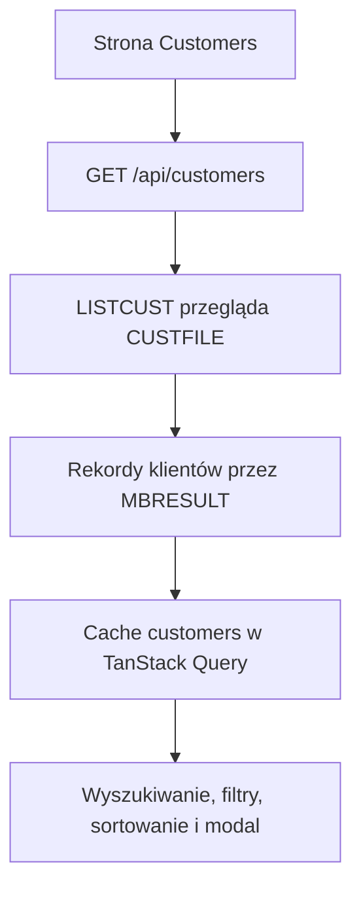

# Klienci

Strona Customers jest widokiem operatora na rejestr klientów przechowywany w rdzeniu MVS. Początkowa lista, utworzenie rekordu i zmiana statusu są operacjami legacy core; wyszukiwanie, filtrowanie, sortowanie oraz modal szczegółów są lokalnymi widokami rekordów zwróconych do przeglądarki.



## Co widzi operator

[`CustomersPage.jsx`](https://github.com/StormSister/MoniBank/blob/main/monibank-frontend/src/pages/CustomersPage.jsx) wyświetla:

- liczbę wszystkich, aktywnych i nieaktywnych klientów;
- tabelę z identyfikatorem, danymi, datami i statusem;
- lokalne wyszukiwanie po nazwie, ID klienta albo identyfikatorze krajowym;
- filtrowanie aktywnych i nieaktywnych oraz sortowanie po nazwisku lub ID klienta;
- modal szczegółów;
- akcje utworzenia klienta i zmiany statusu.

Liczniki są obliczane z pełnej listy znajdującej się obecnie w przeglądarce. Wyszukiwanie i filtry zmieniają tylko widoczne wiersze; nie wysyłają kolejnego żądania HTTP ani operacji na mainframe.

## Pobranie rejestru {#list}

[`useCustomers`](https://github.com/StormSister/MoniBank/blob/main/monibank-frontend/src/hooks/useCustomers.js) wysyła:

```http
GET /api/customers
```

[`CustomerController`](https://github.com/StormSister/MoniBank/blob/main/monibank-backend/src/main/java/com/monibank/mainframe/customer/api/CustomerController.java) przekazuje żądanie do `CustomerService.getCustomers`, który wykonuje `LISTCUST` z pustym wejściem.

[`LISTCUST.cob`](https://github.com/StormSister/MoniBank/blob/main/monibank-backend/src/main/resources/cobol/application/customers/LISTCUST.cob) sprawdza wspólną COMMAREA i wymaga długości wejścia `0000`. Następnie:

1. otwiera przeglądanie `CUSTFILE` poleceniem `STARTBR`;
2. czyta każdy 119-bajtowy rekord przez `READNEXT`;
3. wysyła jeden rekord `MBR;D` typu `CUSTOMER` dla każdego klienta;
4. kończy przeglądanie przez `ENDBR`;
5. wysyła końcowy `MBR;S` z wynikiem `OK`.

Pusty plik oznacza poprawną pustą listę, a nie błąd. Java zachowuje wyłącznie rekordy danych typu `CUSTOMER`, parsuje ich pola fixed-width i zwraca tablicę JSON. Routing przez wspólną transakcję KICKS opisuje [Bramka MBGATE](./mbgate), a transport wyniku wielorekordowego — [Kanał wynikowy MBRESULT](./mbresult).

## Widoki lokalne i granica modalu szczegółów {#local-view}

Przeglądarka przechowuje zwróconą tablicę pod kluczem TanStack Query `['customers']`. Domyślna konfiguracja aplikacji uznaje zapytanie za świeże przez 60 sekund, ponawia nieudane zapytanie raz i nie pobiera danych tylko dlatego, że okno ponownie otrzymało fokus.

Lokalnymi operacjami na tej tablicy są:

- liczniki podsumowania;
- wyszukiwanie tekstowe;
- filtrowanie statusu;
- sortowanie;
- otwarcie modalu szczegółów.

Otwarcie **Customer details** **nie** wykonuje `GETCUST`. Modal odnajduje wybrane ID w tablicy zwróconej wcześniej przez `LISTCUST`. Pokazuje więc rekord z cache listy i nie sprawdza niezależnie, czy rekord VSAM zmienił się od czasu jej pobrania.

Backend rzeczywiście udostępnia `POST /api/customers/get` i program COBOL `GETCUST`. Ten osobno zweryfikowany przepływ opisuje artykuł [Integracja GET CUSTOMER](../articles/get-customer), ale aktualny modal strony Customers go nie wywołuje.

## Utworzenie klienta

Akcja **New customer** wysyła `POST /api/customers`. Jest to operacja zapisu, w której MVS nadaje identyfikator i zapisuje autorytatywny rekord. Po sukcesie frontend wstawia zwrócony rekord do istniejącego cache `['customers']`, zamiast wykonywać ponownie `LISTCUST`.

Walidacja pól, 105-znakowe wejście, przydzielenie sekwencji, `ADDCUSG`, zapis VSAM, korelacja wyniku i błędy są już opisane na stronie [Proces dodawania klienta](./dodaj-klienta), dlatego nie powtarzam ich tutaj.

## Zmiana aktywnego statusu {#status}

Akcja aktywacji lub dezaktywacji wysyła:

```http
PATCH /api/customers/{customerId}/status
Content-Type: application/json

{"status":"A"}
```

Dozwolone są wyłącznie statusy `A` i `I`. [`CustomerRecordMapper`](https://github.com/StormSister/MoniBank/blob/main/monibank-backend/src/main/java/com/monibank/mainframe/customer/mainframe/CustomerRecordMapper.java) buduje 14-znakowe wejście `CHGCUST`: 13 znaków ID klienta i jeden znak statusu.

[`CHGCUST.cob`](https://github.com/StormSister/MoniBank/blob/main/monibank-backend/src/main/resources/cobol/application/customers/CHGCUST.cob) sprawdza wejście, czyta odpowiedni rekord `CUSTFILE` z opcją `UPDATE`, zmienia tylko status i wykonuje `REWRITE`. Zwraca kompletny zaktualizowany rekord klienta jako jeden `MBR;D`, a następnie końcowy nagłówek wyniku.

Gdy Java potwierdzi, że otrzymała dokładnie jednego klienta o oczekiwanym ID, frontend zastępuje ten rekord w `['customers']`. Nie pobiera ponownie całej listy. Dezaktywacja jest zatem zmianą statusu, a nie usunięciem: rekord pozostaje widoczny i można go ponownie aktywować.

## Autorytet danych i świeżość

| Wartość albo zachowanie | Źródło prawdy |
|---|---|
| Rekord klienta i status | `CUSTFILE` w rdzeniu MVS |
| Wygenerowany identyfikator | sekwencja MVS i program dodający klienta |
| Lista zwrócona stronie | wynik `LISTCUST` |
| Wyszukiwanie, filtr i sortowanie | bieżący stan przeglądarki |
| Zawartość modalu szczegółów | rekord `LISTCUST` znajdujący się w cache |
| Komunikat sukcesu i otwarty modal | bieżący stan przeglądarki |

Stopka `Source: LISTCUST / VSAM` opisuje pochodzenie pobranej listy. Nie oznacza, że każde lokalne sortowanie, filtrowanie lub otwarcie modalu ponownie odczytuje VSAM.

## Błędy i odświeżanie

Jeżeli początkowe pobranie listy się nie powiedzie, tabelę zastępuje komunikat błędu z jawną akcją **Retry**. Nieudane utworzenie klienta albo zmiana statusu pozostawia odpowiedni modal otwarty i pokazuje komunikat API.

Udane mutacje zmieniają lokalny cache dopiero po odebraniu i zweryfikowaniu przez Javę skorelowanego wyniku mainframe’u. Pełne przeładowanie strony, nowe zapytanie po okresie świeżości albo jawne ponowienie listy może ponownie uruchomić `LISTCUST`. Strona nie ma własnego cyklicznego pollingu.

## Powiązana dokumentacja szczegółowa

- [Proces dodawania klienta](./dodaj-klienta)
- [Integracja GET CUSTOMER](../articles/get-customer)
- [Bramka MBGATE](./mbgate)
- [Kanał wynikowy MBRESULT](./mbresult)
