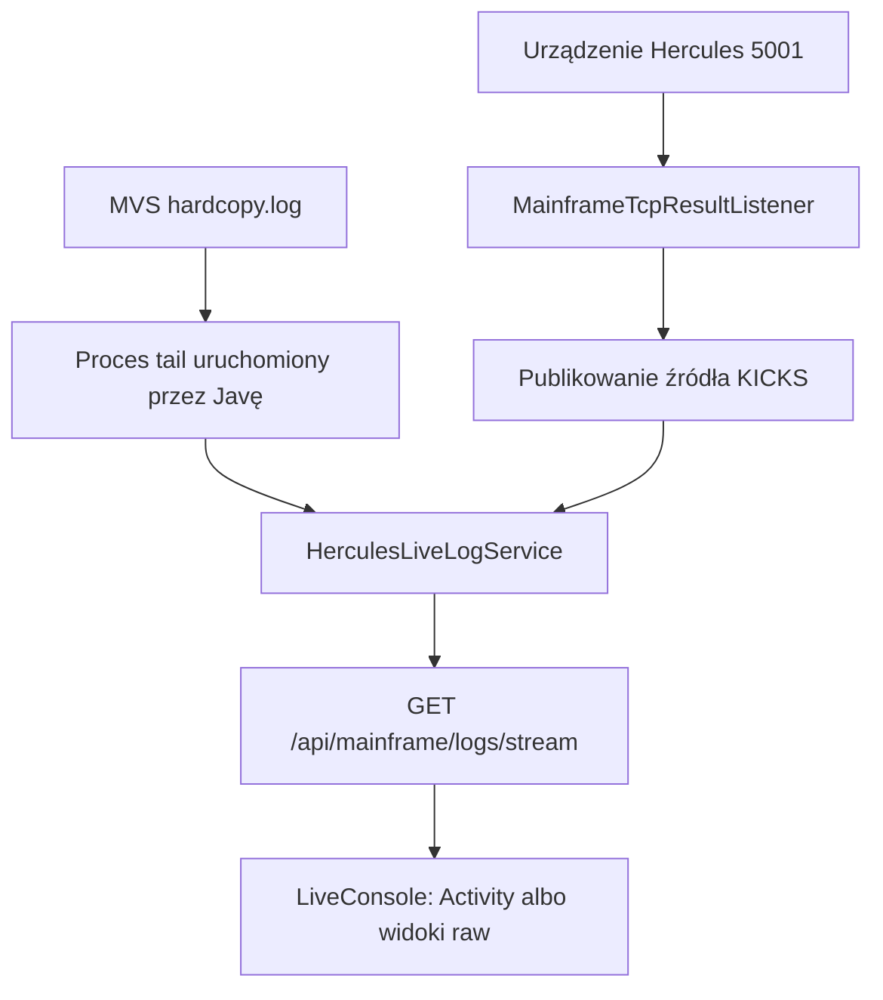

# Konsola mainframe na żywo

Konsola po prawej stronie jest tylko do odczytu i służy do obserwowania działającego środowiska legacy. Łączy dwa różne strumienie: hardcopy MVS oraz linie odbierane przez Javę z urządzenia drukarki Hercules `5001`. Nie udostępnia pola do wpisywania komend konsoli i nie jest trwałym dziennikiem operacji MoniBanku.



## Co widzi operator

[`LiveConsole.jsx`](https://github.com/StormSister/MoniBank/blob/main/monibank-frontend/src/components/layout/LiveConsole.jsx) wyświetla stały panel zawierający:

- stan połączenia i liczbę linii przechowywanych w przeglądarce;
- zakładki `Activity`, `KICKS raw` i `System raw`;
- automatyczne przewijanie i opcjonalne ukrywanie separatorów JES;
- czyszczenie lokalnego bufora;
- zmianę szerokości, pełny ekran, minimalizację i zamknięcie.

Zwykła szerokość panelu jest przechowywana w `localStorage` przeglądarki. Domyślnie wynosi 520 pikseli i jest ograniczona do przedziału 420–760 pikseli oraz szerokości dostępnego ekranu. Jest to wyłącznie stan interfejsu, niezwiązany ze strumieniem backendu.

## Dwa strumienie źródłowe {#sources}

| Widok UI | Zdarzenie SSE | Rzeczywiste źródło |
|---|---|---|
| `System raw` | `jes` | Linie śledzone w pliku hardcopy MVS środowiska Hercules |
| `KICKS raw` | `kicks` | Logiczne wyniki i pozostałe linie drukarki publikowane przez `MainframeTcpResultListener` |
| `Activity` | tworzony w przeglądarce | Wybrane zdarzenia rozpoznane w obu strumieniach |

W profilu produkcyjnym [`LocalMainframeLiveLogProcessFactory`](https://github.com/StormSister/MoniBank/blob/main/monibank-backend/src/main/java/com/monibank/mainframe/hercules/LocalMainframeLiveLogProcessFactory.java) uruchamia `tail -F` dla `MAINFRAME_LIVE_LOG_PATH`, którego wartością domyślną jest `/mainframe-logs/hardcopy.log`. Produkcyjny plik Compose montuje `/srv/monibank/mainframe-logs` w kontenerze backendu wyłącznie do odczytu.

Profil lokalny korzysta z [`SshMainframeLiveLogProcessFactory`](https://github.com/StormSister/MoniBank/blob/main/monibank-backend/src/main/java/com/monibank/mainframe/hercules/SshMainframeLiveLogProcessFactory.java). Wykonuje on takie samo `tail -F` przez SSH i może opcjonalnie uruchomić je we wskazanym kontenerze Herculesa.

Drugie źródło nie jest kolejnym śledzonym plikiem. [`MainframeTcpResultListener`](https://github.com/StormSister/MoniBank/blob/main/monibank-backend/src/main/java/com/monibank/mainframe/hercules/MainframeTcpResultListener.java) odbiera strumień drukarki `5001`, składa ramki wyników MoniBanku i publikuje otrzymane linie jako zdarzenia `kicks`. Sposób ramkowania i zamykania odpowiedzi opisuje osobna strona [Kanał wynikowy MBRESULT](./mbresult).

## Transport SSE i bufory

[`MainframeLiveLogController`](https://github.com/StormSister/MoniBank/blob/main/monibank-backend/src/main/java/com/monibank/mainframe/api/MainframeLiveLogController.java) udostępnia:

```http
GET /api/mainframe/logs/stream
Accept: text/event-stream
```

Odpowiedź wyłącza cache HTTP oraz buforowanie Nginx. [`HerculesLiveLogService`](https://github.com/StormSister/MoniBank/blob/main/monibank-backend/src/main/java/com/monibank/mainframe/hercules/HerculesLiveLogService.java) nadaje każdej linii rosnący identyfikator i nazwę źródła.

Serwis przechowuje w pamięci najwyżej 500 połączonych linii. Nowy odbiorca bez `Last-Event-ID` otrzymuje maksymalnie 100 najnowszych. Gdy identyfikator jest podany, serwis odtwarza zachowane linie o większym ID. Co 15 sekund wysyła komentarz keepalive.

[`useMainframeLiveLog`](https://github.com/StormSister/MoniBank/blob/main/monibank-frontend/src/hooks/useMainframeLiveLog.js) tworzy przeglądarkowy `EventSource`, obsługuje zdarzenia `jes` i `kicks` oraz niezależnie zachowuje 500 ostatnich linii. Licznik w nagłówku konsoli pokazuje rozmiar tego bufora przeglądarki, a nie liczbę linii w pliku hardcopy.

## Jak powstaje Activity {#activity}

`Activity` jest projekcją tworzoną we frontendzie, a nie trzecim strumieniem backendu. Przeglądarka rozpoznaje wybrane wzorce i buduje z nich krótsze komunikaty dla operatora.

Ze źródła KICKS/drukarki rozpoznaje:

- rekordy danych `MBR;D`;
- końcowe rekordy sukcesu `MBR;S` i błędu `MBR;E`;
- granice raportu dziennego `MBS;H` i `MBS;E`.

Z hardcopy rozpoznaje wybrane zdarzenia JES i TSO, między innymi zakolejkowanie i start joba, kody powrotu kroków, zakończenie, błędy JCL, ABEND-y, logowanie i wylogowanie sesji TSO oraz oczekiwanie na niedostępny dataset.

Linie niepasujące do tych reguł celowo nie pojawiają się w `Activity`, lecz pozostają dostępne w odpowiedniej zakładce raw. Tego widoku nie można zatem traktować jako pełnego hardcopy, audytu ani licznika operacji. Trwała telemetria żądań należy do dziennika Operations.

## Utrata połączenia i ponowne łączenie {#reconnection}

Java uruchamia proces śledzący hardcopy po pojawieniu się pierwszego odbiorcy SSE. Jeżeli proces `tail` lub SSH się zakończy, czeka dwie sekundy i uruchamia nowy. Przy pierwszym połączeniu pobiera 100 wcześniejszych linii; kolejne uruchomienia procesu zaczynają od nowego wyjścia.

Przeglądarka pokazuje trzy stany:

- `connecting` przed otwarciem strumienia;
- `connected` po `EventSource.onopen`;
- `reconnecting` po `EventSource.onerror`.

Ponowne połączenie HTTP wykonuje natywny `EventSource`. Identyfikatory zdarzeń pozwalają backendowi odtworzyć linie nadal obecne w jego 500-elementowym buforze. Jeżeli przerwa trwa wystarczająco długo, starsze linie mogą już wypaść z bufora i powstanie luka.

## Lokalne kontrolki i ich granice

Automatyczne przewijanie pozostaje włączone, kiedy widok znajduje się najwyżej 36 pikseli od dołu. Przewinięcie w górę je wyłącza, dzięki czemu nowe linie nie zabierają operatorowi oglądanego zdarzenia.

`Hide JES banners` jest dostępne tylko w zakładkach raw. Ukrywa rozpoznane separatory w renderowanym widoku, ale nie usuwa ich z żadnego bufora. **Clear** czyści wyłącznie stan aktualnej przeglądarki. Nie skraca hardcopy MVS, nie usuwa wyjścia drukarki i nie czyści bufora odtwarzania w Javie.

## Granica bezpieczeństwa {#security}

Funkcja jest tylko do odczytu: endpoint nie przyjmuje komend, a produkcyjny katalog hardcopy jest zamontowany w backendzie z `:ro`. Zamknięcie, wyczyszczenie lub filtrowanie panelu nie zmienia stanu Herculesa, MVS, KICKS ani JES.

Aktualna [`SecurityConfiguration`](https://github.com/StormSister/MoniBank/blob/main/monibank-backend/src/main/java/com/monibank/mainframe/security/SecurityConfiguration.java) dopuszcza `/api/**`, w tym ten endpoint SSE, bez tokenu administratora. Publiczne demo świadomie udostępnia więc wybrane informacje operacyjne. `HerculesLiveLogService` nie ma warstwy redagującej treść; wartości poufne nie powinny trafiać do transmitowanych źródeł. Surowe porty mainframe’u są osobnym zagadnieniem sieciowym i ta funkcja ich nie otwiera.

## Granica odpowiedzialności

Live Console odpowiada na pytanie „co emituje teraz środowisko legacy?”. Nie potwierdza zakończenia każdego żądania biznesowego, nie zastępuje skorelowanej odpowiedzi [`MBRESULT`](./mbresult) wykorzystywanej przez Javę ani trwałego dziennika Operations. Te powierzchnie pokazują część wspólnych zdarzeń, ale mają inne zadania.
