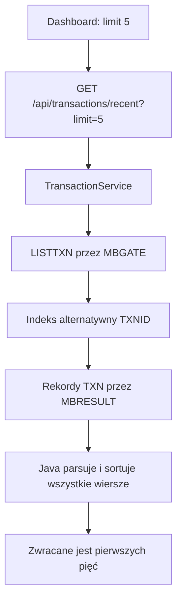

# Ostatnie transakcje · Live

Ten panel dashboardu jest krótkim widokiem transakcji zapisanych w zbiorze VSAM mainframe'u. Słowo **Live** oznacza, że dane są pobierane aktywną ścieżką terminalową KICKS. Nie oznacza ciągłego strumienia zdarzeń przesyłanego do tabeli.

## Co widzi operator

Dashboard prosi o pięć wierszy i pokazuje:

| Kolumna | Pole źródłowe | Sposób prezentacji |
| --- | --- | --- |
| Data i czas | `createdAt` | `yyyyMMddHHmmss` wyświetlane jako data i minuty |
| Typ | `type` | `DP`, `WD` i `IN` jako Wpłata, Wypłata i Odsetki |
| Konto | `accountId` | identyfikator konta z mainframe'u |
| Szczegóły | `detail` | wizualnie skracane, gdy tekst jest za długi |
| Kwota | `direction`, `amount`, `currency` | debet ze znakiem minus, kredyt ze znakiem plus |
| Saldo po operacji | `balanceAfter`, `currency` | saldo zapisane w transakcji |
| Status | `status` | `C`, `P`, `F` jako Completed, Pending, Failed |

Odnośnik **Open statements** prowadzi do podstrony wyciągów. Nie przekazuje do niej pięciu wierszy z dashboardu jako gotowego wyciągu.

## Ścieżka żądania {#request-path}

Zapytanie frontendu tworzy `useRecentTransactions(5)`. Kontroler przyjmuje limit od 1 do 50, chociaż ten panel zawsze prosi o pięć rekordów.

## Co robi LISTTXN

Dla endpointu ostatnich transakcji Java uruchamia `LISTTXN` z pustym wejściem. Wybiera to tryb przeglądania wszystkich transakcji.

Program COBOL:

1. rozpoczyna CICS browse na `TXNID`, czyli ścieżce po alternatywnym indeksie identyfikatora transakcji;
2. odczytuje każdy dostępny 119-bajtowy rekord transakcji;
3. zamienia kwoty i salda packed decimal na pola drukowalne;
4. wysyła przez MBRESULT po jednym rekordzie `MBR;D` typu `TXN` dla każdego wyniku;
5. kończy nagłówkiem `MBR;S` i kodem `OK`.

Brak rekordów w VSAM jest poprawnym wynikiem i daje pustą listę. Błąd rozpoczęcia, odczytu lub zakończenia browse albo błąd kanału wynikowego powoduje odpowiedź błędną, a nie częściowy sukces.

## Parsowanie, kolejność i rzeczywisty limit {#limit}

Parser Java wymaga, aby każdy drukowalny payload transakcji miał dokładnie 119 znaków. Mapuje go na odpowiedź API i sortuje cały wynik według:

1. `createdAt` — najnowsze najpierw;
2. `transactionId` — malejąco, gdy znaczniki czasu są równe.

Dopiero później `getRecentTransactions(limit)` wybiera żądaną liczbę wierszy.

::: warning Obecna granica skalowania
Parametr `limit=5` ogranicza odpowiedź HTTP, a nie browse na mainframe. `LISTTXN` nadal odczytuje i zwraca cały plik transakcji, zanim Java go posortuje i zachowa pięć rekordów. Jest to poprawne dla obecnego edukacyjnego zbioru danych, ale większy system powinien przenieść limit albo stronicowanie bliżej VSAM.
:::

## Kiedy panel się odświeża {#refresh}

To zapytanie nie ma interwału odpytywania. Ładuje się przez React Query i korzysta z globalnego czasu świeżości wynoszącego minutę; odświeżanie po powrocie fokusu okna jest wyłączone.

Wpłata albo wypłata zakończona przez ten frontend od razu aktualizuje cache transakcji, a następnie unieważnia aktywne zapytania transakcyjne. Dzięki temu nowa transakcja może pojawić się bez pełnego przeładowania strony.

Transakcje utworzone poza tym przepływem — na przykład naliczenie odsetek podczas zamknięcia dnia — nie wysyłają zdarzenia do tej tabeli. Stają się widoczne po wykonaniu nowego zapytania, na przykład po przeładowaniu strony. Dlatego **Live** nie należy rozumieć jako strumienia WebSocket albo Server-Sent Events.

## Stany pusty i błędny

- Podczas wykonywania zapytania tabela pokazuje wiersze ładowania.
- Poprawna odpowiedź bez rekordów pokazuje **No transactions found**.
- Błąd żądania pokazuje **Could not load transactions from the mainframe**.

Panel raportuje dostępność odczytu transakcji niezależnie od podsumowania poprzedniego dnia znajdującego się nad nim. Jeden może nie działać, a drugi pozostać dostępny, ponieważ uruchamiają inne operacje mainframe i czytają inne pliki VSAM.
