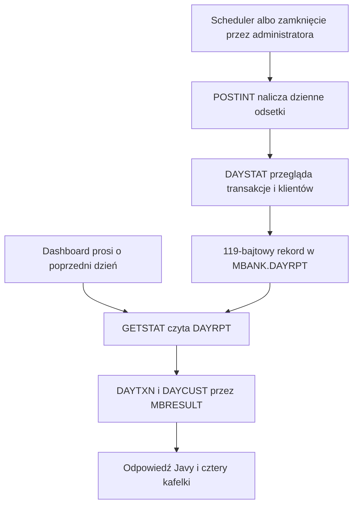

# Podsumowanie poprzedniego dnia

Ten panel dashboardu pokazuje trwały raport zamkniętego dnia utworzony przez MVS. Otwarcie strony nie przelicza odsetek ani nie skanuje bieżącego pliku transakcji. Pobiera gotowy raport dla wybranej daty biznesowej i waluty.



## 1. Co widzi operator

Panel pokazuje stan raportu, datę biznesową oraz cztery kafelki:

| Kafelek | Wyświetlana wartość | Informacja pomocnicza |
|---|---|---|
| Wszystkie operacje zamkniętego dnia | zakończone wpłaty + wypłaty + naliczenia odsetek | liczba i łączna kwota odsetek |
| Wpłaty gotówkowe w ciągu dnia | suma zakończonych wpłat | liczba wpłat |
| Wypłaty gotówkowe w ciągu dnia | suma zakończonych wypłat | liczba wypłat |
| Aktywni klienci przy zamknięciu | klienci ze statusem `A` zapisanym w VSAM | klienci utworzeni w dacie biznesowej |

Badge pokazuje `CLOSED` wyłącznie po poprawnym sparsowaniu raportu. Podczas pobierania widzimy `LOADING`, a po błędzie — `UNAVAILABLE`.

## 2. Frontend i wybór daty

Panel renderuje [`DashboardPage.jsx`](https://github.com/StormSister/MoniBank/blob/main/monibank-frontend/src/pages/DashboardPage.jsx). Wywołuje [`useDailyCloseReport`](https://github.com/StormSister/MoniBank/blob/main/monibank-frontend/src/hooks/useDailyCloseReport.js) z walutą `EUR` i bez jawnej daty.

Hook wybiera kolejno:

1. datę przekazaną przez wywołujący komponent;
2. wartość build-time `VITE_DAILY_CLOSE_DATE`, jeżeli ją skonfigurowano;
3. poprzedni dzień obliczony w przeglądarce.

Następnie wykonuje `GET /api/dashboard/daily-close?date=<data>&currency=EUR` pod kluczem TanStack Query `['daily-close', data, waluta]`.

Raport nie ma interwału pollingu. Globalna konfiguracja zapytań uznaje go za świeży przez 60 sekund i wyłącza odświeżanie po powrocie do okna. Przy błędzie banner udostępnia jawny przycisk **Try again**. To zachowanie różni się od żywego statusu i licznika operacji, które są odpytywane cyklicznie.

## 3. HTTP i ścieżka odczytu w Javie {#read-path}

[`DailyCloseReportController`](https://github.com/StormSister/MoniBank/blob/main/monibank-backend/src/main/java/com/monibank/mainframe/dashboard/api/DailyCloseReportController.java) przyjmuje datę ISO i trzyliterową walutę pisaną wielkimi literami. Jeśli inny klient nie poda daty, kontroler używa poprzedniego dnia według lokalnej daty serwera; dashboard zwykle przesyła swoją datę jawnie.

[`DailyCloseReportService`](https://github.com/StormSister/MoniBank/blob/main/monibank-backend/src/main/java/com/monibank/mainframe/dashboard/DailyCloseReportService.java) utrzymuje w pamięci cache maksymalnie ośmiu raportów data/waluta, uporządkowany według ostatniego użycia. Trafienie do cache kończy obsługę bez MVS. Brak wpisu uruchamia na mainframe operację tylko do odczytu `GETSTAT` z 11-znakowym wejściem:

```text
yyyyMMddCCC
```

Przykład `20260914EUR` oznacza raport EUR za 14 września 2026 roku.

## 4. Co odczytuje GETSTAT

[`GETSTAT.cob`](https://github.com/StormSister/MoniBank/blob/main/monibank-backend/src/main/resources/cobol/statistics/GETSTAT.cob) wykonuje kluczowy `CICS READ` na `DAYRPT`. Klucz ma 11 znaków: osiem znaków daty biznesowej i trzy znaki waluty.

Program wymaga dokładnie 119-bajtowego rekordu w stanie `C`, z datą oraz walutą zgodną z żądaniem. Brak klucza daje `RPTNOTF`. Po sukcesie program wysyła:

- jeden rekord `MBR;D` z encją `DAYTXN`;
- jeden rekord `MBR;D` z encją `DAYCUST`;
- końcowy nagłówek `MBR;S` ze stanem `C` i zapisanym kodem wyniku.

Rekordy przechodzą wspólnym [kanałem wynikowym MBRESULT](./mbresult). `GETSTAT` czyta trwały raport; sam nie przegląda `TXNFILE` ani `CUSTFILE`.

## 5. Jak powstaje raport {#production}

Jeśli daily close jest włączony, [`DailyCloseScheduler`](https://github.com/StormSister/MoniBank/blob/main/monibank-backend/src/main/java/com/monibank/mainframe/dashboard/DailyCloseScheduler.java) korzysta ze skonfigurowanego crona i strefy. Domyślne wartości repozytorium to `00:05` w `Europe/Warsaw`, ale funkcja produkcyjna pozostaje wyłączona, dopóki nie włączy jej `MB_DAILY_CLOSE_ENABLED`.

Scheduler zamyka poprzedni dzień kalendarzowy w skonfigurowanej strefie. To samo można uruchomić chronionym endpointem administracyjnym. [`DailyCloseOrchestrator`](https://github.com/StormSister/MoniBank/blob/main/monibank-backend/src/main/java/com/monibank/mainframe/dashboard/DailyCloseOrchestrator.java) nie pozwala na dwa równoczesne zamknięcia w jednej instancji backendu i zajmuje wyłączną blokadę koordynatora VSAM dla całego przepływu:

1. `POSTINT` nalicza dzienne odsetki;
2. `DAYSTAT` oblicza i zapisuje raport;
3. Java umieszcza zwrócony raport w cache pamięciowym.

Catch-up po starcie jest konfigurowany osobno. Przed wykonaniem zaległego zamknięcia najpierw wywołuje `GETSTAT`, aby restart backendu nie powtórzył istniejącego zamknięcia tylko dlatego, że cache Javy jest pusty.

## 6. Jak DAYSTAT liczy poszczególne wartości

[`DAYSTAT.cob`](https://github.com/StormSister/MoniBank/blob/main/monibank-backend/src/main/resources/cobol/statistics/DAYSTAT.cob) przegląda ścieżkę alternatywną `TXNID`, a następnie `CUSTFILE`.

Do sum transakcji włącza wyłącznie rekordy spełniające jednocześnie trzy warunki:

- status zakończony (`C`);
- data utworzenia zgodna z datą biznesową;
- waluta zgodna z żądaniem.

Licznik operacji zwiększają tylko typy `DP`, `WD` i `IN`. Ich liczby oraz kwoty są również sumowane osobno. **Total closed-day operations jest więc liczbą transakcji z VSAM-u, a nie liczbą zdarzeń w journalu operacji Javy.**

Przegląd klientów ma inną semantykę:

- total, active i inactive opisują wszystkie rekordy klientów widoczne w chwili zamknięcia;
- liczba nowych klientów obejmuje rekordy utworzone w dacie biznesowej;
- podsumowanie klientów ma zakres `ALL`, niezależny od waluty transakcji.

## 7. Trwałość i ponowne uruchomienie

`DAYSTAT` zapisuje jeden 119-bajtowy rekord `MBANK.DAYRPT` pod kluczem data biznesowa + waluta. Rekord zawiera liczniki, kwoty, request ID, stan `C`, wynik `OK` oraz logiczny czas zamknięcia `23:59:59` wybranego dnia.

Pierwsze zamknięcie używa `CICS WRITE`. Jeśli klucz już istnieje, ponowne wykonanie czyta go do aktualizacji i używa `CICS REWRITE`. Naliczenie odsetek jest zaprojektowane jako idempotentne dla konta i dnia: `POSTINT` stosuje deterministyczny identyfikator transakcji, a duplikat oznacza, że dane konto zostało już obsłużone. Można więc zastąpić podsumowanie bez celowego tworzenia drugiej transakcji odsetkowej.

Dzięki temu trwałym źródłem po restarcie jest `DAYRPT`, a nie cache Javy.

## 8. Parsowanie, błędy i zachowanie UI {#failures}

[`DailyStatisticsResultParser`](https://github.com/StormSister/MoniBank/blob/main/monibank-backend/src/main/java/com/monibank/mainframe/dashboard/mainframe/DailyStatisticsResultParser.java) wymaga dokładnie jednego payloadu `DAYTXN` i jednego `DAYCUST`, każdy o długości 119 znaków. Przed utworzeniem `DailyCloseReportResponse` porównuje ich daty, zakres klientów, request ID, końcowy stan i kod wyniku.

API rozróżnia:

- HTTP `404` / `DAILY_CLOSE_REPORT_NOT_FOUND`, gdy MVS zwróci `RPTNOTF`;
- HTTP `503` / `DAILY_CLOSE_REPORT_UNAVAILABLE`, gdy raportu nie można wiarygodnie odczytać.

W obu przypadkach dashboard pozostawia dostępny panel żywych transakcji. Brak raportu historycznego nie oznacza więc, że bieżący mainframe albo ścieżka transakcji live są offline.

## Aktywna ścieżka a kod pomocniczy

Aktywną ścieżką dashboardu jest operacja online `GETSTAT` przechodząca przez bramkę terminalową. Repozytorium zawiera również komponenty JCL `DailyCloseBatchExecutor` i `DailyCloseReportExecutor`, ale obecny kontroler dashboardu ani aktywny scheduler ich nie wstrzykują. Nie należy przedstawiać ich jako źródła aktualnej odpowiedzi produkcyjnej tego panelu.
