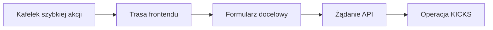

# Szybkie akcje dashboardu

Sześć kafelków szybkich akcji na dole dashboardu to skróty nawigacyjne. Kliknięcie **nie** wykonuje od razu operacji na mainframe. Kafelek otwiera właściwą podstronę i — tam, gdzie jest to potrzebne — przekazuje parametr wybierający odpowiedni formularz.

## Mapa tras {#routes}

| Kafelek | Trasa | Efekt na stronie docelowej |
| --- | --- | --- |
| New Customer | `/customers?action=new` | wybiera formularz nowego klienta |
| Open Account | `/accounts?action=new` | wybiera formularz nowego konta |
| Deposit | `/cash-desk?operation=deposit` | wybiera proces wpłaty |
| Withdraw | `/cash-desk?operation=withdrawal` | wybiera proces wypłaty |
| Issue Card | `/cards?action=new` | wybiera formularz nowej karty |
| Statement | `/statements` | otwiera ekran wyciągów |

Nawigację realizuje React Router w `DashboardPage`. Z dashboardu nie są przekazywane dane klienta, konta ani body żądania.

## Gdzie zaczyna się operacja biznesowa {#submission-boundary}

Za walidację, dane wpisane przez operatora i wywołanie API odpowiada dopiero strona docelowa. Ta granica jest istotna:

Zamknięcie formularza albo opuszczenie podstrony przed wysłaniem nie tworzy więc operacji na mainframe ani wpisu w dzienniku operacji.

## Szczegółowa dokumentacja procesów

Każda trasa zostanie opisana osobno, ponieważ różnią się payloadem, walidacją i programem COBOL. Proces klienta jest już dostępny:

- [Dodanie klienta: od formularza operatora do rekordu VSAM](./dodaj-klienta)

Kolejne strony rozwiną w tym samym, opartym na kodzie formacie:

- otwarcie konta;
- wpłatę i wypłatę;
- wydanie karty;
- wygenerowanie wyciągu.
