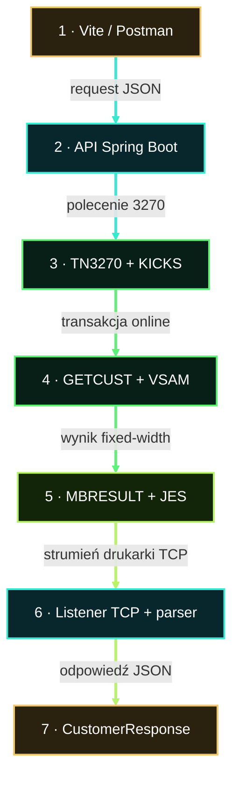

# Architektura Legacy Banku

Legacy Bank jest aktywnie rozwijaną gałęzią MoniBanku działającą na MVS 3.8J. Polecenie i jego wynik korzystają z dwóch osobnych kanałów integracji.

<strong>Ścieżka polecenia:</strong> Vite lub Postman → Java → 3270/KICKS → COBOL/VSAM <strong>Ścieżka wyniku:</strong> COBOL → MBRESULT/JES → Java → odpowiedź JSON

Stały kanał terminalowy przekazuje polecenie online. Kanał wirtualnej drukarki JES klasy Z zwraca skorelowany wynik fixed-width do listenera TCP w Javie, gdzie dane są parsowane i mapowane na odpowiedź HTTP.

Pierwszy artykuł techniczny rozwinie ten widok i prześledzi działającą implementację **GET CUSTOMER** — klasa po klasie i program po programie.

[Zobacz kod źródłowy na GitHubie](https://github.com/StormSister/MoniBank) · [Wróć do opisu projektu](/pl/)